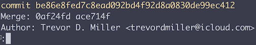

In our command line, we're inside of a directory called `utility functions`, which is a git repository. If we run a git command that has a lot of output like `git log`, it will open up in what's called a "Terminal Pager".

We know that we're inside of the pager program because of the colon at the bottom of the screen. 

Unless you've changed the pager and use on your computer, you're most likely using the `Unix less` pager.

`less` has a lot of really useful commands that we can use to navigate around our pager. The most important one is `q`, which brings us back to our main command line prompt. That `q` stands for quit. After I run the `q` command, I usually clear my screen.

Let's run `git log` again to get back into our pager output. We can use our down and up arrows to go up and down one line at a time. We can also use our PageUp and PageDown keys to go up and down one screenful at a time.

We can do the same thing more efficiently using `J` and `K` to go down and up one line at a time. We can use `Ctrl F` as in forward to go forward a screenful, and `Ctrl B` as in backward to go backward a screenful.

We can search for something specific by using the forward slash, `/`, which if you notice at the bottom of the screen changes our prompt to a forward slash from a colon. Then type in a search like `trevor`. Once we hit Enter, it will highlight all of our search results. We can use the `n` key as in next to go to the next search result and capital `N` to go to the previous search result.

For a quick review, I'm going to hit `q` to quit my pager output. When I run any git command that has a lot of output like `git blame`, `diff`, or `log`, it will open up in my pager. I can navigate by screens with `Ctrl F` and `B`, navigate by lines with `J` and `K`, search for a specific terms with the forward slash and the term, and then `n` and capital `N` to go forward and backward between those search results.

Finally, `q` to quit and get back to my main prompt.