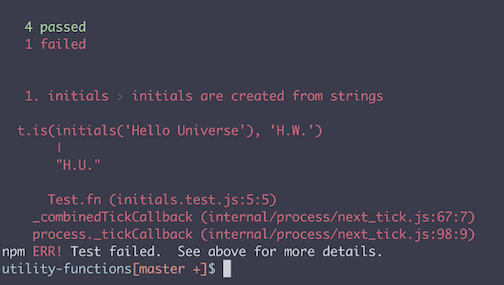
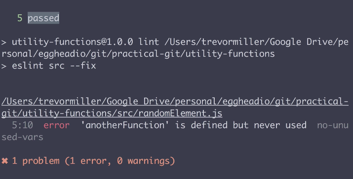

In our command line, we're going to set up a directory called `utility-functions` which is a git-repository. If we take a look inside of our `.git` folder in our git-repo, we can see all of its folders and files.

One of these is the `hooks` folder. Let's take a look at what's inside the `hooks` folder.

By default, you can see that git provides a whole bunch of `.sample` files. Each of these files in your `hooks` directory is a script that matches a `git hook` name.

For example, this `pre-rebase.sample` script would be fired before every rebase in your repo. Now these don't run by default because they have this `.sample` extension. But if you were to remove the `.sample` and only have a file with just the `hook` name, git would automatically run that `hook` based on the name.

For our project, we want to automatically run our `test` and our `lint` before every commit. Inside of our `hooks` folder, let's make a new `pre-commit` script, `touch hooks/pre-commit`. Now let's open up this file in our code editor.

On the first line of our script file, we need to tell the shell which interpreter to use to execute the file. For this project, let's use `bash`. We do that by doing the number symbol, then explanation point, then `bin/bash`, `#!/bin/bash`.

Now we could run anything here in this script that we want to execute before a commit. In the case of this project, we've defined some npm-script in our `package.json` and we'd like to run our `test` script as well as our `lint` script before each commit to insure that we don't have any broken tests or lint errors, `npm test && npm run lint`.

Now that we have script written out, we need to make sure that it's executable by our system. Let's go back to our command line and let's run `chmod` which stands for change mode and will let us change the permissions of a file. We need to pass it the `+x` option which means we want to make a file executable as a program, and then we provide the path to file, which in this case is `hooks` and then `pre-commit, chmod +x hooks/pre-commit`.

If we run that command, our `pre-commit` script is now executable. Now back in the root of our project, let's try to make a commit that has a broken test and lint errors.

#### Terminal
```bash
$ git add -A
$ git commit -m "Add broken code"
```

Now when I run the commit in the code block above, our `pre-commit` script is executed and we see that we have a broken test and that our commit did not go through. 



I've fixed the broken test, but there's still the lint error. Let's try to commit again.

Now our tests have passed, but our linting errors are being shown. 



I've fixed the lint errors. Let's commit again.

Now if we run `git status`, we can see that git has ran our `pre-commit` hook successfully and has allowed our commit to go through. One thing to know is that when you manually add a `git hook` inside of the `hooks` folder in our `.git` folder that hook is only accessible locally on your machine.

If you'd like your hooks to be available in the remote repo for all people working on your project, you'll either need to write a script to copy it with something like `npm scripts` or use a prebuilt tool.