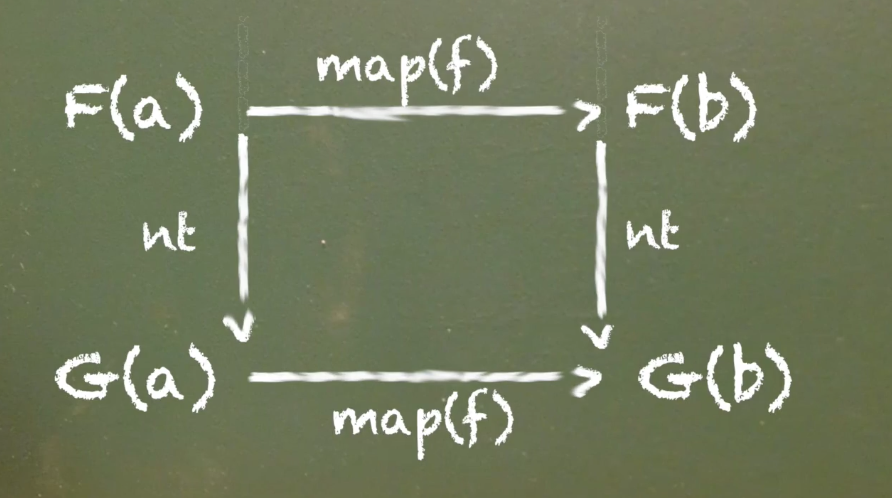

What the devil is a **natural transformation**? Simply put, and perhaps naively put, it's just a type conversion. It's taking one functor to another. A natural transformation is actually a function that takes a functor holding some `a` to another functor holding that `a`. it's a structural change.
`F a -> G a`

We'll broaden our definition in a moment, but let's go ahead and implement one of these. Let's say I have an `either` and I'd like to turn it into a `Task`. We'll take our `either` here and we'll simply fold it out of the `either` and into a `rejected` `Task` if it's a `Left` or a successful `Task` if it's a `Right`.

```javascript
const eitherToTask = e =>
    e.fold(Task.rejected, Task.of)
```

We would use it like so. If I have the `Right` of `"nightingale"` and I call `eitherToTask` on that, I will now have a `Task` I can `fork`. We'll just write this out so we can see it. We have `error` here with the `e` and the success case for the results.

```javascript
eitherToTask(Right('nightingale'))
.fork(e => console.error('err', e),
      r => console.log('res', r))
```

Running this we see we have the `res nightingale`, and we have a `Left` of this `'errrrrr'`, we'll get at an `err errr` here. *laughs* That's how that is.

```javascript
eitherToTask(Left('errrrr'))
.fork(e => console.error('err', e),
      r => console.log('res', r))
```

Anywho, we'll take our natural transformation here, and let's make another one here.

Let's turn a `Box` into an `either`. It takes our `Box b` and this `Box` will do the same thing. We'll just fold it out and into the `either`. We can write it like this, which would be the same thing, but I'd like to write it first class. Here, we are taking a `Box` of, let's say, `100`.

```javascript
const boxToEither = b =>
    b.fold(Right)
```

If we call the `boxToEither` it will have a `Right` of `either`, a `Right` of `100` here. Let's go ahead and look at this.

```javascript
const boxToEither = b =>
    b.fold(Right)

const res = boxToEither(Box(100))
console.log(res)
```

There we are, we have a `Right` of `100`. Why did we choose `Right` here? Had we chosen a `Left` we would be violating the laws of natural transformations.

What is that law? Let's go ahead and formulize exactly what a natural transformation is here. A natural transformation is anything `nt`, this function, natural transformation, that when I transform `x`, some functor, when I `map` over that with `f`, it must be equal to mapping `f` over our functor, and then naturally transforming it afterwards.

`nt(x).map(f) == nt(x.map(f))`

Let's go ahead and apply this law and see if it holds here. We can say on our `res` here, it's called `res1`, and we'll say first convert it with our natural transformation and then we'll map `x * 2`, say. Then the other side of the equation we will first `map` it then transform it afterwards.

```javascript
const res1 = boxToEither(Box(100)).map(x => x * 2)
const res2 = boxToEither(Box(100).map(x => x * 2))
console.log(res1, res2)
```

We should get the same results `either` way. Let's go ahead and run this. Here we are. They are indeed equal. Had I chosen a `Left` here what would happen? This map wouldn't run after the natural transformation. These are not equal, so it must be a `Right`.

Indeed, any function that satisfies this equation, `// nt(x).map(f) == nt(x.map(f))` is a natural transformation. Let's broaden our intuition just a little bit further. If I have a function first we're taking array of `xs` and we simply grab the first thing out of the `x`, and we'll throw it in an `either` with `fromNullable`.

```javascript
const first = xs =>
    fromNullable(xs[0])
```

What we're doing here is transforming a `List` into an `either`. We lose the rest of the `List`, but that doesn't matter, because this equation is still valid. Were we to write first on `[1,2,3]` and we'll `.map(x => x + 1)`, and we'll do the same here.

We'll have `[1,2,3]`, `.map(x => x + 1)`. Then we'll transform it with `first` at the end.

```javascript
const res1 = first([1,2,3]).map(x => x + 1)
const res2 = first([1,2,3].map(x => x + 1))
```

These two shall be equal and they are. Any function that satisfies this equation is a natural transformation. Let's look at this on the board here.



If we have some `F(a)` and some functor holding an `a` and we `map(f)` over it, it transforms that `a` to a `b`. we're just mapping a function from the type `a` to some type `b` here all inside our functor `f`. Then we run a natural transformation we'll have a `G(b)`.

If we take the other path moving downward we'll first naturally transform our functor holding an `a` into the `G(a)` here, and then we `map(f)` over that to get a `G(b)`. We end up with the same result. This can be quite useful.