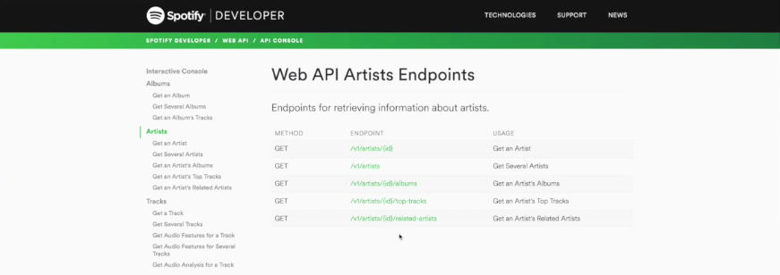
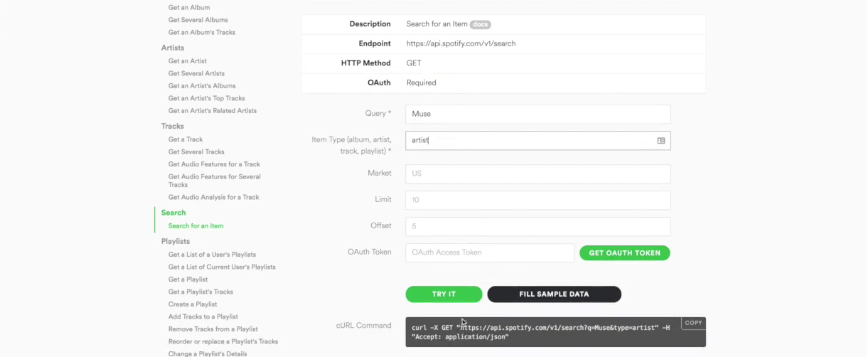
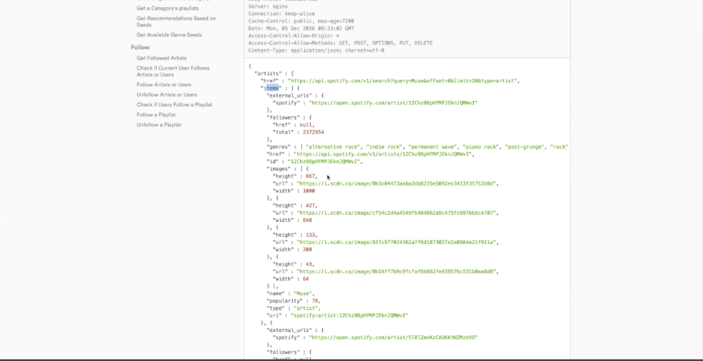
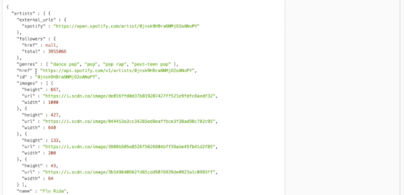

We are looking at a Spotify API doc here. We want to make a little app that will go ahead and get the related two `artists` and then compare them to give me a suggestion.



For instance, I give it, let's say `$ node index.js`. We'll give it `oasis` and `blur`. We should get some `artists` recommendations based on those two.

```
$ node index.js oasis blur
```

Here, to form a little plan, I'm looking at the API docs. I see I can get several `artists` or `artists` with an `id` and get their `related-artists` if I have an `id`. I'm looking here. There's a search, so I can search for an item here. If we do a quick little test, it says Muse here, so we'll take Muse, and then `artists`, that's what we want to look for. Here's our URL. Let's copy this for future reference.



We will try it. Sure enough, we get a response here. It looks like this. It has `artists` which have `items`. That's all of the `items`. Now, they actually have their `id` in them. It's `artists`, then `items`.



We'll do a similar thing with related. Let's go ahead and just fill in some simple data and try it. If we have some `id`, it returns us back `artists`, but it's not `items`. It's just an array of all the other `artists` here.



Let's go ahead and get started. I'll do `$ npm init`, and yes, yes, yes, yes. We'll `vim in`. Let's go ahead and touch `index.js` in vim here. Let's start by `npm i`. I'm going to install my favorite dependencies and we'll use them here.

There's `data.either`, `data.task`. Instead of box, we'll use `fantasy-indentities` if we need to use those and `request` just to make a basic HTTP request. We'll go ahead and `--save` all of this right there.

```
$ npm i data.either data.task fantasy-identities request --save
```

With this plan, we want to take two sets of `artists` and compare them and figure out the commonality between them. In a normal object-oriented setting, you might start with a `class` called `Spotify`. You would go ahead and try to make a class of `Artist`. We'll put methods on Spotify to go get `artists` and so on, etc. 

Here, we're going to do something a little bit different. We're going to build a **flow** for our data to flow through. We are going to retrieve the data and then just pass it through a series of functions. Let's do that.

We'll start off with a little sketch here. We'll say `main`. We need some arguments here. We have `oasis` and `blur`. Let's go ahead and start by `console.log(process.argv)` so we can see what we have here. If I run this `$ node index.js oasis blur`, we have an array of args. We have a path to node, the follower using, and the two `artists`.

```javascript
console.log(process.argv)
```

```
[ '/Users/blonsdorf/.nvm/version/node/v7.2.0/bin/node',
  '/Users/blonsdorf/Documents/venn/index.js',
  'oasis', 
  'blur' ]
```

This already is breaking a nice rule of functional programming with grabbing this ambient state out of nowhere. What we'll do here is just bringing a `Task` right off the bat. We'll wrap our `argv` in a new `Task`.

```javascript
const Task = require('data.task')

const argv = new Task((rej, res) =>
```

Notice, I'm not making a new function every time. It's just one `Task` holding the results of `process.argv`. There it is.

```javascript
const argv = new Task((rej, res) => res(process.argv))
```

I would use this by saying `argv.map`. What we want to do here is grab the last two or more ignoring these first two arguments.

Why don't go ahead and just get our `args`? We'll do `args.slice(2)`. This'll be our `artists`. Let's just call it `names` for now because they're not actually `artists` from the system here. They're just `names`.

Back to `main`, we can call `main` with `names`. Let's go ahead and say `names.map(main)`. We'll grab our names, pass them into `main`, and then we will just `fork` that with a `console.error` or `console.log` just like that.

```javascript
const Task = require('data.task')

const argv = new Task((rej, res) => res(process.argv))

const main = (names) =>
    ?

names.map(main).fork(console.error, console.log)
```

What shall we do with these names? We can destructure them right here in the args here, `name1`, `name2`. Remember, we want to go get the search results for each name and then get the `related-artists` from that first result, the best result here. I would say, let's call it `findArtist` because we want to search but then grab the first `artists` anyway.

```javascript
const main = (names) =>
    findArtist
```

Find the `artists` with the `name1`. We will just `chain` that `artist` into the call to `relatedArtists` and we go `artist.id`.

```javascript
const main = (names) =>
    findArtist(name1).chain(artist => relatedArtists(artist.id))  
```

What I'm doing here is just sketching out here without coloring anything in. We're just writing a basic workflow. We want to do this for both `name1` and `name2`, this find the `artist` and then get their related `artists`. Let's pull this out into its own function here. We'll call this `related`. It will just take a `name` and do this little process for that `name`.

```javascript
const related = name =>
    findArtist(name)
    .chain(artist => relatedArtists(artist.id))
const main = ([name1, name2]) =>
    findArtist(name1)
    .chain(artist => relatedArtists(artist.id))  
```

By sketching these things out the way we are, we're not going to run into any snags later because we're walking the data through these functions and making sure we have what we need when we need it.

Why don't we go ahead and do the `.map(artist => artist.id)`? We can just call this first class here, `relatedArtists`, just like that. This is a just a personal preference. I like to see the data transform before it's passed into the function.

```javascript
const related = name =>
    findArtist(name)
    .map(artist => artist.id)
    .chain(relatedArtists)

const main = ([name1, name2]) => 
```

Now, if we have the `related` on `name1`, and the `related`, on `name2`, and we haven't written `findArtist` or `relatedArtist`, we have to go write those. What we can do here is assume that we have both pieces of data.

```javascript
const main = ([name1, name2]) => 
    related(name1) related(name2)
```

We know if we want to work with two pieces of data at the same time that are independent of each other, we can use **applicatives**. Since surely `related` is going to make an HTTP call to do some kind of side effect, we'll have a `Task`.

Let's say `Task.of` `rels1`, `rels2`. These `rels` are just the `related-artists`. We'll do something with them. Let's just pop them into an array right now so we can take a look at them. We will `.ap` that to a `related`. We'll `.ap` that to the other `related`. There we are.

```javascript
const main = ([name1, name2]) => 
    Task.of(rels1 => rels2 => [rels1, rels2])
    .ap(related(name1))
    .ap(related(name2))
```

If we can get this part to work, then we can figure out how to find the similar `artists` afterwards with both pieces of data.s