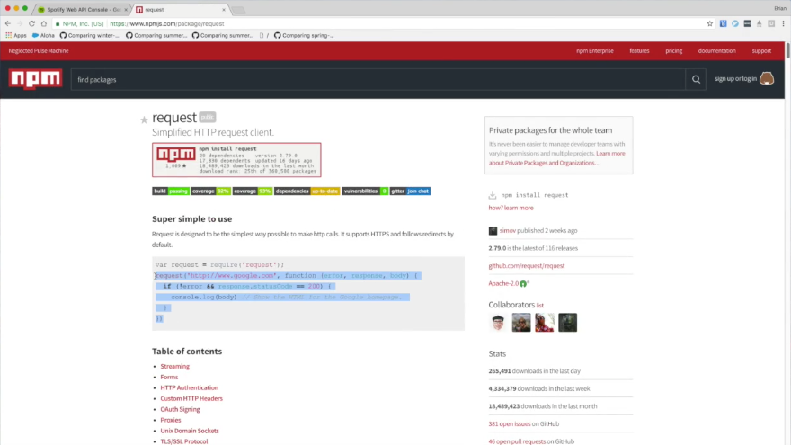
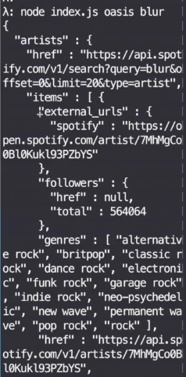
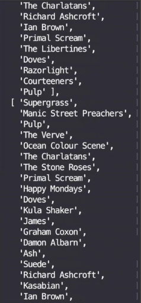

Let's go ahead and make little Spotify API here. We have both of these, and it's totally OK to go ahead and make what looks like a `Spotify` class, somewhere else, that's really just a module. We just have a little `Spotify` module here. We'll go ahead and make that, `spotify.js`. There we go.

```javascript
const Task = require('data.task')
const Spotify = require('./spotify')
```

Let's save it, and go ahead and grab these from here, pull them out, and paste them here.

####spotify.js
```javascript
"https://api.spotify.com/v1/search?1=${query}&type=artist" // artists: {items: []}
"https://api.spotify.com/v1/artists/${id}/related-artists" // artists: []
```


Looks like we're going to need `Task` after all, so we have `Task`. What other dependencies might we need? We need our little `request`, here, because we're going to be doing API calls.

####spotify.js
```javascript
"https://api.spotify.com/v1/search?1=${query}&type=artist" // artists: {items: []}
"https://api.spotify.com/v1/artists/${id}/related-artists" // artists: []

const request = require('request')
const Task = require('data.task')
```

We have our `request` and a `Task`. That's it, for now. Let's go ahead and implement this. I always forget how `request` works. Let's go ahead and look that up here. `request npm` here. Grab this. It's already there. I look this up all the time. I never remember these APIs.
We grab this here. 



Just paste it right in. Now, I could use, again, a little wrapper library, but maybe not in this case, because it's a little weird. Let's go ahead and just call this `httpGet`, we'll take a `url`, and just wrap this ourselves, manually, here. Just go ahead and write `url` as our first argument. Takes a little arrow function. Forget about all that.

Now, if we have an error, we just reject it. Oh? We don't have a reject. Let's wrap it in a little `Task` here. Reject result, and we can reject the `error` or resolve the `body` here. Perfect.

```javascript
const httpGet = url =>
    new Task((rej, res) =>
    request(url, (error, response, body) =>
        error ? rej(error) : res(body)))
```

That's all it took. Now, we have a pure HTTP library, to make GET calls here. We'll go ahead and start.

Let's go ahead and say `findArtist`. What we're going to do here, I should mention, is just `export` a little object with `findArtist`, and `relatedArtists`. That's it. Everything else will be hidden. There will be private methods, hidden from the public, but they have these two composable pieces, to go play with over in the other files.

```javascript
const findArtist

module.exports = {findArtist, relatedArtists}
```

For our Spotify API, we'll take in a `name` of the artist. Then, we'll do our `httpGet` of our first call here. Here it is. We'll just grab it inside of that, and paste it here. We have our result. That is in this `name` here. It should be passed in as the query.

```javascript
const findArtist = name =>
    httpGet('https://api.spotify.com/v1/search?1=${name}&type=artist')
    .map(result =>
```

We have our result and we'll just `map` over that `result`, to get the `artists`, and then the `items` off of that. That way, we'll be working with the set we want, and we don't need the rest of this information.

```javascript
const findArtist = name =>
    httpGet('https://api.spotify.com/v1/search?1=${name}&type=artist')
    .map(result => result.artists.items)
```

Then, finally, once we've got all the artists, we just want the best match. We'll just grab the `first` one. Of course, we have to write a little `first` function.

```javascript
const first 

const findArtist = name =>
    httpGet('https://api.spotify.com/v1/search?1=${name}&type=artist')
    .map(result => result.artists.items)
    .map(first)
```

We don't want to do unsafe actions anywhere in our code, so calling `xs.zero` might return a `null`, and this would be very bad for our users. We don't want our users to be hit with a `null` out of nowhere if they don't find the artist.

Let's go ahead and throw this in a `fromNullable`. We'll go ahead and pull in `Either`. This is from Folktale now, not the one we defined earlier, but same, same idea. We have our `first`.

```javascript
const Either = require('data.either')

...

const first = xs =>
    Either.fromNullable(xs[0])
```

Now we have a problem, because `findArtist` was returning a `Task` of an artist, but now it's returning a `Task` of an `Either Artist`.

We know just by what we had sketched out earlier, over here on our `index.js`, that we we would like to `chain` right into `relatedArtists`, which is another `Task`, but we won't be able to do that very well with a `Task` holding an `Either`.

Let's go ahead and just `chain` our `eitherToTask`. We'll say, if it cannot get the `first` thing, we'll just reject this whole `Task` as a failure. That's just a decision we're making for this one piece. We could have used other things, including monad transformers or traversals and folds, and whatnot, to clear that up.

```javascript
const eitherToTask =

const findArtist = name =>
    httpGet('https://api.spotify.com/v1/search?q=${name}&type=artist')
    .map(result => result.artists.items)
    .map(first)
    .chain(eitherToTask)
```

We'll just go ahead and turn that `Either` into a `Task` here. `Task.rejected`. `Task.of`, and this is that natural transformation that we've seen before. Now we can get the artist. Grab all the `items`, grab the `first` item, and turn it into a successful or a rejected `Task`.

```javascript
const eitherToTask = e =>
    e.fold(Task.rejected, Task.of)

const findArtist = name =>
    httpGet('https://api.spotify.com/v1/search?q=${name}&type=artist')
    .map(result => result.artists.items)
    .map(first)
    .chain(eitherToTask)
```


Let's go ahead and just do the other method, right here, which is `relatedArtists`, which takes an `id`.
This second call up here. We'll just paste this right into that. Sure enough, we have our second call here. It passes in an `id`. Then, instead of getting `items`, just gets that list of `artists`, and there we are.

```javascript
const relatedArtists = name =>
    httpGet('https://api.spotify.com/v1/search?q=${name}&type=artist')
    .map(result => result.artists.items)
    .map(first)
    .chain(eitherToTask)
```

Let's give it a shot. Let's see, with all that we've written here and what we're including over here as our basic workflow, we could go see if this is what we expect. Let's run it. 

####Terminal Output
```
Task { fork: [Function], cleanup: [Function: cleanupBoth] }
```

Oh, it's a `Task`. Looks like we are mapping into another `Task`, here, which duplicates that, so we can just `chain` instead.

```javascript
names.chain(main).fork(console.error, console.log)
```

Now, let's run this. Oh, goodness! That's a lot of output here. It says, `Cannot read property 'items' of undefined`.
`.map( result => result.artist.items)`. 

Interesting. That looks like the output. Let's go investigate. What I can do here is just do a quick cheat here. Once we get back our result, we'll do a `map`, and we'll get our `result` here. We'll just do a little `console.log`, right in the middle, remembering to `return` the `result` afterwards.

```javascript
const findArtist = name =>
    httpGet('https://api.spotify.com/v1/search?q=${name}&type=artist')
    .map(result => {
        console.log(result)
        return result
    })
    .map(result => result.artist.name)
    .map(first)
    .chain(eitherToTask)
```

OK, let's try this again. We want to get rid of that error. Yes, here it is, right above it is the result. We'll zoom all the way to the top. OK, here we are, and it's starts with `"artists"`, and here's `"items"`. so it looks like it should work.



Oh, you know what? We're not parsing with **JSON**. Looks like we haven't parsed it at all, it's just a string here. We can go ahead and `.map(JSON.parse)` right here, and this should do the trick. Now, I guess we have to do the same for down here.

```javascript
const findArtist = name =>
    httpGet('https://api.spotify.com/v1/search?q=${name}&type=artist')
    .map(JSON.parse)
    .map(result => result.artist.name)
    .map(first)
    .chain(eitherToTask)
```

The thing is parsing isn't very safe. This will throw an error, which gets rid of all the purity and doesn't work well with async, and all of that. Let's go ahead and wrap this in a little `try / catch` and we'll use the **Folktale** version. We'll call it `parse` and we'll say `Either.try(JSON.parse)`. This is just the way it works in Folktale, but this is just our `try / catch` helper.

```javascript
cosnt parse = Either.try(JSON.parse)
```

We can go ahead and just parse right here.
Then we will turn it into a `Task` right afterwards. That way, we won't have to worry about `Either`. We'll just reject if we cannot parse.

```javascript
const findArtist = name =>
    httpGet('https://api.spotify.com/v1/search?q=${name}&type=artist')
    .map(parse)
    .chain(eitherToTask)
    .map(result => result.artist.name)
    .map(first)
    .chain(eitherToTask)
```

This workflow must be the same for this and our `relatedArtists`, so let's go ahead and pull it into a little function called `getJSON`.
Then, we'll get take our `url` and just run this little workflow here. It's our little `httpGet` with a `url`, we'll `parse` it, and we'll turn it into a `Task`. OK, so, `getJSON` goes here, and `getJSON` goes here.

```javascript
const getJSON = url =>
    httpGet(url)
    .map(parse)
    .chain(eitherToTask)

...

const findArtist = name =>
    getJSON('https://api.spotify.com/v1/search?q=${name}&type=artist')
    .map(result => result.artist.name)
    .map(first)
    .chain(eitherToTask)

const relatedArtists = id =>
    getJSON('https://api.spotify.com(/v1/artists/${id}/related-artists')
    .map(result => result.artists)
```

Now, it's hopefully just a list of two, and it is. Here we are. We have `"artists"`. It's a little hard to look at here, with all these data. All we're really interested in is names. Why don't we go ahead and `map` over the artists?

Then, we'll go `artist.name`, right there, and we'll just take a look at what we have here. Oh, undefined. `relatedArtists` is actually an array. That's right. That's why a type helper is very good sometimes. We now have `artist.name`, just like that.

```javascript
const related = name =>
    Spotify.findArtist(name)
    .map(artist => artist.id)
    .chain(Spotify.relatedArtists)
    .map(artists => artists.map(artist => artist.name))
```

Here we are. We have two arrays of the similar artists, well, the `relatedArtists`. Our next step, we have to figure out how to take this list of lists and find the commonality. We want to combine these two lists into a new list.



A little bell should be going off in your head, right now, saying, **Semigroups**.