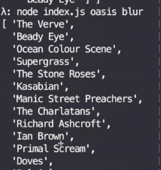

So we left off with two related lists of `artists`. When we call `oasis` and `blur` here, we get the list of `artists` related to `oasis` and the list of `artists` related to `blur`.

Now, we'd like to take this little piece here and expand it to the rest of our program, and really try to find the commonality between these two lists. We say we're going to combine this list with this list into a unique list.

```javascript
cosnt main = ([name1, name2]) =>
    Task.of(rels => rels2 => [rels1, rels2])
    .ap(related(name1))
    .ap(related(name2))
```

If we look at this a little closer, we could say if I have a list of `[1,2,3,4]`. This is Ben's. Then we have `[3,4,5]`. We want the same elements to cross, which would be `[3,4]`

There we go into the results. These would be the similar elements in both arrays just like `similarArtists` in these two arrays. What we're looking at here is actually set into section, which is very nicely expressed in **Semigroup**.

We can write ourselves a little `Intersection` Semigroup. We know the laws hold up front because of set theory. However, if you didn't, you could always check like we did before.

Let's go ahead and define this up here so it's out of the way. We have an `Intersection`. It takes an array. We have the `xs` and `concat`. We want to `concat` and just destructure and assign it to `ys` here. This is our basic template.

```javascript
const Intersection = xs => 
({
    xs,
    concat: ({xs: ys}) =>
})
```

We have to expose our `xs` to get it out of the other object there. Now, we can say if our `xs.filter` out, if we have any `x` that's included in the `ys` or some `y` is equal to `x`, then that will keep that `x`. This should work just fine. It should just go through the `xs` and find any `y` that matches.

```javascript
const Intersection = xs => 
({
    xs,
    concat: ({xs: ys}) =>
        Intersection(xs.filter(x => ys.some(y => x === y)))
})
```

There we go. We can hide a complexity in here, because this is the low level interface that most people won't look at. We could put `for` loops and make it really optimized, but we decided to just stick with simple functions here.

Let's go ahead and take the Semigroup and put it to use. What we have here is a bunch of names and a bunch of names in a list. Let pull this whole function into it's own little deal. We'll call it `artistIntersection` and it must be curried because of applicatives here.

```javascript
const artistIntersection = rels1 => rels2 =>
    [rels1, rels2]
const main = ([name1, name2]) =>
    Task.of(artistsIntersection)
    .ap(related(name1))
    .ap(related(name2))
```

What we want to do here is to take each of these, just pop them in an `Intersection`, and then `concat` that with the `Intersection` of the others. Once you combine two `Intersection`s, you get a third `Intersection`. We'll want to just pop them out with `.xs` off the `Intersection` here.

```javascript
const artistIntersection = rels1 => rels2 =>
    Intersection(rels1).concat(Intersection(rels2)).xs
```

Let's give this a shot and see if it works. There it is, our `Intersection` of these two lists here. That's terrific.



Let's see if we can if we can do it with `$ node index.js beatles hollies`. We get `[ 'The Byrds' ]`.

Now, let's see if we can expand this a little bit into three bands. Let's say if I want `Oasis`, `blur`, and `Radiohead`, I want the `Intersection` of all of those. In order to do this, let's get rid of this applicative work though.

Instead of three bands, let's just take as many as we want. We'll go ahead and bring in `List` from `immutable-ext`. We'll go ahead and `$ install immurable-ext --save`.

While that's going, we'll go over here. Let's rethink this. Instead of taking two `names` and using applicatives, let's go ahead and take in a `List` of `names`. We'll just pop that right into a `List`. Then, get rid of this. We'll just go ahead and, if we were to `map` over each name and get `related`, we would end up with a `List` of tasks.

```javascript
const {List} = require('immutable-ext')

...

const main = names =>
    List(names)
    .map(related)
```

We want to flip this around and make a `.traverse(Task.of, related)` there. Now, we have a task of `List`s. Then we simply `map` over that to get the `artistIntersection`. Of course, this is still in the curried applicative form here. We'll just take our `rels`.

```javascript
const artistIntersection = rels =>
    Intersection(rels1).concat(Intersection(rels2)).xs
```

Instead of using this Semigroup `concat`, we'll just go ahead and `foldMap` it. We'll take our `rels` and we'll `foldMap` `Intersection` of that and grab the `xs` out.

```javascript
const artistIntersection = rels =>
    rels.foldMap(Intersection).xs
    Intersection(rels1).concat(Intersection(rels2)).xs
```

Notice, I'm not using the empty value. If I put an `Intersection` of an empty `List` here to get the empty value start, this would not intersect with anything else. We're going to rely on the `Intersection` not being empty there, or these `rels` not being empty.

Let's see if this takes in these `names` and gets the `Intersection` of all three of these. We'll try `Oasis`, `blur`, and `Radiohead`. That's `[ 'Pulp' ]` apparently.

This a little strange just to get that out. Why don't we go ahead and do one last thing? We'll pull in a `Pair` and `Sum` from our little monoid `List` here. The reason we like to do this is so that we can try to cram more information in here while we `foldMap`.

```javascript
const {Pair, Sum} = require('./monoid')
```

Instead of just an `Intersection`, if we remember any `Pair` is also a Semigroup, let's go ahead and expand this little function here to put our `x` in there. We'll put this whole thing in a `Pair`.

```javascript
const artistIntersection = rels =>
    rels.foldMap(x => Pair(Intersection(x), Sum(x.length))).xs
```

Now that it's in a `Pair`, we could put the `Sum` in, as well, and take the `length` of the results. Now, we can see how many we're comparing while we get the `Intersection`. It all just works with this `foldMap` and interfaces. Of course, we're not getting another `Intersection` out, we don't have `xs` anymore. We get the `Pair` out here.

```javascript
const artistIntersection = rels =>
    rels.foldMap(x => Pair(Intersection(x), Sum(x.length)))
```

Let's go ahead and, after it's done, call `toList` on our `Pair` because there is a **natural transformation** from our `Pair` to a `List`. Let's go ahead and see if this does the trick. Run all three. There we go. We are comparing `60` and we end up with just `[ 'Pulp' ]` out of all those `60` values.

```javascript
const artistIntersection = rels =>
    rels.foldMap(x => Pair(Intersection(x), Sum(x.length)))
    .toList()
```

####Terminal Output
```
[ { xs: [ 'Pulp' ], concat: [Function: concat] }, Sum(60) ]
```

We can make this a little nicer just to finish this up. We could do a little...a `Pair` is a functor. We can actually call `bimap`, which is a bi-functor to run on both values. That way, we can say, "Here's two functions. Get me the `xs` off the first, and get me the `x` out of the second from the `Sum`."

```javascript
const artistIntersection = rels =>
    rels.foldMap(x => Pair(Intersection(x), Sum(x.length)))
    .bimap(x => x.xs, y => y.x)
    .toList()
```

That way, we have a nice little packaged up result, `[ [ 'Pulp' ], 60 ]`. If we maybe look at `oasis` and `beatles`, see if there's anything there, we got `40` but we got nothing.

Hope you found this useful. Off you go to go functional program in the real world.