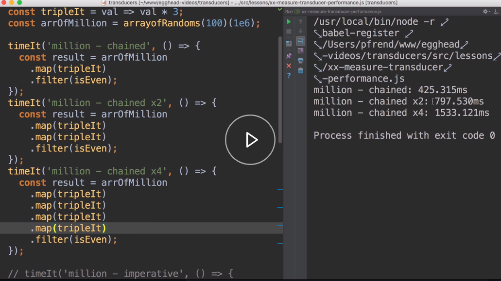
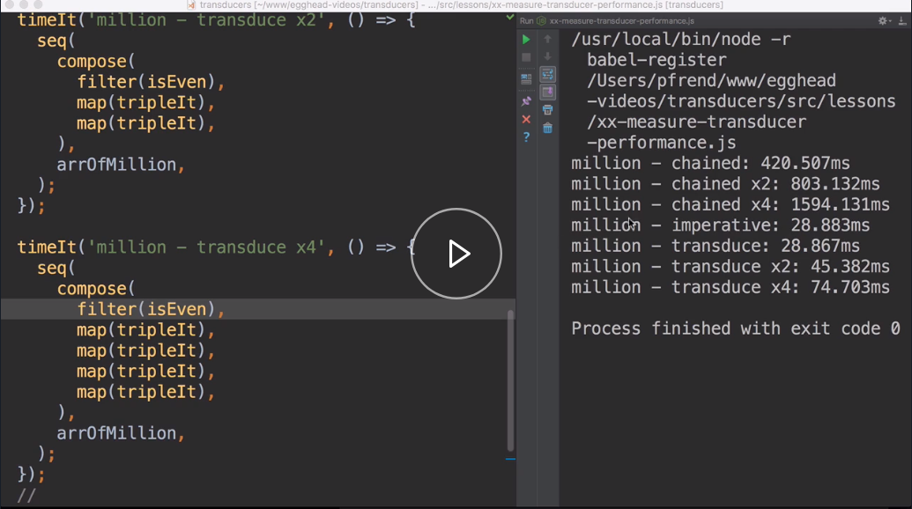
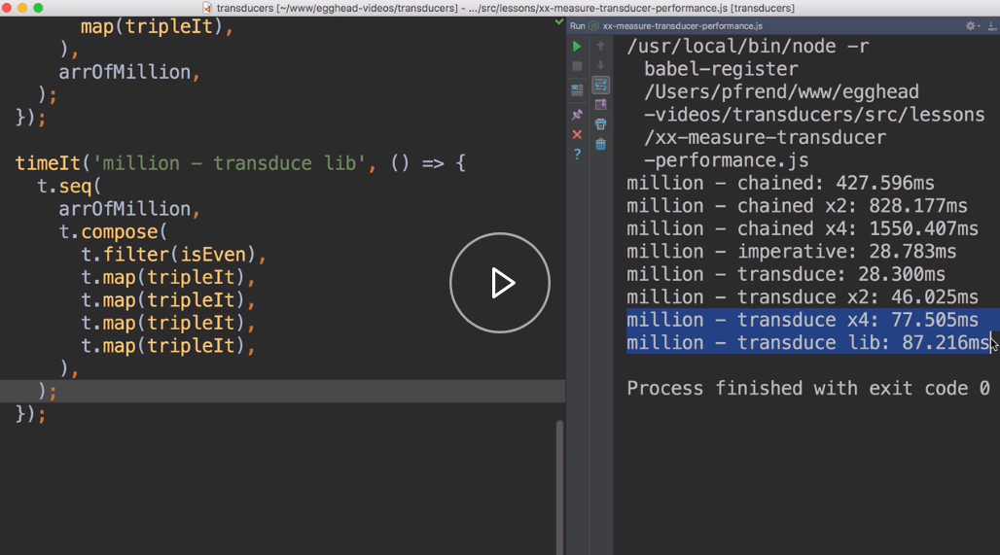

Let's begin by measuring the performance of some regular array operations using `map` and `filter`. We'll be doing all our operations on this `arrOfMillion`, which is an array of one million random numbers.

#### 12-measure-transducer-performance.js
```javascript
const arrOfMillion = arrayofRandoms(100)(1e6);
```

To begin with, we're just calling `map` and `filter` once. Then we're just doubling the amount of calls to `map` to get times two and times four down here. 

```javascript
timeIt('million - chained', () => {
  arrOfMillion
    .map(tripleIt)
    .filter(isEven);
});
timeIt('million - chained x2', () => {
  arrOfMillion
    .map(tripleIt)
    .map(tripleIt)
    .filter(isEven);
});
timeIt('million - chained x4', () => {
  arrOfMillion
    .map(tripleIt)
    .map(tripleIt)
    .map(tripleIt)
    .map(tripleIt)
    .filter(isEven);
});

```

Now, let's try and run this. If we analyze our results, we see that every time we double our calls to map, the final time pretty much close to doubles every time.



It scales linearly. Now, let's do the same operations, but with our new transducer helpers. We've got these stub timing methods down here, the first one being our imperative call, which just builds up the results a `forEach` loop.

```javascript
timeIt('million - imperative', () => {
  const result = [];
  arrOfMillion
    .forEach(val => {
      const tripled = tripleIt(val);
      if (isEven(tripled)) result.push(tripled);
    });
});
```

Then down here is where we'll fill out our transduce calls. Here, I'll do a call to `seq`. Just like we're above, I want this to be a combination of a `map` and a `filter`. I'll call `compose`, and we'll call `filter(isEven)`, and `map(tripleIt)`.

Our collection should be our `arrOfMillion`. 

```javascript
timeIt('million - transduce', () => {
 seq(
   compose(
     map(tripleIt),
     filter(isEven),
   ),
   arrOfMillion,
 );
});
```

Let's copy this. We'll paste that in down here, but double the calls to `map`, and do the same thing one last time. We want four calls here. 

```javascript
timeIt('million - transduce x2', () => {
  seq(
    compose(
      map(tripleIt),
      map(tripleIt),
      filter(isEven),
    ),
    arrOfMillion,
  );
});

timeIt('million - transduce x4', () => {
  seq(
    compose(
      map(tripleIt),
      map(tripleIt),
      map(tripleIt),
      map(tripleIt),
      filter(isEven),
    ),
    arrOfMillion,
  );
});
```

Now, let's measure this again.



To begin with, we see that our transduced call is pretty much exactly the same as our imperative call. All of our operations are now composed cleanly, and we can reuse them however we want. As we increase our calls to `map`, we see that these times are also much lower.

Transducing with four calls to map is taking 74 milliseconds, compared with 1.6 seconds. Now, let's also do the same thing, but the transducers JS library. I'll uncomment this, and let's copy our call.

```javascript
timeIt('million - transduce lib', () => {
 seq(
    compose(
      map(tripleIt),
      map(tripleIt),
      map(tripleIt),
      map(tripleIt),
      filter(isEven),
    ),
    arrOfMillion,
  );
});
```

If we go to the top of the document, we're importing `t` from `transducers.js`. Now, the API of `transducers.js` is very similar to what we've built. `t` exposes lots of methods. To avoid name conflicts, we'll just access all of these methods of the `t` object.

I'll go `t.sequence`, `t.compose`, `t.filter`, and `t.map`. The only other difference is that this collection needs to be the first argument. Let's put that up here, and that should be it. 

```javascript
timeIt('million - transduce lib', () => {
  t.seq(
    arrOfMillion,
    t.compose(
      t.map(tripleIt),
      t.map(tripleIt),
      t.map(tripleIt),
      t.map(tripleIt),
      t.filter(isEven),
    ),
  );
});
```

Let's run it again. If we look at the results, we can see it performs very similar to our implementation.

