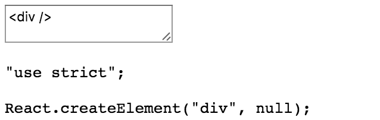
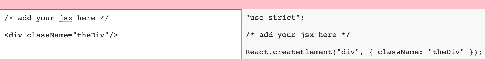

In this lesson, we're going to create an in-browser **JSX** transpiler. Here, in our `index.html` of our `create-react-app` application, I'm bringing in the standalone version of `Babel`.


Here, in our code, we've got a simple component that says returning a `<div>`. We're going to add to that a `<header>`. This is where we're going to place our error, if we have one. That's going to come from our state. We're going to have a `<div>` with a `className="container`. We'll be styling that in just a moment.

We're going to have a `<textarea>`. This guy is going to have an `onChange` event `this.update`, and we'll `bind` that to the context of `this`. We're going to have a `defaultValue={this.state.input}`. That's going to be for the code that we're typing that we want to transpile.
#### App.js
``` javascript
class App extends React.Component{
  render(){
    return (
      <div>
        <header>{this.state.err}</header>
        <div className="container">
          <textarea
          onCange={this.update.bind(this)}
          defaultValue={this.state.input}/>
          <pre>
            {this.state.output}
          </pre>
        </div>
      </div>
    )
  }
}
```
Next to that, we're going to have a `<pre>` tag. Its content is going to be for the `output`. We'll get that from `this.state.output`.

Let's go ahead and set up our state. Create a `constructor` called `super()` to get our context. We're going to say `this.state` equals first, we're going to have our `input`.

We're going to go and set that to a default of, `/*Add your JSX here*/`. We'll have our `output`. That will just be an empty string, and it will have our `err`. That will also be an empty string. 

``` javascript
constructor() {
  super();
  this.state = {
    input: '/* add your jsx here */'
    output: '',
    err: ''
  }
}
```
Let's go ahead and create our `update` method. This is going to take in an event off of our text area. We're going to say `let code = e.target.value`. We're going to throw the rest of this in a `try/catch` block.

``` javascript
update(e) {
  let code = e.target.value;
  try{

  }
  catch(err){

  }
}
```

What we're going to try to do is set our state of `output` to `window.babel`. We're accessing that library that we're bringing in over CDN. We're going to call its `transform` method. Into that, we're going to pass our code.

I'm going to break this up a little bit, so we can see it a little better. Along with our code, we need to pass our options. What we need is the `presets`, which is an array.

Into that, we're going to say, `es2015` and `react`. From the result of that, we need code. What we're doing is we're saying `window.babel` transform our code using these presets, and then give us that code back.

``` javascript
try {
  this.setState({
    output: window.Babel
    .transform(code, { presets: ['es2015', 'react']})
    .code,
    err: ''
  })
}
catch(err){
  this.setState({err: err.message})
}
```
Assuming that doesn't fail, we're going to set our error to empty string. If it does fail, we're going to set our error to `error.message`.

Let's go ahead and save that. See if we messed anything up. It's going to be a little hard to see here before we style it. I'm going to go ahead and create a `<div>`, close it. It looks like everything is working.



Now, we need to create our style. Right here in source, I'm going to create a new file, `app.css`. We're going to `import` that into our component right here. After we import our React package, we're going to say `import 'App.css'`, and we'll go ahead and start setting that up.

On our `body`, we're going to have a `margin` of zero, a `padding` of zero. We're going to try to set everything up to be a `font-family` of `monospace`.

Our `header`, which is going to house our error, I'm going to say `display: block` on that guy, give it a `height` of five viewport height units. Just in case our errors get long, we're going to say `overflow: auto`. Give that a `background-color`. I'm going to go with pink. We're going to give it a bit of color. Since it's an error, we'll make that red.
### App.css
``` css
body {
  margin: 0;
  padding: 0;
  font-family: monospace;
}

header {
  display: block;
  height: 5vh;
  overflow: auto;
  background-color: pink;
  color: red;
  font-size: 28px;
}
```
I'm going to set up a `font-size` of 28 pixels. We can see that there in the browser.

Now, on our `container`, which holds our `<textarea>` and our `<pre>`, we're going to have that take up the remaining viewport `height`, and we're going to set that to `display` with `flex`. We've got our `<pre>`, which is going to house our output. That's going to be the element down the right below the header. We're going to give that a light grey background, so we'll do F8.

``` css
.container {
  height: 95vh;
  display: flex;
}

pre {
  background-color: #f8f8f8;
}
```
For our `pre` and our `textarea`, give each of those a `width` of 50 percent. Use that `monospace` family. We'll have the `font-size` match the `<header>` size, so 28 pixels.

Give that a `margin` of zero, a `padding` of ten, and `color` of something blackish. That's starting to come together.

``` css
pre, textarea {
  width: 50%;
  font-family: monospace;
  font-size: 28px;
  margin: 0;
  padding: 10px;
  color: #222;
}

textarea:focus {outline: 0}
```
In OS X, we're going to get this outline here. Let's go ahead and get rid of that. We'll say `textarea:focus {outline: 0}`. Let's blow this up. If we start typing here, let's say starting off our `<div>`, we haven't enclosed it. We are getting an error message.

If I close that, we get a `react.create` element over on the right. Let's try a class name really quick. This seems to be working just fine.


