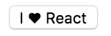

In order to access nested values or components in a component, we can use `props.children`. To illustrate this, I'm going to have my `App` component return a new component called `<Button>`, and inside of the opening and closing tags for that component, I'm going to type the word `React`.
#### App.js
``` javascript
import React from 'react';
class App extends React.Component {
  render(){
    return <Button>React</Button>
  }
}

export default App
```
That's the value we're trying to get at, `React`. We're going to create our **stateless function component** called `Button`, it's going to take in `props` and simply going to return an actual HTML button. To get at that value of react, which is nested in between our opening and closing tags, we're going to use `props.children`.

``` javascript
const Button = (props) => <button>{props.children}</button>
```
We're going to save that and there in the browser, we can see that we've created an HTML `<button>`, and we've allowed that in our HTML, or text content of react to pass through.

I also said we could access nested components, this time around, I'm going to create a `class` component, for no other reason other than to illustrate it a little bit differently.

I'm going to call this one my `Heart` component. It's going to return a `<span>`, and right here inside of that `<span>`, I'm going to drop the HTML entity for a heart symbol.

``` javascript
class Heart extends React.Component {
  render(){
    return <span>&hearts;</span>
  }
}
```

We're going to jump up here, back to our `App` component, and inside of the opening and closing `<Button>` tags, I'm going to say `I`, we're going to drop in our nested component, which is going to be our `Heart` component.

``` javascript
render(){
  return <Button>I <Heart /> React</Button>
}
```

We're going to save that, and we can see that using `props.children` allowed both the text values, as well as the nested component to flow on through into our HTML button.

