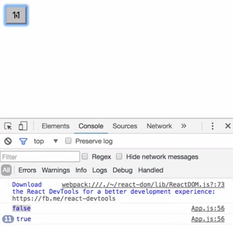
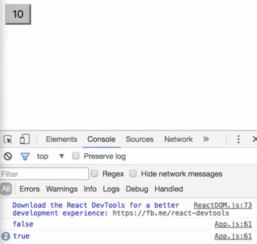
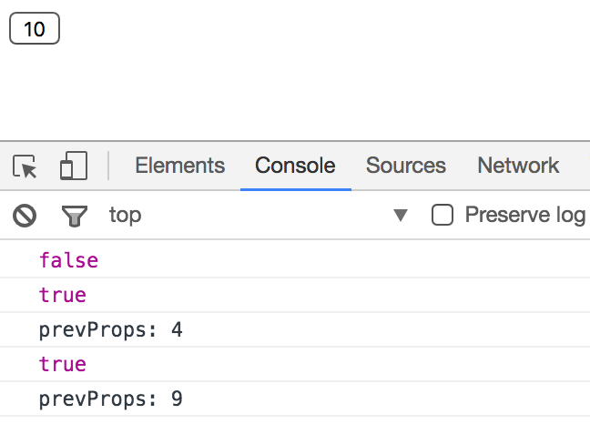

In this lesson, we're going to talk about the updating lifecycle methods that are available to us in our components.

To get us started, I'm going to return a `<button>`. It's going to have an `onClick` handler of `this.update.bind.(this)`. It's inner html is going to be `this.props.val`. We're going to get that `val` from `defaultProps`. I'm going to say `app.defaultProps` equals, we'll set our `val` to `0`.
#### App.js
``` javascript
import React from 'react';
import ReactDOM from 'react-dom';

class App extends React.Component {
  return (
    <button onClick={this.update.bind(this)}>
      {this.props.val}
    </button>
  )
}

App.defaultProps = {val: 0}

export default App
```
We're going to go ahead and create this `update` method. We're going to get a little tricky with this one. We're actually going to rerender our entire component.

``` javascript
update() {
  ReactDOM.render(
    <App val={this.props.val+1} />, 
    document.getElementById('root'))
}
```
I'm going to say `ReactDOM.render(<App />)`. I'm going to target the same `<div>` that we're targeting `index.js`. Here, we're going to say `val` equals, and we're going to say `this.props.val+1`. Every time we render it, we're going to increment by one that value of `val`. If we save that and try it out, each time we click on this, it get incremented by one because of its new props.

I'm going to add to this some `state`. I'm going to set up our `constructor`. We'll call `super()` to get our context. I'm going to set the `state` to equal. We're going to have a value here for `increasing`. I'm going to set that to `false`. What we want to do is determine if the new prop that's coming in of `val` is `increasing` from the previous prop or not.

``` javascript
constructor() {
  super();
  this.state = {increasing: false}
}
```
The first updating lifecycle method we can look at is `componentWillReceiveProps`. This means that new properties are coming in. We get access to those `props` right here, with this variable, `nextProp`. What we're going to do is we're going to set our `state` of `increasing` to `nextProps.val > this.props.val`.

``` javascript
componentWillReceiveProps(nextProps){
  this.setState({increasing: nextProps.val > this.props.val})
}
render(){
  console.log(this.state.increasing)
  return (
    ...
  )
}
```
Then here, in our `render` method, we'll simply `console.log(this.state.increasing)`. The first time through, that should not be `true`. Each subsequent rerender it should be `true`.

We'll save that and open up our dev tools. Here's the first firing. We'll click on this guy, and from here on out, it's going to be `true`, because we're constantly increasing that value.



The next updating phase we can look at is `shouldComponentUpdate`. This is going to take in our `nextProps`, as well as our `nextState`. What I'm going to do here is say if the `nextProps` not `val` is a multiple of five, then, we'll go ahead and update it.

``` javascript
shouldComponentUpdate(nextProps, nextState) {
  return nextProps.val % 5 === 0;
}
```
Here, it's simply returning a `true` or `false`. It's important to note that this doesn't prevent our `state`, and of course, not our `props`, from being updated. **It simply prevents a rerender.** If I save that, two, three, four five, we get our update, one, two, three, four, five, we get our update. Again, the `state` has actually been changed.



The last one we can take a look at is `componentDidUpdate`, which takes in our `prevProps`, as well as our `previousState`. Here, we'll just log out `prevProps`, and the actual `prevProps`. Here in the browser, we'll click one, two, three, four, five. Whoops.

``` javascript
componentDidUpdate(prevProps, prevState) {
  console.log(`prevProps: ${prevProps.val}`)
}
``` 

Let's go ahead and get the `val` off of that guy. `prevProps.val`. One, two, three, four, five. We can see our previous prop was `4`, that indicates that our `state` is actually being updated while our props are actually being updated. We can see from our `state` we've got `true`, and our prop is now `4`. If we go one, two, three, four, five, we get nine.


