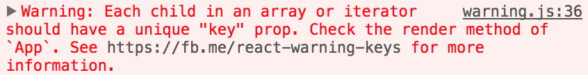
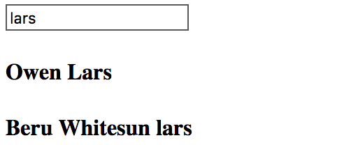

In this lesson, we're going to talk about iterating over a data set in order to create our JSX. Right here in our `render` method, right before our `return` statement, I'm going to say `let items = this.state.items`. That's going to set that data up.

We're going to set up our `constructor`, where we'll call `super()` to get our context. We're going to say `this.state = {items: []}`, and we'll set that to an array. Now to get that data, we're going to use `fetch` to make an AJAX call to the Star Wars API. We'll just hit up the people endpoint there.

#### App.js
``` javascript
import React from 'react';

class App extends React.Component {
  constructor() {
    super();
    this.state = {items: []}
  }
  componentWillMount(){
    fetch('http://swapi.co/api/people/?format=json')
      .then( response => response.json() )
      .then( data => {})
  }
  render(){
    let items = this.state.items
    return (
      <div>
      
      </div>
    )
  }
}

export default App
```
If you're not familiar with that, it's just this open source API that returns a bunch of data about Star Wars. When we get that data back, we're going to get `results` off of that. We're going to call it `items`, and then, we'll just set our state of `items` to that value.

``` javascript
componentWillMount(){
    fetch('http://swapi.co/api/people/?format=json')
      .then( response => response.json() )
      .then( ({results: items}) => this.setState({items}))
  }
```
Now that we've got that here in a `render` method, we can simply interpolate `items.map`. We can just map over those guys -- it's an array -- which will give us our item. We can just return something simple, like an `<h4>`.

``` javascript
render(){
  let items = this.state.items
  return (
    <div>
      {items.map(item => <h4>{item.name}</h4>)}
    </div>
  )
}
```
Inside that guy, say `item.name`, which is a value that we know we're going to get off of that. Save that, and we can see we've got our names coming in, but we've also got this warning down here that says `each child in an array or iterator should have a unique key prop`.



All that's saying is right here in our `<h4>`, we need a key prop that is equal to something unique. Now, we could use the index off of the iterator here. However, that's not going to be as performant as something completely unique to the record. Since, in this case, I don't have an ID, I'm going to use `item.name`. I'm going to save that. 

``` javascript
    <div>
      {items.map(item => 
        <h4 key={item.name}>{item.name}</h4>)}
    </div>
```
We get our data, and our warning is gone. Now we could have just as easily created a separate component for this. Let's say we've got one here called `Person`. It takes in its props. It's going to return the same `<h4>` with `props.person.name`.

``` javascript
const Person = (props) => <h4>{props.person.name}</h4>
```
Come up here, and rather than returning the `<h4>`, we're going to return a `Person` component. We'll say `Person={item}`. Save that, and now again, we've got our data, but we're back to the same error. Now in this case, it's not telling us that the key is needed on the `<h4>`, because in the context of this component, the `<h4>` has no siblings.

The `key` is needed amongst siblings. Here on the `Person` component, we're going to say `key={item.name}`. Save that, and everything is working fine.

``` javascript
<div>
  {items.map(item => 
    <Person key={item.name} person={item} />)}
</div>
```
If we wanted to get a look at how we can further use this JSX generation from a data set, let's say if `this.state.filter` -- we'll need to create that -- but if we have a `filter`, we'll say `items = items.filter`.

``` javascript
if(this.state.filter){
  items = items.filter( item =>
  item.name.toLowerCase()
    .includes(this.state.filter.toLowerCase()))
}
```
That'll give us our `item`. Then, we'll say if the `item.name.toLowerCase` includes `this.state.filter`, also `toLowerCase`, then, we'll have our filtered item. Let's go ahead and set up a quick `filter` method. This is just going to take an event off of an input. We're going to set our state of `filter` equal to `e.target.value`.

``` javascript
filter(e){
  this.setState({filter: e.target.value})
}
```
That'll just be the result of an `<input>` field. We'll just set that right here. Input, and on its `onChange` event, we'll say `this.filter`. We'll `bind` that to `this`. Save that. We've got our data. We've got our input field here. If I type L, we're going to get all the names with L. If I type C, we're going to get C3PO. V, we're going to get Darth Vader.


