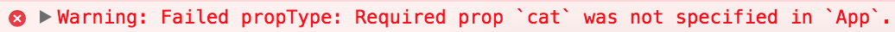

We can pass data into our components by using what's called **props**. Here, I've created a prop called `txt`. This looks a lot like passing an attribute into an html element. I'm going to set that to a string of, `This is the prop text`.
#### index.js
``` javascript
import React from 'react';
import ReactDOM from 'react-dom';
import App from './App';

ReactDOM.render(
  <App txt="this is the prop text" />
  document.getElementById('root');
);
```
In our component, we can access our props by interpolating with curly brackets, `this.props`, and then, the name of the prop that we're looking for. In our case, it's `txt`. 
#### App.js
``` javascript
import React from 'react';

class App extends React.Component {
  render(){
    return <h1>{this.props.txt}</h1>
  }
}
export default App
```
Save that and we can see, `This is the prop text`. Now, outside of JSX, we don't need to interpolate that, so, I can say, `let txt = this.props.txt`, and then in our JSX, I can just use that variable name `txt`.

``` javascript
class App extends React.Component {
  render(){
    let txt = this.props.txt
    return <h1>{txt}</h1>
  }
}
```
Just so we can see that change in the browser, I'm going to update our value to, `This is the prop value`, and we can see that there in our browser. Now, we can define the properties that we're going to be looking for in our component by adding a property to our component called `PropTypes`.

This is going to be an object where each key is the name of the property, and each key's value is the type of value that we're looking for. If we're `txt`, I can say I'm looking for `React.PropTypes.string`. I'm going to create one more here which can be called `cat`. I'm going to say `React.PropTypes.number` is what we're looking for. In this case, we're looking for a number. I can save that. Everything's going to work just fine.

``` javascript
class App extends React.Component { ... }

App.PropTypes = {
  txt: React.PropTypes.string,
  cat: React.PropTypes.number
}
```
However, on each of these `PropTypes`, we can add an `isRequired` to it. When I save that, everything's going to work fine, but we can see here in the console that `the prop cat is marked as required in 'App', but its value is 'undefined'`.



If I jump back over to our component usage, and say, `cat` equals, we'll set that to five, everything's working again. We're not getting that error. 
#### index.js
``` javascript
ReactDOM.render(
  <App cat={5} txt="this is the prop value" />
  document.getElementById('root')
);
```
We can also set a series of default properties by adding a property to our component called `defaultProps`.

Again, this is going to be an object where each key is the property. I'm going to set our default for `txt` to, `This is the default text`. I'm going to save that. What we're going to see is that the value that was passed into our component actually overwrites the default.
#### App.js
``` javascript
class App extends React.Component { ... }

App.PropTypes = { ... }

App.defaultProps = {
  txt: "this is the default txt"
}
```
Once I clear that out, we get our, "This is the default text," which is the default property that we set for our component.