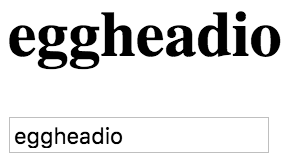

Important feature of React is the fact **a React component can output or render other React components**. We've got a very simple component here. It has a `state` with a value of `txt`. It's got an `update` method which is going to update that value of text from an event.
#### App.js
``` javascript
import React from 'react';

class App extends React.Component {
  constructor(){
    super();
    this.state = {
      txt: 'this is the state text'
    }
  }
  update(e){
    this.setState({txt: e.target.value})
  }
  render(){
    return (
      <div>
        <h1>{this.state.txt}</h1>
        <input type="text"
          onChange={this.update.bind(this)} />
      </div>
    )
  }
}
```
In our JSX, we're outputting our `state.text` value. We're also outputting an `<input>` and its `onChange` event is tied to our `update` event. I'm going to save that. We're going to try it out in the browser. Anything I type here is going to update the `state.text`.



What we're going to do is we're going to create a new component. This is going to be a stateless function component. We're going to call it `Widget`. It's going to take in `props`. We're going to return this input JSX right here. We're just going to drop that down there, get this guy into one line.

``` javascript
class App extends React.Component {

  ...

  render(){
    return (
      <div>
        <h1>{this.state.txt}</h1>
        <Widget update={this.update.bind(this)} />
      </div>
    )
  }
}

const Widget = (props) => 
  <input type="text" onChange={this.update.bind(this)} />
```
Here where we had our input, we're going to go ahead and render a `Widget` component. We can self-close that. We're just going to have an `update` prop and into that we're going to pass `this.update.bind(this)`.

Now, down here, where we had `this.update.bind(this)`, we're going to go ahead and just say `props.update`, since it's passed in as a prop and we don't need the binding. 

``` javascript
const Widget = (props) => 
  <input type="text" onChange={props.update} />
```
We'll save that. Here in the browser when we type, our child component is updating the state of our parent component.

This also means that we could have a few of these guys on the page and every time we type in one of them, it'll update the value in our parent component.

``` javascript
render(){
    return (
      <div>
        <h1>{this.state.txt}</h1>
        <Widget update={this.update.bind(this)} />
        <Widget update={this.update.bind(this)} />
        <Widget update={this.update.bind(this)} />
      </div>
    )
  }
```