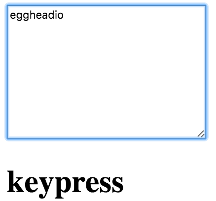

In this lesson, we're going to take a look at **React Synthetic Event System**, which normalizes all the events we might want to use across various browsers.

I'm setting up a simple `textarea` here. I'm going to keep the `cols` and the `rows`. We're not going to worry about the rest. We'll self-close this guy. Right after that, we're going to have an `<h1>`. Its content is going to be `this.state.currentEvent`.
#### App.js
``` javascript
import React from 'react';

 class App extends React.Component {
   render(){
     return (
       <div>
        <textarea 
          cols="30" 
          rows="10"/>
        <h1>{this.state.currentEvent}</h1>
       </div>
     )
   }
 }
```
Let's go ahead and set up our initial state in our `constructor`. We'll call `super()` to get our context. We'll say `this.state` is equal to `currentEvent`. We'll just set that up with a few dashes. We're also going to have an `update` method. I'm going to go ahead and bind that here to a context of `this`.

``` javascript
 class App extends React.Component {
   constructor(){
     super();
     this.state = {currentEvent: '---'}
     this.update = this.update.bind(this)
   }
   render(){
     ...
   }
 }
```
We're going to create that method. Now it's going to take in an event off of that `<textarea>`. We're simply going to set our `state` of `currentEvent` to that event `type`.

``` javascript
 class App extends React.Component {
   constructor(){
     ...
   }
   update(e){
     this.setState({currentEvent: e.type})
   }
   render(){
     ...
   }
 }
```
We get all the standard key press events. I'm going to go ahead and assign on key press to `this.update`. Try that out in the browser. 

``` javascript
<textarea 
  onKeyPress={this.update}
  cols="30" 
  rows="10"/>
```
Once we get up there, as soon as we type a key, we get key press. We get all the standard ones, key down, key up and so forth. Let's try a couple more complicated ones.



We've got `onCopy`, `onCut` and `onPaste`. I'm going to go ahead and save that. Type some code in here. When we copy, we get our copy event. When we cut, we get our cut event. When we paste, we get our paste event. We can do that with the keyboard shortcuts as well. Here's a copy, here's a cut, and here's a paste.

``` javascript
<textarea 
  onKeyPress={this.update}
  onCopy={this.update}
  onCut={this.update}
  onPaste={this.update}
  onFocus={this.update}
  onBlur={this.update}
  cols="30" 
  rows="10"/>
```
We get our standard `onfocus` and `onblur` events. When we focus on the field, we get our focus, and when we move away we get our blur, so focus and blur. We get the whole series of mouse events, so `mouseOver`, `mouseDown` and up.

We also get some more obscure ones. This will be `onDoubleClick`. When we click in the text area, we're going to get our focus. If I double-click, we get our double-click event. Do that one more time. Double-click and there is our double-click event.


We also automatically get a series of touch events. I'm going to say `onTouchStart`, `onTouchMove`, and `onTouchEnd`. For this one, we're going to switch over to an iPad emulator. Bring this out a bit.

``` javascript
<textarea 
  onKeyPress={this.update}
  onCopy={this.update}
  onCut={this.update}
  onPaste={this.update}
  onFocus={this.update}
  onBlur={this.update}
  onDoubleClick={this.update}
  onTouchStart={this.update}
  onTouchMove={this.update}
  onTouchEnd={this.update}
  cols="30" 
  rows="10"/>
```
Here is our text field. If I touch right there, you'll see I've got a touch start. I'm moving, I get touch move. I get touch end. I'll do that one more time. Touch start, touch move and touch end.