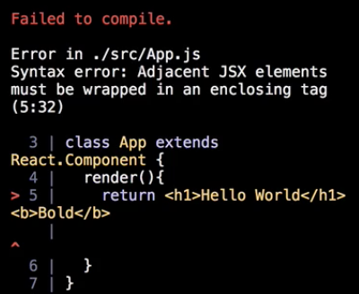

The render method of our React component is only allowed to return a single node. To illustrate that, right here after the `<h1>`, I'm going to create a second node. It's a `<b>` tag with an inner HTML of bold. 
#### App.js
``` JavaScript
import React from 'react';

class App extends React.Component {
  render(){
    return <h1>Hello World</h1> <b>Bold</b>
  }
}
```
We can see we do in fact get an error here. `Adjacent JSX elements must be wrapped in an enclosing tag`.



The reason this doesn't work is it's the equivalent of trying to return a function followed by another function. That function is `React.createElement`. It'd be like trying to `return React.createElement` followed by `React.createElement`, and that's not going to translate well to JavaScript.

``` JavaScript
render(){
   // return <h1>Hello World</h1> <b>Bold</b>
   return React.createElement('', , ) React.createElement('', , )
  }
```
The way that we solved this is by wrapping our nodes in a parent node. I'm just going to create a `<div>` here. I'm going to wrap these guys, our `<h1>` and our `<b>` tag, in that `<div>`.

``` JavaScript
render(){
    return (
      <div>
        <h1>Hello World</h1> 
        <b>Bold</b>
      </div>
    ) 
  }
```
Let me just clean this up a little bit, save that, and we can see on the right everything is working as expected.

You'll notice I am wrapping my JSX in parentheses. I can go ahead and get rid of those. Everything will work fine if I bring the first line of our JSX up to the same line as the return statement.

``` JavaScript
render(){
    return <div>
        <h1>Hello World</h1> 
        <b>Bold</b>
      </div>
  }
```
That's going to work just fine, but as soon as I put it onto the next line, it is in fact going to break. I just as a preference, not a requirement, wrap my JSX in parentheses just so that I can utilize all the white space.