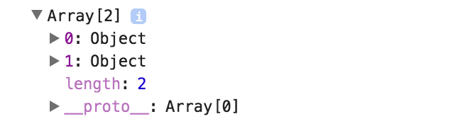

In a number of situations, you may want to iterate over the children of your components. To illustrate that, I'm going to say `let items = this.props.children`. I'm going to `map` over those. I'm going to take in a `child` and return the same `child`. We'll log out our `items`.
#### App.js
``` javascript
class App extends React.Component {
  render(){
    return (
      <Parent>
        <div className="childA"></div>
        <div className="childB"></div>
      </Parent>
    )
  }
}

class Parent extends React.Component {
  render(){
    let items = this.props.children.map(child => child)
    console.log(items)
    return null
  }
}
```
In this case, in our `Parent` component, which we're rendering in our `App` component, we have two children, each a `<div>`, one with a `className` of `childA`, and another with a `className` of `childB`. We're expecting those to be represented in this `items` variable. We do in fact see that. We've got an array with two objects representing each of children.

However, if we remove the second child and try to rerun the same code, we're going to get an error that says, `Map is not a function of props.children`. If we log out `this.props.children` before we call a `map` method, we're going to see that our children in this case is actually a single object.

To solve that, React provides us with `React.Children` and a number of methods that we can attach to that. `map` is in fact one of them. Here we will say `map`. This is going to take two arguments instead of just the mapping function.

``` javascript
class Parent extends React.Component {
  render(){
    let items = React.Children
      .map(this.props.children, child => child)
    console.log(items)
    return null
  }
}
```
The first argument is going to be the actual children, then the following will be a mapping function. We'll save that. Even with one child, we do get an array with a single object. In this particular case with mapping, and the fact that I'm simply returning the component, we can actually call `React.Children.toArray`, pass in our `props.children`. Assign that to `items`.

``` javascript
render(){
  let items = React.Children.toArray(this.props.children)
  console.log(items)
  return null
}
```
We'll get the exact same result, with one or more children. There it is with two, and we get that right there. 



In addition to `map` and `toArray`, we also have a standard `forEach`, same signature. In this case, let's log something out since this won't return an array.

``` javascript
render(){
  let items = React.Children
    .forEach(this.props.children, child => console.log(child.props.className))
}
```
We'll say `child.props.classname`, save that. We should see `childA` and `childB`, and we do.

Another method that we have is `React.children.only`. This is going to return a single child. If it's more than one child, it will throw an error. Let's assign that to items. I'm expecting an error, which we did get, because we have more than one child. We're going to delete the second child, and now we've got a single child.

``` javascript
let items = React.Children.only(this.props.children)
console.log(items)
return null
```