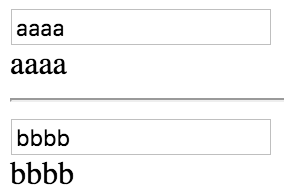

**Refs** are a way for us to reference a node, or an instance of a component in our application. To get us started here, I'm creating a component that outputs a single input field. It's going to have an `onChange` event equal to `this.update.bind` to `this`. Right after, we're going to put out a bit of state, it's going to be `this.state.a`.
#### App.js
``` javascript
import React from 'react';

class App extends React.Component {
  render(){
    return (
      <div>
        <input
          type="text"
          onChange={this.update.bind(this)}
        /> {this.state.a}
      </div>
    )
  }
}

export default App
```
We're going to go ahead and setup a `constructor`, we can create our initial state. We are going to call `super()` to get our context, and we're going to set `this.state` equal to an object with a key of `a`, which is equal to an empty string. I'm going to go ahead and create our `update` method.

We're going to follow a familiar pattern here, we're just going to take an event off of the `<input>` field, and we're going to call `this.setState` or a equal to the event `e.target.value`. 

``` javascript
class App extends React.Component {
  constructor(){
    super();
    this.state = {a: ''}
  }
  update(e){
    this.setState({a: e.target.value})
  }
  render(){ ... }
}
```
It's going to be the value from our input field. We're going to save that, try it out in the browser, everything's going to work as expected when we type in the `<input>` field, it updates our `state`.

Let's go ahead and say we wanted to have two of these guys, and drop in a `<hr>` just to break these up. On this one, we want it to update a state of `b`. Now, this isn't going to work with the existing pattern that we have in place, but we're just going to try it, we can see what happens. We're going to update our `b` with that value, as well.

``` javascript
class App extends React.Component {
  constructor(){
    super();
    this.state = {a: '', b: ''}
  }
  update(e){
    this.setState({
      a: e.target.value,
      b: e.target.value
    })
  }
  render(){ return (
      <div>
        <input
          type="text"
          onChange={this.update.bind(this)}
        /> {this.state.a}
        <hr />
        <input
          type="text"
          onChange={this.update.bind(this)}
        /> {this.state.b}
      </div>
    ) 
  }
}
```
Now, when we type in the first field, the `a` field, it's updating both our `a` and our `b` state. Likewise, if we type in the `b` field, it's going to update our `a` and our `b` state. That's because we haven't differentiated between these two inputs.


We can use a `ref` for that. On this guy, I'm going to say `ref="a"`, and on the second field, I'm going to say `ref="b"`, and that gives us a reference to each of these. I'm going to go ahead and kill off the event in our update method, and I'm going to set `a` to `this.refs.a.value`.

``` javascript
update(){
    this.setState({
      a: this.refs.a.value,
      b: this.refs.b.value
    })
  }
  render(){ return (
      <div>
        <input
          ref="a"
          type="text"
          onChange={this.update.bind(this)}
        /> {this.state.a}
        <hr />
        <input
          ref="b"
          type="text"
          onChange={this.update.bind(this)}
        /> {this.state.b}
      </div>
    ) 
  }
```
`ref` actually returns the node that we're referencing, here, I can say `this.refs.b.value`. Now, in the browser, when I type in the a field, it's updating our a state. When I type in the `b` field, it's updating our `b` state. The `ref` attribute or prop can also take a callback.



Like I said before, it's returning the node or component that we're referencing, we get the `node`, we could take that, and here in our callback method, we could say `this.a` is equal to the `node`, and now for `a`, we can just call it, `this.a`. We get back that node, we can use the DOM method of value. Save that, and everything works as expected.

``` javascript
update(){
    this.setState({
      a: this.a.value,
      b: this.refs.b.value
    })
  }
  render(){ 
    return (
      <div>
        <input
          ref={node => this.a = node}
          type="text"
          onChange={this.update.bind(this)}
        /> {this.state.a}
     
     ...

    ) 
  }
```
We can also reference an instance of another component, here, let's create a quick component. We're going to call it `Input`, we're going to return an `<input>`, and on this, we'll just have an `onChange` equal to `this.props.Update`.

``` javascript
class Input extends React.Component {
  render(){
    return <input type="text" onChange={this.props.update} />
  }
}
```
Up here, we're going to change this `a` input or input component, and now, since we're referencing a component, this is better represented by `component` rather than `node`. We'll say `component` there, and then, we're going to pass in this `update`, we don't need the `type`.

``` javascript
<Input
  ref={ component => this.a = component}
  update={this.update.bind(this)}
/>  {this.state.a}
```
Now, It's going to run that, and we're going to see that it's not exactly going to work. The `b` component is still working just fine, but here, `a` is no longer `a` node, it's now a component.

One way we can get at that, is by bringing in `ReactDOM`, and then, wrapping `this.a` in `ReactDOM.findDOMNode(this.a)`, which is our component, and then, get the `value` off of that. 

``` javascript
update(){
  this.setState({
    a: ReactDOM.findDOMNode(this.a).value,
    b: this.refs.b.value
  })
}
```
Now, if we type in, here we get that value. The reason we're going to getting away with that is that, we are returning a single node here.

When we get that component back, and we do `findDOMNode` on it, there's just one `DOMNode` there. But if we wrap this guy in a `<div>`, that `findDOMNode` call is referencing the `<div>` now, which has no value. One thing we could do, is put a `ref` on this guy, we'll call it `input`.

``` javascript
class Input extends React.Component {
  render(){
    return <div><input ref="input" type="text" onChange={this.props.update} /></div>
  }
}
```
Now, what we could do is, we can actually strip this back down, get rid of the `ReactDOM` find node part, and we could say, `this.a` which is our component.ref, we're getting the `refs` of our a component `input`, which is going to be that input field, and get its `value`.

``` javascript
update() {
  this.setState({
    a: this.a.refs.input.value,
    b: this.refs.b.value
  })
}
```
We save that, we type in our `a` field, we get our a. We type in our `b`  field, we get our b.