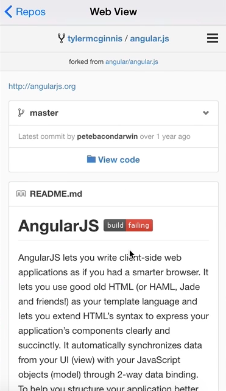

We want to make it so when someone comes to the repos page, if they click on one of the names of the repository, we want them to be taken to a web view to see GitHub's URL.

Notice we have this `onPress` handler set up inside of `Repositories.js`, but we're not really doing anything with it yet. Let's change that. We're going to navigate to a new route.

The component we're going to use is one we haven't made yet, but we will make it. We're going to name it `component: Web_View`, the `title:` is just going to be `'Web View'`. Then what we're going to `passProps` is this `{url}` which we're getting when we invoke the `openPage` function, which is coming in on the `onPress`.

####Repositories
```javascript
class Repositories extends react.Component{
    openPage(url{
        this.props.navigator.push({
            component: Web_View,
            title: 'Web View',
            passProps: {url}
            })
        })
    ...
}
```

Now, what we need to do is go and define what this `Web_View` is. If I don't do it now, I'm going to forget. I'm going to go up here and `require` `Web View`. We're going to put it in `Helpers`, and then it's going to be called `WebView.

```javascript
var Web_View = require('./Helpers/WebView');
```

Let's go into our `Helpers` folder, create a new file called `WebView.js` Then, we're going to `require` `react` and then we're going to need a few things. We're going to need a `View`, we're going to need a `WebView` now, which is new, and a `StyleSheet`. 

####WebView.js
```javascript
var React = require('react-native');

var {
    View,
    WebView,
    StyleSheet
} = React;
```

The `styles` for this component, we're going to have a `container`. It's just going to be `flex: 1`, `backgroundColor: #F6F6EF`, and a `flexDirection: column`.

```javascript
var styles = StyleSheet.create({
    container: {
        flex: 1,
        backgroundColor: #F6F6EF,
        flexDirection: column
    }
})
```

Now, we have our style set up. Let's go ahead and create our `class` for our component. We'll call it `WebView`. It's going to `extends React.Component` as normal, we'll `return` something from this `render` and then so I don't forget, `module.exports = WebView`.

```javascript
class WebView extends React.Component{
    render(){
        return(
            {/* No Code Yet!!! */}
        )
    }
};

module.exports = WebView;
```

Then, what we're going to return is a `<View>` with our `style={styles.container}` and inside of that `<View>`, we're going to use `WebView`.

What `WebView` will allow us to do is it'll load a url, which we're getting from `{this.props.url}`, the url that we're passing in inside of the apps view.

```html
class WebView extends React.Component{
    render(){
        return(
            <View style={styles.container}>
                <WebView url={this.props.url} />
            </View>
        )
    }
};
```

Now that we have that, the last thing we need to do is add a `propType` on here because we don't want this to run unless we give it a `url`. We're going to say `url:` is `React.PropTypes`. It's going to be a `string`, and we're going to make it `isRequired`.

```javascript
WebView.propTypes = {
    url: React.PropTypes.string.isRequired
}
```

In the app, we type in a name, we go to repos, and then we should be able to come to any of these, but we have an error: `maximum call size stack exceed`.

I did some digging and I did something stupid. Notice, I have a `WebView` variable, I also named my class `WebView`. Let's change our class to just be `Web` and everywhere we reference it, our `class`, `.propTypes`, and `.exports`.

Now, the only `WebView` we should have is the `WebView` component we're using. Let's go and try this now, I'm going to recompile it, search for a username, view repos, and then angular. There we go, there's our web view.

