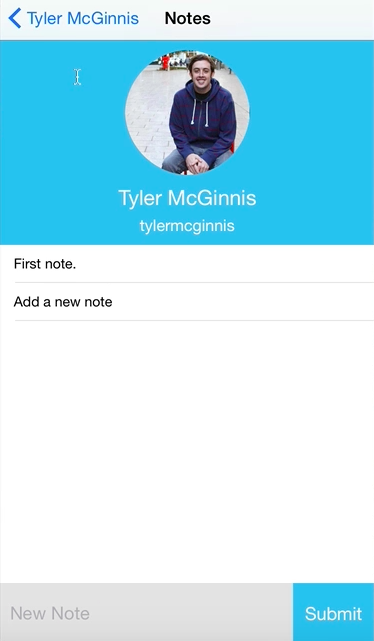

We finished our `<Notes>` component. The very last thing we need to do is go back to our `Dashboard.js` and tie it to this `goToNotes` button. The first thing I'm going to do is I'm going to `require` our `Notes` component. 

#### Dashboard.js
```javascript
var Notes = require('./Notes');
```

Then, in our `Notes.js`, you might remember that our `Notes` is expecting to receive `userInfo` and some `notes`.

What we need to do is we need to grab those `Notes` before we take the user to the `Notes.js` route. So, in our `goToNotes` button, we're going to do `api.getNotes`. We're going to pass it the `(this.props.userInfo.login)`. Then, that will return us a promise with the response of the data, `.then((res) => `. Then, what we're going to do is we're going to just check to make sure `res` is a thing. We're going to `say res = res` or if that's not true, then we're just going to make an empty object, `res = res || {}`. 

```javascript
goToNotes(){
    api.getNotes(this.props.userInfo.login)
        .then((res) => {
            res = res || {};
        })
}
```

This will help us if we have no notes. It's not going to error out because our `ListView` is expecting to receive an object whether that's empty or whether that's not. We just have that checked.

Then, what we can do is as we've always done. Go to our new `component` by `this.props.navigator.push`. The `component` is going to be, `Notes`. The title is going to be, `Notes`. The properties we're going to pass to it, `passProps`, is, `notes: res`, and `userInfo: this.props.userInfo`.

```javascript
goToNotes(){
    api.getNotes(this.props.userInfo.login)
        .then((res) => {
            res = res || {};
            this.props.navigator.push({
                component: Notes,
                title: 'Notes',
                passProps: {
                    notes: res,
                    userInfo: this.props.userInfo
                }
            })
        })
}
```

Let's go ahead and add first note. There were go.

