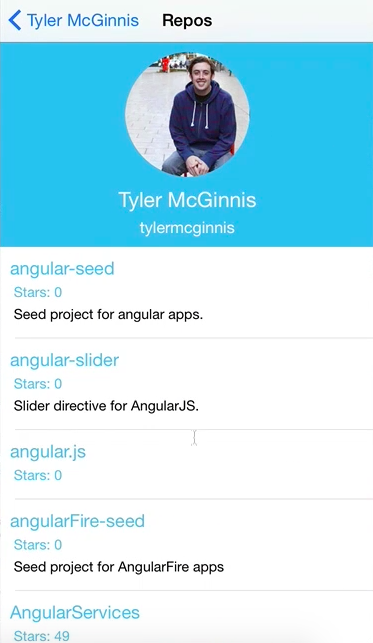

You'll remember earlier when we created our `Dashboard`, we had a `goToProfile` function, a `goToRepos` function, and a `goToNotes` function. Each of these were invoked when a user pressed on a certain `<TouchableHightlight>` button. But because we didn't have the repositories component finished, we just console.log, `'Go to repos'`.

We start by copying what we did in `goToProfile` and pasting it into `goToRepos`. What we're going to do now is, instead of just logging that, let's actually take the user to the `Repositories` component. The title, let's call it `'Repos'`. 

####Dashboard.js
```javascript
goToRepos(){
    this.props.navigator.push({
        component: Repositories,
        title: 'repos',
        passProps: {userInfo: this.props.userInfo}
    });
}
```

The data we're going to pass in, in a repositories component, we're expecting to receive `userInfo`. We're also expecting to receive some `repos`, as well. When we made our API, we made this `getRepos` method. All it did was it used `fetch` to go and grab the user's GitHub repos. Then, it returns that promise.

Let's go ahead and first let's require API. What we should be able to do now is, inside of our `goToRepos` function, is `api.getRepos`, and we're going to pass it `(this.props.userInfo.login)`. This is going to be the username of the GitHub user that we're dealing with.

```javascript
goToRepos(){
    api.getRepos(this.props.userInfo.login)
    this.props.navigator.push({
        component: Repositories,
        title: 'repos',
        passProps: {userInfo: this.props.userInfo}
    });
}
```

Then, remember, that will return a promise. We're going to have a `.then`. We're going to use the arrow function, we're going to get this `res` back from our promise.

When all the data gets back, when it gets parsed to JSON, we're then going to call this `.then` function, which will go and change routes. We're going to pass it `userInfo`. We're also going to pass it `repos`. That'll be the `res` that we got.

```javascript
goToRepos(){
    api.getRepos(this.props.userInfo.login)
    .then((res) => {
        this.props.navigator.push({
            component: Repositories,
            title: 'repos',
            passProps: {userInfo: 
                this.props.userInfo, 
                repos: res
            }
        });
    });
}
```

Now, let's verify that everything's working. If we come to our app, type any username, then go to View Repos, it does not seem to be working. We forgot to require `Repositories`. 

```javascript
var Repositories = require('./Repositories');
```

I'm going to require that right now. Now, if we go back, let's see if this works now. There we go. There's all the repositories.


