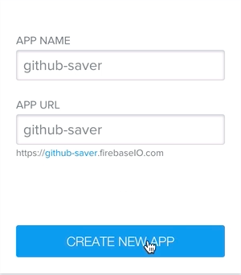
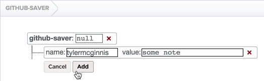
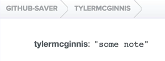

In order to persist data, we are going to use `Firebase`. If you're following along, go over to `firebase.com` and sign up for an account. Once you do that, you will be taking to this dashboard page. You can go ahead here and create a new app, so we can just call it `github-saver`.



If I create this new app, I can go to it, and I notice firebase will give me this url, `https://github-saver.firebaseio.com`.

Firebase is known for their two-way data binding with angular, and also their web socket-y stuff were everything is up-to-date, and it's really, really convenient.

The bad thing about that is with react native it doesn't support website, so we are going to use firebase's restful API, which is still really, really convenient.

Let's head over to our API file with me earlier, and we are going to create two units. The first one is going to be called `getNotes`. What it's going to do is, it's going to accept a `username`, trim it up a bit with `username.toLowerCase().trim();`.

Once we do that, our `url` is going to be the firebase url that we got from firebase, `https://github-saver.firebaseio.com`, and then we're going to append to it the `username` we got that was passed and when we invoke to the function, as well as `.json` on the end.

####api.js
```javascript
getNotes(username){
    username = username.toLowerCase().trim();
    var url = 'https://github-saver.firebaseio.com/${username}.json';
}
```

Then what we can do is, we're going to use `fetch` again. We're going to fetch data from that `url`, call `.then`, get a `res`, and then return another promise, which is parsing our `.json`. 

```javascript
getNotes(username){
    username = username.toLowerCase().trim();
    var url = 'https://github-saver.firebaseio.com/${username}.json';
    return fetch(url).then((rest) => res.json());
},
```

It looks very similar, that's because it's pretty much the same as the `getRepos` or `getBio` we made earlier.

The last one we are going to make is called `addNote`. This will allow us to add a new note up to firebase, so we're going to take in a `username`, and we're going to take in a `note`. Then we're going to clean our username up.

```javascript
addNote(username, note){
    username = username.toLowerCase().trim();
}
```

After that, what we'll do is let's make another `url`. What we're going to do is make a post request with `fetch`.

What's nice about fetch it's API, it's almost the exact same thing. We're going to pass on a url now, `'https://github-saver.firebaseio.com/${username}.json'`, we are also going to pass in an object as the second argument. The `method: 'post'`. The `body` of that post request is going to be `JSON.stringify(note)`. Then as always, fetch will return us a promise, which we can add `.then` on to. Then we're going to return the `response.json()`. 

```javascript
addNote(username, note){
    username = username.toLowerCase().trim();
    var url = 'https://github-saver.firebaseio.com/${username}.json';
    return fetch(url, {
        method: 'post',
        body: JSON.stringify(note)
    }).then((res) => res.json());
}
```

There we go. There's our way we make post requests through firebase by using `addNote`, and there's our way we'll make get requests to firebase through `getNotes`.

Now, whenever we invoke these two methods, we'll either get the data that's stored at this firebase url, or we'll add a new item to that database.

The biggest thing to remember here is that when you have your url, the url is the exact same url you got from firebase. We're appending a username to it, so what we'll eventually see is something like this, where we will have the username, and then we'll say the value will be `"some note"`.



Now, notice if I go to this url, githubsaver.com/TylerMcGuinness, you can see all of Tyler McGuinness' notes. 



So, firebase is really, really convenient and if you want to use the rest API all you can do is append `.json` on the end of it.