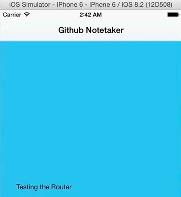

What you can do with this app that we'll build is you can enter in someone's GitHub username. You'll see their image. Then what you can do is you can view their profile, some things about them like their email address, their repos, and other things about their GitHub profile.

Then what you can do is you can view all their repositories where you'll see a list of their repository names as well as how many stars each one has and a short description. You'll be able to click on that and see a nice web view. Then what you're also able to do if you wanted to take notes about this person, you can do that in the Notes tab.

What I like about this app as a demo app is that it will demonstrate a lot of the things that we'll do every day when we're building these apps. For example, we'll do a lot of routing in this app. We'll do some network requests. We'll update, and we'll need to link that out to the screen. A lot of these things that we'll learn in this app we'll be able to take and apply to basically every other app we build.

The first React Native component we're going to be talking about is NavigatorIOS. What NavigatorIOS allows us to do is, inside of our main component, if we drop this code in it, 

####Facebook.github.io/react-native/docs/navigatorios.html#content
```html
Render: function() {
    return (
        <NavigatorIOS
            initialRoute={{
                component: MyView,
                title: 'My View Title',
                passProps: { myProp: 'foo' },
            }}
        />
    )
};
```

it allows us to add an initial route property to our component. Notice we specify a `component`, a `title`, and any properties we want to pass to it.

Whenever our main component is rendered, it will render this `NavigatorIOS` component which will then go and render `MyView`. Then inside of `MyView` what we're allowed to do is we're allowed to treat our navigation or our routing almost like it's an array, like we're pushing and popping from it.

If I had some button where I wanted to go to a new view, all I would do is `this.props.navigator.push` and then my next component I want to take it to.

```javascript
var MyView = React.createClass({
    _handleNextButtonPress: function () {
        this.props.navigator.push(nextRoute);
    };
});
```

Let's go and add NavigatorIOS to our main component. Let's also make it so when our initial component loads, we'll also load another component which we'll also create.

Coming over to our code, let's go ahead and take out all this stuff. 

####index.ios.js
```javascript
<View style={styles.container}>
    <Text style={styles.welcom}>
        Welcome to Github Notetaker!
    </Text>
    <Text style={styles.instructions}>
        To get started, edit index.ios.js
    </Text>
    <Text style={styles.instructions}>
        Press Cmd+R to reload, {'/n'}
        Cmd+Control+Z for dev menue
    </Text>
</View>;
```

What I also need to do is whenever you use a new component, you need to make sure that you include it up here. We're going to include NavigatorIOS. 

```javascript
var {
    AppRegistry,
    StyleSheet,
    Text,
    NavigatorIOS, 
    View,
} = React;
```

Now, what I'm going to return is that `NvaigatorIOS` component with a few properties.

Our `initialRoute` is going to have a `title` of `'GitHub Note Taker'`. Then the component we're going to render for the initial route is going to be our main component. 

```javascript
class githubNotetaker extends Readct.Component{
    render() {
        return (
            <NavigatorIOS
                initialRoute={{
                    title: 'Github Notetaker',
                    component: Main
                }} 
            />
        );
    }
};
```

We haven't made that yet, so we'll go and do that right now.

Let's create a new folder called `App`. Inside of this folder is where we'll have all of our JavaScript files. In here, let's create another folder called `Components`. Then inside of here, we'll make a new file called `Main.js`. This `Main.js` file, again, will be file that gets rendered. It will be basically the initial component that gets rendered, but it will also include routing.

The very first thing is we're going to `require('react-native');`. 

####Main.js
```javascript
var React = require('react-native');
```

Then what we're going to do is create a `class` called `Main` which `extends React.Component`. Then our `render` method, what we're going to `return` is a `<View>` with some `<Text>` inside of it that just says, `Testing the router`.

```javascript
class Main extends React.Component{
    render(){
        return (
            <View>
                <Text> Testing the Router </Text>
            </View>
        )
    }
}
```

What's going to happen if we try to run this right now is it's going to say, "Hey, view is undefined" because we've never said what view is. Using some ES6 destructuring, we're going to say, `View` and `text` to require those in. 

```javascript
var {
    View, 
    Text
} = React
```

Then the second to last thing we need to do is make sure that we `export` this so that we can require it in our index.ios.js file. 

```javascript
module.exports = Main;
```

The last thing we want to do is set up some styles.

I'm going to make sure we have a `StyleSheet`. All a `StyleSheet` is it basically just makes low level optimizations with your style sheet. Also what I'm going to do for styles, I don't really want to bore you. I don't want to take this into a Flexbox lecture and a CSS lecture. All the styles I'll use I'll just paste in from what I had earlier.

```javascript
var styles = StyleSheet.create({
    mainContainer: {
        flex: 1,
        padding: 30,
        marginTop: 65,
        flexDirection: 'column',
        justifyContent: 'center',
        backgroundColor: '#48BBEC'
    },
    title: {
        marginBottom: 20,
        fontSize: 25,
        textAlign: 'center',
        color: '#fff'
    },
    searchInput: {
        height: 50,
        padding: 4,
        marginRight: 5,
        fontSize: 23,
        borderWidth: 1,
        borderColor: 'white',
        borderRadius: 8,
        color: 'white'
    },
    buttonText: {
        fontSize: 18,
        color: '#111',
        alignSelf: 'center'
    },
    button: {
        height: 45,
        flexDirection: 'row',
        backgroundColor: 'white',
        borderColor: 'white',
        borderWidth: 1,
        borderRadius: 8,
        marginBottom: 10,
        marginTop: 10,
        alignSelf: 'stretch',
        justifyContent: 'center'
    },
});
```

Notice with `StyleSheet` all we're doing is passing this `create` method and object which defines all of our styles. What that allows us to do now is on this view we can say, `style={styles.mainContainer}`, I believe is what we called it.

```javascript
class Main extends React.Component{
    render(){
        return (
            <View style={styles.mainContainer}>
                <Text> Testing the Router </Text>
            </View>
        )
    }
}
```

Now, this component is ready to test, so let's head over to `index.ios.js`. I'm also going to add some styles here. I'm going to remove default styles, and I'm going to add in some styles up here. 

```javascript
var style = StyleSheet.create({
    container: {
        flex: 1,
        backgroundColor:`#111111`
    },
});
```

Now, what I'll need to do is, on our `NavigatorIOS` component, I'm going to give it a `style` of `{styles.container}`. Now, that looks good.

```javascript
class githubNotetaker extends Readct.Component{
    render() {
        return (
            <NavigatorIOS
                style={styles.container}
                initialRoute={{
                    title: 'Github Notetaker',
                    component: Main
                }} 
            />
        );
    }
};
```


What we expect to see when we reload our app is...here we go. We have this title. We have testing our router. Then we also have some styles added to it.

