If you head over to [http://facebook.github.io/react-native/](http://facebook.github.io/react-native/), that will bring you to this page, and then you can click on this button, `Get started with React Native`. 

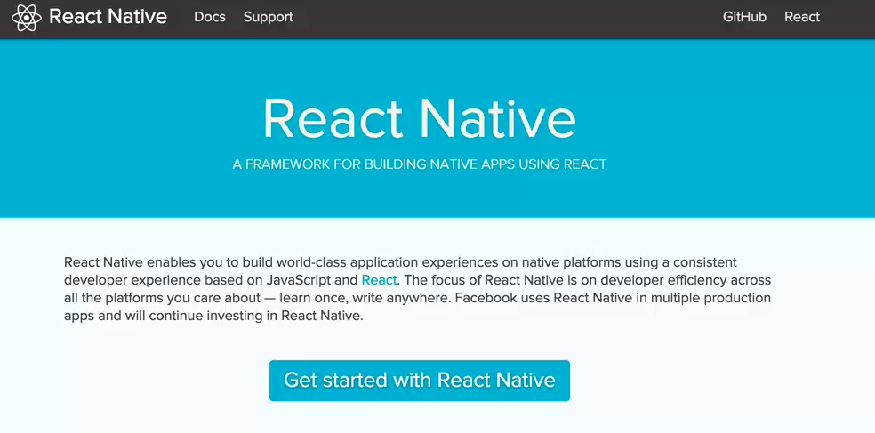

The very first thing you'll need to do, if you don't already have these installed already, is install `Homebrew` and install `Xcode`. Homebrew will allow you to install `node` if you don't have that installed. 

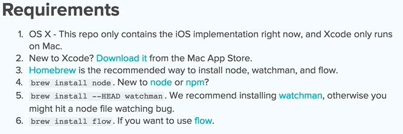

It'll also allow you to install `watchman`. Basically, all watchman is doing is it's used by React Native to figure out when your code changes, and it'll reveal itself accordingly. It's basically like having Xcode do a build each time you save your file.

Once you have node and watchman installed, and then, obviously, Xcode, then what you'll need to do is you'll need to install the `React Native CLI`. If you're unfamiliar with node and with `npm`, all this is doing is it's installing the node package or npm package to your system globally, with a `-g` flag.

Once you do that, then you'll be able to use `react-native init` in order to initialize new React Native projects. That's exactly what we'll start doing.

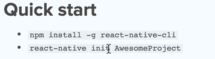

I'll head over to my terminal. I'm going to go to my desktop.

Now, what I'm going to do is `react-native init` and then the name of my project, which we'll call `githubNotetaker`. That's just the app we'll be building in this series. 

####Terminal
```bash
$ react-native init githubNotetaker
```

I'll `cd` into the folder we just created. 

```bash
$ cd githubNotetaker/
```

What I'm going to do is open this up with Sublime. We have the code here, but I'm also going to use Xcode and open the same file up with Xcode as well. I'm going to go `File`, `Open`, and then go to my `desktop` and open up the entire folder.

If we want to see a preview of this app that React Native provides us by default, all you need to do is click on this play button up in the top left. That'll compile it. You'll notice this terminal window opens up here.

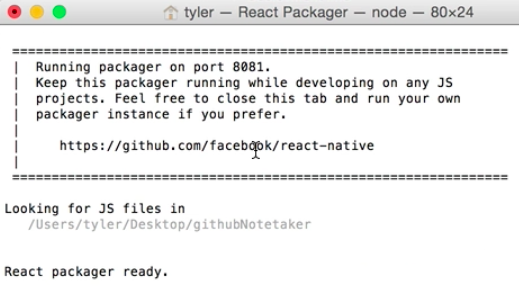

In the meantime, React will be compiling it, and then we'll get this simulator going. That'll pop us into our new github-notetaker app, and then we'll get a preview right here.

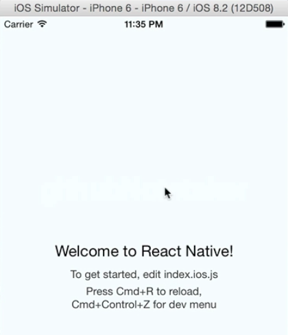

What's super cool about React Native and what I mentioned in the introduction is Facebook has done a really good job of bringing the things we're used to on the Web, like live reload and debugging, into development with React Native.

If you click on your simulator and then you click on `control-command-Z`, that'll pop up this little window. I'm going to go ahead and enable live reload. 

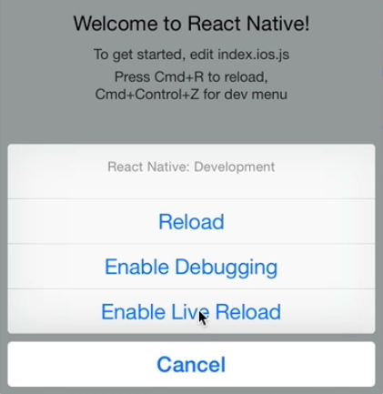

Now, you'll notice, here's the source code over here. If I change the text to say `Welcome to GitHub Notetaker`, 

####index.ios.js
```javascript
var githubNotetaker = React.createClass({
    render: function() {
        return (
            <View style={styles.container}>
                <Text style={styles.welcom}>
                    Welcome to Github Notetaker!
                </Text>
                <Text style={styles.instructions}>
                    To get started, edit index.ios.js
                </Text>
                <Text style={styles.instructions}>
                    Press Cmd+R to reload, {'/n'}
                    Cmd+Control+Z for dev menue
                </Text>
            </View>
        );
    }
});
```

and I save this, it automatically reloads over here. 

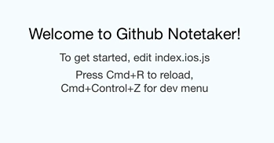

That's fantastic, especially for developing.

Another great feature is say I had a `var` and, for whatever reason, I wanted to debug this. I can throw a `debugger;` in there. 

```html
var githubNotetaker = React.createClass({
    render: function() {
        var name = "Tyler";
        debugger;
...
```


Over in the IOS Simulator, if I hit `command-d`, that will open up this other window.

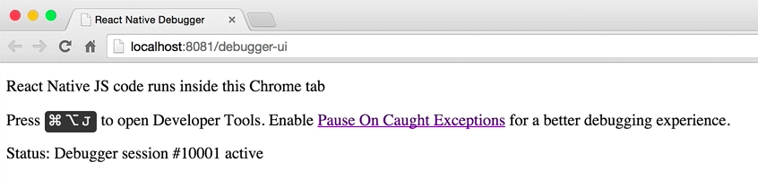

If we open up the console here and refresh our app, we get thrown right into debugger, just as if we were on the Web. 

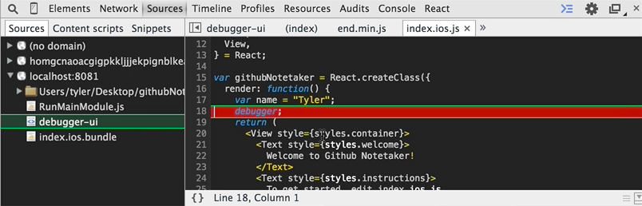

We can use things, check out what the name of the variable is, and check out the local scope and all the other variables. Super-handy and something we've grown used to on the Web, that a lot of people take for granted.

I'm going to close the console now. I'm also going to remove this extra code that we just added, the variable and the debugger. You'll notice, as you're looking at React Native code, that it's a mix ES6 and React code. If you're not familiar with ES6 or with React, don't worry about it. I'll walk through it in this tutorial.

The approach I'm going to take is I'm going to do this application pretty much all in ES6. You'll notice, here, React is creating this class using the `React.createClass` syntax. 

```javascript
var githubNotetaker = React.createClass
```

I'm going to refactor this, right now, in order to use ES6 classes, just because I think that's the future and we'll all be doing that here, soon.

What I'm going to do is `create` a class called `githubNotetaker`. This class is going to `extends React.Component`. Take off the first parenthesis. 

```javascript
class githubNotetaker extends React.Component {
    ...
}
```

What we're doing is we're just creating a new `githubNotetaker` class. That `extends React.Component` so we can do things like `.setState()` and a few other things as well, which we'll talk about when we get there.

As of right now, what we have is we're requiring React Native. This is an ES6 thing called "destructuring". 

```javascript
var {
    AppRegistry,
    StyleSheet,
    Text,
    View,
} = React;
```

Basically, if you were to rewrite this like this, 

```javascript
var AppRestry = React.AppRegistry;
```

it would be mostly the same thing. It would be basically the same thing. You would do this for each property in this object.

Destructuring just allows us to shorthand that so it makes less writing, which is usually a nicer thing. Also, too, with ES6, you don't really need to use the keyword `function` in here. I'm going to take away that. 

```html
class githubNotetaker extend React.Component {
    render() {
        return (
            <View style={styles.container}>
                <Text style={styles.welcom}>
                    Welcome to Github Notetaker!
                </Text>
...
```

Everything else looks pretty good. Let's save this and then go back to our app. We have an error, index.ios.js, line nine. 

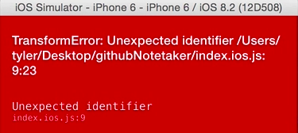

This needs to be `extends`, not `extend`. 

```javascript
class githubNotetaker extends React.Component {
    ...
}
```

Now, if we come back over here and refresh, then our app is back to where it was, 


but we've added some more ES6 stuff.

Let's talk a little bit more about React and the fundamental building blocks of React. You'll notice the very first thing we're doing is creating a `React.Component`. Everything in React is a component.

We can go and look at some examples of this on the web. All this is is an iTunes app that's built with React. You'll notice if we go ahead and look at what things are components, you'll notice that we have lots of components. Everything is a component. The darker the red is, the more nested the components are. 

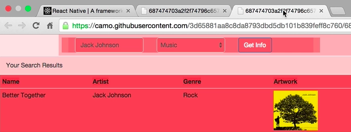

Everything in React is a component that we first start out with. Then what we can do is we can nest components as deep as we want, but the fundamental building blocks of React are components.

You can think of `render` as essentially the UI or the thing that's going to be rendered to the screen when React does all its rendering stuff.

Notice in this `render` method, we're returning a bunch of these native iOS components, where typically, if we're doing web development, `<View>` would be like `<div>`, `<Text>` would be `<span>` and things like that, but since we're doing React Native, everything's in these native components.

That's what's actually really cool about React Native. The current state of building Android and iOS apps with JavaScript is one where frameworks produce hybrid apps. That's the norm.

Most of the frameworks allow various levels of communicating with the native environment. The issue there is that all of them fall short in one aspect or another because they're all either wrapping a Web app in a Web view or they're doing some other JavaScript technique, which isn't really ideal.

The fundamental base of React is that when any state changes, React takes the current representation of the DOM, compares that with the new representation of the DOM, then finds the minimum number of steps to go from the current representation to the next.

React keeps track of these `dif`'s and then makes one batch update to the DOM. This is extremely performant and one of the reasons why React is so fast. The important thing to realize though is that the DOM is an implementation detail of building apps for the Web.

React doesn't need to just wrap a DOM. With the fundamental nature of React, we can take our virtual DOM representation. Instead of wrapping the real DOM, we can wrap `UIkit` for iOS development or the Android equivalent for Android development.

React Native is able to take the native standard platform components, like `UITabBar` and `UINavigationController`, and wraps them in React component counterparts. This gives your app a consistent look and feel with the rest of the platform ecosystem.

React Native not only wraps native components, but it's able to perform the layout on a separate thread, leaving the main thread open for more important tasks, like animation. With React Native, there's no HTML, no browser, and no Web views.

There's always been the saying of "Write once, run anywhere." React Native doesn't embrace this mantra. In fact, it rejects it. When you're building an iPhone app, you're not really thinking about Android principles.

Both platforms have an entirely different look. They both have an entirely different way you interact with apps. It will never make sense to have one app which runs on both platforms. If you're wanting to target both platforms, you should write two different apps.

The benefit of React and React Native is if you understand how to build a React Native app for iOS, you understand how to build a React Native app for Android. It's "Learn once, write anywhere."

Facebook's goal is to, and I quote, "be able to develop a consistent set of goals and technologies that let us build applications using the same set of principles across whatever platform we want."

What this means is that a set of engineers can build an iOS app and turn around the next day and build the exact same app for Android just by virtue of knowing React. If you understand the principles of React and are somewhat familiar with ES6 and Flexbox, you'll fit right in with React Native.