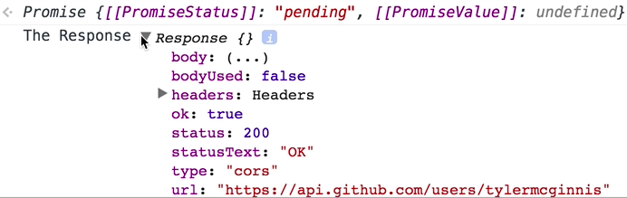
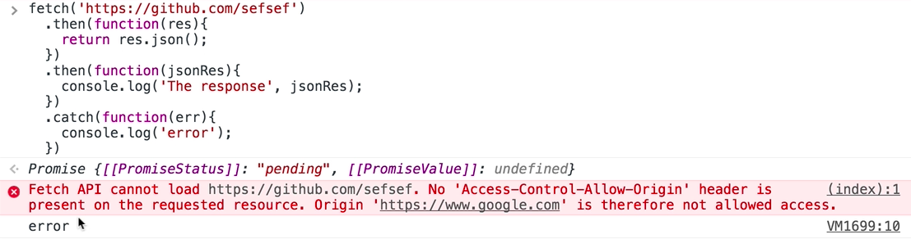

If you've ever used the XML HTTP request API, it's pretty archaic and it's pretty weird. Odds are you've used Angular's HTTP service before, or you've used something like Axios or any other library that allows you to make XHR requests. Another one, a very popular one, is obviously jQuery's AJAX.

What React Native utilizes is this thing called `fetch`. The fetch API has been available in the service worker global since Chrome 40, but it'll be enabled in the Windows scope in Chrome 42. Currently, I'm running `Chrome Canary`, which means we have `fetch` available, but it's not currently in Chrome yet.

What `fetch` is is it's similar to XML HTTP requests, in the sense where it allows you to make HTTP requests, but it's promise-based. The API for it is a little more clean. What we're going to do is if we had a URL, we're going to use the GitHub API, the endpoint we're going to hit is `api.github.com/users/tylermcginnis`. Then what we can do is if we run or if we invoke fetch, you'll notice that what that returns us is a promise.

####Chrome Canary Console
```javascript
> var url = `https://api.github.com/users/tylermcginnis`;
> 
> fetch(url)
< Promise {[[PromiseStatus]]: "pending", [[PromiseValue]]: undefined}
>
```

Now, instead of having to worry about these callbacks, `fetch(url)`, we're going to get a promise back, that we can then chain `.then` on. The way I like to think about it if you're new to promises and the way you can think about it is we invoke this fetch function. When fetch has finished requesting our data from this URL, it will invoke the function that's inside the `.then` method.

```javascript
> fetch(url)
>   .then(function(res){
>   
>   })
```

We can also do something like this, where if there's an error, it will invoke this `.catch` method and give us back this error. We'll `console.log('error')`. Here, we'll console.log the response.

```javascript
> fetch(url)
>   .then(function(res){
>       console.log("The Response", res);
>   })
>   .catch(function(err){
>       console.log('error');
>   })
```

Notice we have this response object. 



It has some stuff on it. This isn't actually the exact data we want though. What we're going to do is we're going to modify this a little bit to say, once we get this response, `res`, back, let's go ahead and `return res.json`.

```javascript
> fetch(url)
>   .then(function(res){
>       return res.json();
>   })
>   .catch(function(err){
>       console.log('error');
>   })
```

This is going to parse our JSON and return us another promise that we can chain on here and pass in another function. Now, this response should be our...Let's call it our `(jsonRes)`. From here, let's `console.log('The response', jsonRes)`.

```javascript
> fetch(url)
>   .then(function(res){
>       return res.json();
>   })
>   .then(function(jsonRes){
>       console.log('The response, jsonRes');
>   })
>   .catch(function(err){
>       console.log('error');
>   })
```

Now, notice what happened was we call `fetch`. We had a `.then` under that. The function, `function(res)`, will run. Once our initial data gets back from the GitHub servers, `.then` we're going to return another promise, `return res.json();`, so we can then chain it again with the second function, `function(jsonRes)`. `.then` we `console.log(The response)`, which is the data that we wanted from GitHub.

If we do this again and we change the `url` to be something that's broken...Let's just do `github.com/sefsef`, you'll notice we get an error because it caught the error. 



That's how you make HTTP requests with React Native, is `fetch`. Even though it's not available in the browser yet, it is available with React Native.