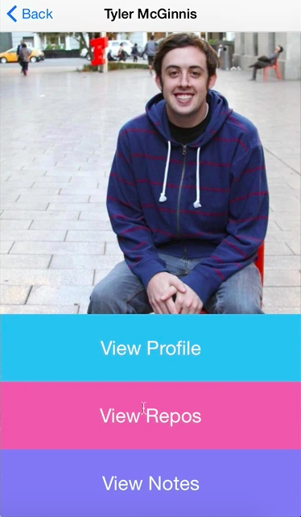

Now what we're going to do in this video is we're going to clean up our `<Dashboard>` component. We're going to need two more components here. We're going to need the `Image` component, and we're going to need the `TouchableHighlight` component.

#### Dashboard.js
```javascript
var {
    Text,
    View,
    StylelSheet,
    Image,
    TouchableHighlight
} = React;
```

We've used `TouchableHighlight` before. This is a reminder. It's basically just a wrapper for making `<View>` respond properly to touches. `Image` is an `Image` component that's going to allow us to throw in images.

If we go down here, to our `render` function, let's throw in an `<Image>`. An `<Image>` takes in a `source`. If that source if coming from a URL, you're going to have a `uri:` property, and then the value is going to be the URL that the Image is located at. Ours is on our `userInfo` object we're passing in. They key is `avatar_url`. Before we finish, let's go ahead and add a `style` that's already been made for us, `{styles.image}`.

```html
class Dashboard extends React.Component{
    render(){
        return (
            <View style={styles.container}>
                <Image source={{uri: this.props.userInfo.avatar_url}} style={styles.image} />
                <Text> This is the dashboard </Text>
                <Text> {this.props.userInfo} </Text>
            </View>
        )
    }
};
```

Let's verify we're good there. If we run this, search for "tylermcginnis", there we go. We get the picture now.


Now what we need to do is, if you remember, in the actual app, we had three buttons we could click. One of them took us to the profile page. One of them took us to the repos page. The other one took us to the notes page.

Let's go ahead and build those right now. Start by deleting our `<Text>` components and replace them with `<TouchableHighlight>`. Let's keep `style` blank for now. We're going to have `onPress=`, we'll make a `goToProfile` function. We'll `.bind(this)` so we get the appropriate context, and then our `underlayColor` is going to be `'#88D45F'`.Then we'll have some text in here, and then the style on this as well is going to be `styles.buttonText`. Then close `<TouchableHighlight>`.

```html
class Dashboard extends React.Component{
    render(){
        return (
            <View style={styles.container}>
                <Image source={{uri: this.props.userInfo.avatar_url}} style={styles.image} />
                <TouchableHighlight
                    onPress={this.goToProfile.bind(this)}
                    underlayColor='#88D45F'>
                    <Text style={styles.buttonText}> View Profile </Text>
                </TouchableHighlight>
            </View>
        )
    }
};
```

This should give us our first button. I'm going to copy this `<TouchableHighlight>` and paste it two more times. Instead of `goToProfile`, on the second one, let's go ahead and have it `goToRepos`, and then this last one will have `goToNotes`.

```html
class Dashboard extends React.Component{
    render(){
        return (
            <View style={styles.container}>
                <Image source={{uri: this.props.userInfo.avatar_url}} style={styles.image} />
                <TouchableHighlight
                    onPress={this.goToProfile.bind(this)}
                    underlayColor='#88D45F'>
                    <Text style={styles.buttonText}> View Profile </Text>
                </TouchableHighlight>
                <TouchableHighlight
                    onPress={this.goToRepos.bind(this)}
                    underlayColor='#88D45F'>
                    <Text style={styles.buttonText}> View Profile </Text>
                </TouchableHighlight>
                <TouchableHighlight
                    onPress={this.goToNotes.bind(this)}
                    underlayColor='#88D45F'>
                    <Text style={styles.buttonText}> View Profile </Text>
                </TouchableHighlight>
            </View>
        )
    }
};
```

There are a few ways that you can make the backgrounds different colors on these. What I'm going to do is I'm going to write a function which will change depending on the number you pass in. 

`goToProfile` is going to be zero, `goToRepos` is going to be one, and then `goToNotes` is going to be two. That's going to return us an object which is going to style the specific button as well as that background color.

Let's go up here, to the top of our class, let's make a `makeBackground()` function. It's going to take in which specific button we're using, `(btn)`, and then we're going to have a style object. Don't worry too much about this. This is just Flexbox stuff.

We're going to do `flexDirection: 'row'`, `alignSelf: 'stretch'`, `justifyContent: 'center'`, and `flex: 'one'`. 

```javascript
class Dashboard extends React.Component{
    makeBackground(btn){
        var obj = {
            flexDirection: 'row'
            alignSelf: 'stretch'
            justifyContent: 'center'
            flex: 'one'
        }
    }
}
...
```

Then what we'll do is we'll say, `if(btn === 0)`, `else if(btn === 1`, `else` button equals zero, then that means it's going to be the `Profile` button. We're going to set the background color on this object to be `'#48BBEC'`.

If it's the view `Repos` button, the background color's going to be `'#E77AAE'`. If it's neither one of those, that means it's the `Notes` button. Let's set the background to be `'#758BF4'`. Then we're obviously going to need to return our object.

```javascript
class Dashboard extends React.Component{
    makeBackground(btn){
        var obj = {
            flexDirection: 'row'
            alignSelf: 'stretch'
            justifyContent: 'center'
            flex: 'one'
        }

        if(btn === 0){
            obj.backgroundColor = '#48BBEC'
        } else if (btn === 1){
            obj.backgroundColor = '#E77AAE' 
        } else {
            obj.backgroundColor = '#758BF4' 
        }

        return obj;
    }
}
...
```

Now what we can do is down here on our buttons, we can set the `styles` equal to whatever gets returned from calling `makeBackground`. We're going to pass in `0` for `Profile`, and then we pass in `1` for `Repos`, then we pass in `2` for `Notes` These are on the instance itself around the class, so we need to add the `this` keyword to those.

Also we need to change "Profile" in each of the `<Text>` components. The second is going to be "View Repos." The third will be "View Notes." 

```html
...
<View style={styles.container}>
    <Image source={{uri: this.props.userInfo.avatar_url}} style={styles.image} />
    <TouchableHighlight
        style={this.makeBackground(0)}
        onPress={this.goToProfile.bind(this)}
        underlayColor='#88D45F'>
        <Text style={styles.buttonText}> View Profile </Text>
    </TouchableHighlight>
    <TouchableHighlight
        style={this.makeBackground(1)}
        onPress={this.goToRepos.bind(this)}
        underlayColor='#88D45F'>
        <Text style={styles.buttonText}> View Repos </Text>
    </TouchableHighlight>
    <TouchableHighlight
        style={this.makeBackground(2)}
        onPress={this.goToNotes.bind(this)}
        underlayColor='#88D45F'>
        <Text style={styles.buttonText}> View Notes </Text>
    </TouchableHighlight>
</View>
...
```

Now let's go ahead and add just some functions so this doesn't error out just above the `render()`. We're going to first create `goToProfile`, which is just going to `console.log('Going to Profile Page')`. Then we'll make the `goToRepos` function, which will `console.log('Going to Repos Page')`. Then let's do `goToNotes`, which is going to `console.log('Going to Notes Page')`.

```javascript
...
goToProfile(){
    console.log('Going to Profile Page');
}
goToRepos(){
    console.log('Going to Repos Page');
}
goToNotes(){
    console.log('Going to Notes Page');
}
...
```

Now let's search for a username. There we go. We get three different buttons. 



Now what we'll need to do is inside of the `goToProfile`,`goToRepos`, and `goToNotes` functions, just like we did with our `getBio` function in `Main.js`, we'll need to `.push`. We'll need to take each one of those buttons to a new component, but those components haven't been built yet. We'll leave these as console.logs, for now, as we go and we build the `Notes` component, the `Repos` component, and the `Profile` component.