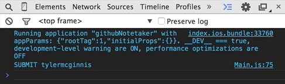

In this review we'll walk through finishing our `Main.js` component which is this component right here. 


It's going to have some text, it's going to be able to have an input box which takes in a username, and then what we need to do is we need some way to capture a touch event, so that whenever someone clicks on `SEARCH` it will then take us to the next component, or the next view.

What we're going to need to do is we're going to need to use three more React native components, `TextInput` which allows us to capture input from the keyboard, `TouchableHighlight` which is going to allow us to capture a touch of it and do something with that, and then `ActivityIndicatorIOS` which will allow us to show or hide a loading spinner based on some Boolean that we set. 

#### Main.js
```javascript
var {
  View,
  Text,
  StyleSheet,
  TextInput,
  TouchableHighlight,
  ActivityIndicator
} from React;
```

The difficult part about building UIs is managing state.

That's something React does a really good job with. The principle that react takes is that every component will manage its own state, and it can pass that state and any piece of data down to its children components, which can then use that.

What we'll do inside of our React component class is we're going to create a `constructor()`. All this is, is an ES6 thing. It will get passed some `props`, then what we'll do is we're going to call our react component, or the thing we're extending, which is our react component constructor and we're going to pass it props, `super(props)`. Then all we'll need to do is set the initial state of this component.

```javascript
class Main extends React.Comonent{
    constructor(props){
        super(props);
        this.state = {

        }
    }
    ....
};
```

You may have noticed, as we're doing the example, is this component is going to manage a `username` which is the thing that we'll type into the input box. It's going to manage an `isLoading` Boolean which will allow us to toggle that spinner, and will also manage a `false` Boolean, which will allow us to show an error message if something bad happens.

```javascript
class Main extends React.Comonent{
    constructor(props){
        super(props);
        this.state = {
            username: '',
            isLoading: false,
            error: false
        }
    }
    ....
};
```

Now I'll modify our UI a little bit. Instead of this saying `Testing the Router`, let's change this to the title which is `Search for a Github User`. The style it's going to take is `{styles.title}` which we made in the `styles` above. 

```javascript
render() {
    return (
        <View style={styles.mainContainer}>
            <Text style={styles.title}> Search for a Github User </Text>
        </View>
    )
}
```

Then what we'll need to do is we need to create a new input field, but we need to tie this `TextInput` field to our state. So the `style` it's going to take is `{styles.searchInput}` which, again, is made above, and then what we'll need to do is the value of this input field is going to be bound to the username in our state, `{this.state.username}`, and then whenever this input field changes, `onChange`, or whenever someone types a new letter, what we'll need to do is we'll invoke a function that we haven't made yet called `handleChange` which will be able to take in, or which will be able to capture the value that's in the input field, and then update our state with whatever that value is, or whatever that text is.

```html
render() {
    return (
        <View style={styles.mainContainer}>
            <Text style={styles.title}> Search for a Github User </Text>
            <TextInput
                style={styles.searchInput},
                value={this.state.username},
                onChange={this.handleChange.bind(this)} />
        </View>
    )
}
```

Let's go up above the `render()` method now and in our class let's create a new function called `handleChange()`. It's going to receive an `event`, and then we'll use `this.setState`, the state of this component, or the `username` state of this component, will be `event.nativeEvent.text`. Now whenever someone types something into the input field, or they change something with the keyboard, our state will be aware of that and it will update itself.

```javascript
...
handleChange(event){
    this.setState({
        username: event.nativeEvent.text
    })
}
...
```
You're asking yourself why we're doing this bind thing down on the `onChange`. All bind does is it returns us a new function with the `this` keyword bound to whatever you pass in. If you're not familiar with the `this` keyword, or binding, or call, or play, or anything of that stuff, just know that when we do this, `{this.handleChange.bind(this)}`, it makes the `this` keyword in `handleChange` be appropriately context to the `this` keyword that we want.

Regular React without ES6, React will go ahead and autobind all of the `this` keywords for you, so you don't really have to worry about this. But because we're using ES6 React doesn't do that, so we need to say, "Hey `this` keyword in `handleChange`, we want it to reference the same thing as `this` keyword in `onChange`."

Now let's go ahead and make our search button. What we'll use is `TouchableHighlight` component, and we'll have a `style` of `style.button` which we made above. We'll have an `onPress` attribute, what this will do is whenever someone presses on this button, it will go ahead and run this `handleSubmit` function that we'll create later, and then we'll have an `underlayColor="white"` so that whenever someone is pressing on the button the background will go white.

```html
render() {
    ...
    <TouchableHighlight
        style={styles.button}
        onPress={this.handleChange.bind(this)}
        underlayColor="white">
    ...
}
```

Let's go ahead and nest a `<Text>` value under the `TouchableHighlight` of search, and add a `style` property on here as well of `{styles.buttonText}`. We'll close our `<TouchableHighlight>` component.

```html
render() {
    ...
    <TouchableHighlight
        style{styles.button}
        onPress={this.handleChange.bind(this)}
        underlayColor="white">
            <Text style={styles.buttonText} SEARCH </Text>
    </TouchableHighlight>
    ...
}
```

Now let's go and let's create our `handleSubmit` function. We're going to add `handleSubmit` right below the `handleChange` function. If you think about the purpose of this `handleSubmit` function, it's going to do a few things. It's going to update our indicatorIOS spinner, it's then going to go and fetch data from Github, get the user's Github information, and then it's going to reroute us to the next route passing in that Github information.

In the next video, we'll talk all about fetching data using React natives. In this video is what we'll do is we'll go ahead and update the state of our loading, our `isLoading` property on the `.setState` to `true`. Then what we'll do is let's just `console.log('SUBMIT')`, and then we'll pass along `this.state.username`, 

```javascript
handleSubmit(){
    this.setState({
        isLoading: true
    });
    console.log('SUBMIT', this.state.username)
}
```

so we can see if this is really working. So let's verify if this is working. 

What I'm going to do now, we're comfortable logging something, but we obviously don't have a console in the iPhone simulator, so I'm going to do `command-d` to open up this debugger window, it opens up the console here. What we expect to happen is when I hit search, there you go. We submit what we type in the input box. 

