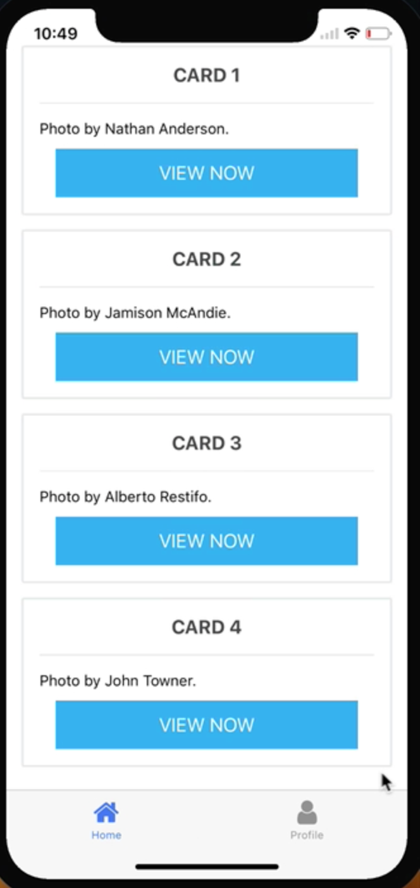
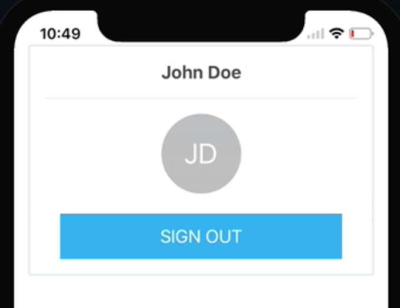
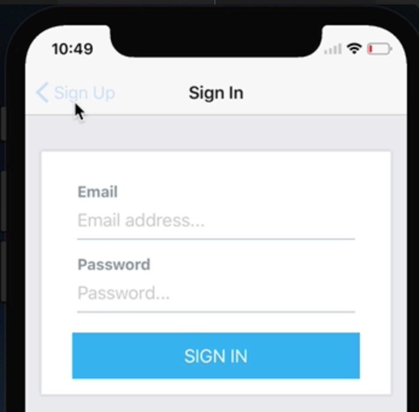
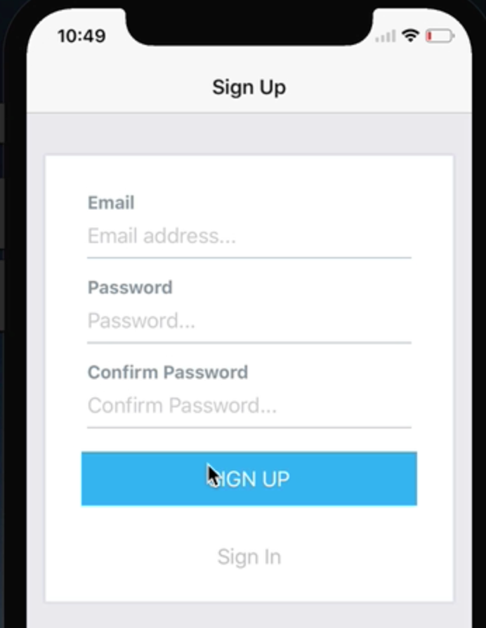
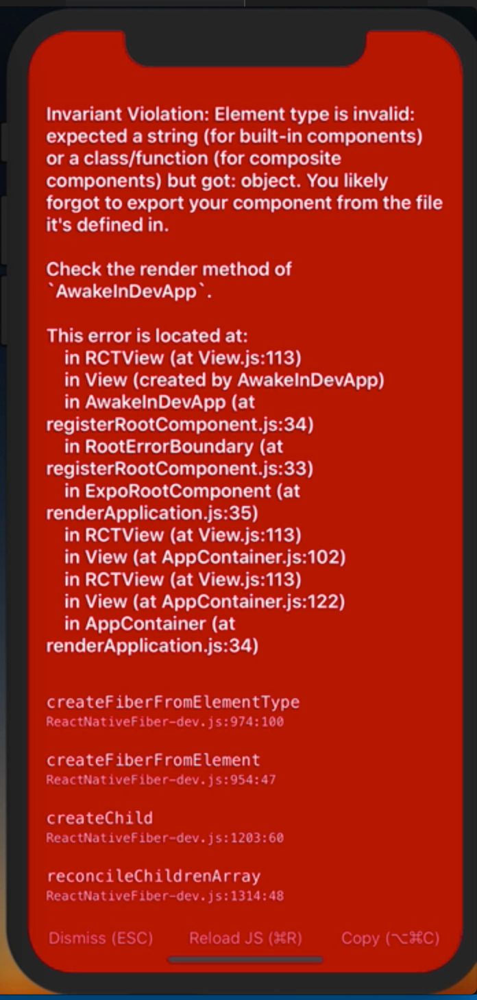

Instructor: [00:00] First, we've got a `PrimaryApp` `TabNavigator`, which is what we're seeing here. 



```javascript
const PrimaryApp = TabNavigator(
  {
    Home: {
      screen: Home,
      navigationOptions: {
        tabBarLabel: 'Home',
        tabBarIcon: ({ tintColor }) => <FontAwesome name="home" size={26} color={tintColor} />
      }
    },
    Profile: {
      screen: Profile,
      navigationOptions: {
        tabBarLabel: 'Profile',
        tabBarIcon: ({ tintColor }) => <FontAwesome name="user" size={26} color={tintColor} />
      }
    }
  }
);
```

It's one tab that renders a list of content, and another profile screen, which renders some profile information. 



The other navigator we've got set up is our `AuthStack`, which is just a `StackNavigator` which we can click through, and press sign in, or sign up.

```javascript
const AuthStack = StackNavigator({
  SignUp: {
    screen: SignUp,
    navigationOptions: {
      title: 'Sign Up',
    }
  },
  SignIn: {
    screen: SignIn,
    navigationOptions: {
      title: 'Sign In',
    }
  }
});
```





[00:17] Now, to actually make this work in a typical application flow, what we're first going to do is import a few packages from React Native, specifically `AsyncStorage`, `View`, and `Text`. 

```javascript
import React from 'react';
import { AsyncStorage, View, Text } from 'react-native';
import { StackNavigator, TabNavigator } from 'react-navigation';
import { FontAwesome } from '@expo/vector-icons';
```

Also, simply to simulate an authentication process that would typically happen on a server, what we've got here is a function which we can `checkAuth`, which is just returning a `Promise`.

```javascript
const checkAuth = () => {
  return new Promise(async (resolve, reject) => {
    const isAuthorized = await AsyncStorage.getItem('authorized');
    if (isAuthorized) {
      resolve(true);
    } else {
      resolve(false);
    }
  });
}
```

[00:40] In which we check `AsyncStorage` for this `authorized` key, and if that exists, we're going to assume that they're authorized. If not, then that user is not authorized. With that in mind, we go ahead and start defining our application.

[00:53] We're going to replace those export defaults with an `App extends React.Component`. Inside of here, we're going to initialize it with some `state`. First, we'll have `isAuthorized`, which is going to be `false`.

```javascript
class App extends React.Component {
  state = {
    isAuthorized: false,
    checkingInitialAuth: true,
  }
```

[01:07] We're also going to have `checkingInitialAuth`. That's going to be `true` by default. We'll then use a `componentWillMount`. Inside of here, first, we're going to make this `async`, so we can use async and await.

```javascript
async componentWillMount() {
    const isAuthorized = await checkAuth();
    this.setState({
      isAuthorized,
      checkingInitialAuth: false,
    });
  }
```

[01:20] We'll say `const isAuthorized`, and we'll `await checkAuth`, which is a function we previously defined. Then with that, we can say `this.setState`. We'll set `isAuthorized` to the value that's returned from our `checkAuth` function. Then we'll say `checkingInitialAuth` will be `false`.

[01:39] We can then go ahead and set up our `render` function. Inside of our `render` function, we're going to access our `isAuthorized`, as well as our `checkingInitialAuth` variables, which are going to be available from `this.state`.

```javascript
render() {
    const { isAuthorized, checkingInitialAuth } = this.state;
    if (checkingInitialAuth) {
      return (
        <View style={{ flex: 1, alignItems: 'center', justifyContent: 'center' }}>
          <Text>Loading...</Text>
        </View>
      );
```

[01:51] Initially, `if` we're `(checkingInitialAuth)`, so if we haven't found out if they're authorized or not, we're just going to return a very basic loading screen, which is just a `View` and some `Text`. This will be a good point where you could actually continue to render your splash screen until you've actually checked authorization.

[02:08] Next, we'll say `else if isAuthorized`. Inside of here, we want to return our `PrimaryApp`'s TabNavigator. 

```javascript
} else if (isAuthorized) {
      return <PrimaryApp />;
    } else {
      return <AuthStack  />;
    }
  }
}

export default App;
```

Finally, if they're not `checkingInitialAuth`, and if they're not `authorized`, we'll want to return our `AuthStack`. 

If you run into this error, make you sure you `export default App`.



[02:28] You can see here, since we're not authorized yet, we're just rendering our `AuthStack`. Now, before we move on, we're going to set up two functions on our component. The first one is going to be `signIn`. When our `signIn` function is called, we'll say `this.setState`. We'll set `isAuthorized` to `true`.

```javascript
signIn = () => {
    this.setState({ isAuthorized: true });
    AsyncStorage.setItem('authorized', 'true');
  }
```

[02:46] We're also going to say `asyncStorage.setItem` of `authorized`, which is the key that we're using in our `checkAuth` function. We'll set that to a string of `true`. Now, `asyncStorage` only accepts strings. That's why we need to use a string, versus just a Boolean.

[03:01] We're also going to set up a function of `signOut`. Just like `signIn`, we'll set `this.setState`. This time, `isAuthorized` is `false`, and `asyncStorage.removeItem`. We just need to specify the key we want to remove. That will be `authorized`.

```javascript
signOut = () => {
    this.setState({ isAuthorized: false });
    AsyncStorage.removeItem('authorized');
  }
```

[03:17] Now, to actually pass these `signIn` and `signOut` functions down to the components where they need to be called, we can do that via `screenPros`, which we'll `define` down here. When the `PrimaryApp` is shown, we want to pass `this.signOut`. When the `authStack` is shown, we want to pass the `signIn` function.

```javascript
} else if (isAuthorized) {
      return <PrimaryApp screenProps={{ signOut: this.signOut }} />;
    } else {
      return <AuthStack screenProps={{ signIn: this.signIn }} />;
    }
```

[03:36] Now, we actually want to use our `screenProps` to `define` this. To do so, looking at our `authStack`, we can go into our `SignUp` screen. What we need to do is import `screenProps`, which will be passed to a screen when it's been registered with the navigator.

```javascript
export default ({ navigation, screenProps }) => (
  <View style={{ paddingVertical: 20 }}>
    <Card>
      <FormLabel>Email</FormLabel>
      <FormInput placeholder="Email address..." />
      <FormLabel>Password</FormLabel>
      <FormInput secureTextEntry placeholder="Password..." />
      <FormLabel>Confirm Password</FormLabel>
      <FormInput secureTextEntry placeholder="Confirm Password..." />

      <Button
        buttonStyle={{ marginTop: 20 }}
        backgroundColor="#03A9F4"
        title="SIGN UP"
        onPress={() => screenProps.signIn()}
      />
      <Button
        buttonStyle={{ marginTop: 20 }}
        backgroundColor="transparent"
        textStyle={{ color: "#bcbec1" }}
        title="Sign In"
        onPress={() => navigation.navigate("SignIn")}
      />
    </Card>
  </View>
);
```

[03:52] Then down here, when they press Sign Up, we expect them to actually go to the sign-up screen. We can say `screenProps.signIn`. We're going to do the same thing on the sign-in screen. This time, again, we've imported `screenProps`. Then when we press sign in, we'll say `screenProps.signIn`.
```javascript
export default ({ navigation, screenProps }) => (
  <View style={{ paddingVertical: 20 }}>
    <Card>
      <FormLabel>Email</FormLabel>
      <FormInput placeholder="Email address..." />
      <FormLabel>Password</FormLabel>
      <FormInput secureTextEntry placeholder="Password..." />

      <Button
        buttonStyle={{ marginTop: 20 }}
        backgroundColor="#03A9F4"
        title="SIGN IN"
        onPress={() => screenProps.signIn()}
      />
    </Card>
  </View>
);
```

[04:10] Now, when we press sign up, we'll switch over to our `authStack`. From here, looking at our profile screen, we want to again import `screenProps` from our `props`, and when the user presses sign out, we pass the `screenProps.signOut` via `screenProps`.

```javascript
export default ({ navigation, screenProps }) => (
  <View style={{ paddingVertical: 20 }}>
    <Card title="John Doe">
      <View
        style={{
          backgroundColor: "#bcbec1",
          alignItems: "center",
          justifyContent: "center",
          width: 80,
          height: 80,
          borderRadius: 40,
          alignSelf: "center",
          marginBottom: 20
        }}
      >
        <Text style={{ color: "white", fontSize: 28 }}>JD</Text>
      </View>
      <Button
        backgroundColor="#03A9F4"
        title="SIGN OUT"
        onPress={() => screenProps.signOut()}
      />
    </Card>
  </View>
);
```

[04:28] Now, when we go to our profile tab, press sign out, it'll bring us to our sign-up screen. Going to sign in to check it out, we can again see we're able to sign in. Now, when we actually refresh the application as well, it's going to persist that authorization state between sessions, because we're doing that check in our `componentWillMount`.

```javascript
async componentWillMount() {
    const isAuthorized = await checkAuth();
    this.setState({
      isAuthorized,
      checkingInitialAuth: false,
    });
  }
```