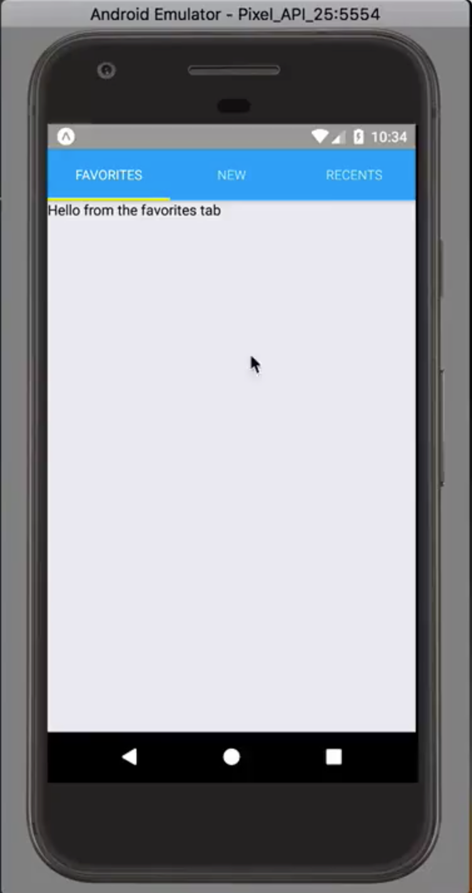

Instructor: 00:00 We have our application which has some tab bars. It's got a modal that's being rendered. All the navigation state is being handled through Redux. One ramifications of doing is, is when you press the hardware back button on Android, it closes the application rather than bringing us back to the previous screen.



00:17 To fix that from `react-navigation`, what we'll have to do is `import` `NavigationActions`. Then from `react-native`, we'll need to `import` our `BackHandler`. 

```javascript
import { addNavigationHelpers, NavigationActions } from 'react-navigation';
import { BackHandler } from 'react-native';
```

We can then go down to where we're defining our `App`.

00:33 I'll go ahead and replace our functional component with a typical `React.Component`. With that complete, we'll then go ahead and create a new function called `onHardwareBack`.

00:45 From within this component, we'll say `const { dispatch, nav } = this.props` using object destructuring. Then, we'll say if `nav.index === 0` we'll go ahead and `return` `false`. Otherwise, we'll `return` `true`.

```javascript
class App extends React.Component {
  onHardwareBack = () => {
    const { dispatch, nav } = this.props;
    if (nav.index === 0) {
      return false;
    }
    dispatch(NavigationActions.back());
    return true;
  }
  ```

01:02 Also, if the `nav.index` is not `zero`, we're going to `dispatch` a new function. That's going to be `NavigationActions.back`. What this is saying is if we return `true`, we're saying that we're handling the hardware back button. If not, then use the system default.

01:22 Before this works, we actually need to call this hardware back. Function, we'll say `within` a `componentDidMount`, `BackHandler.addEventListener`. We'll listen to the `hardwareBackPress`, and when that happens, we'll say `this.onHardwareBack`.

```javascript
class App extends React.Component {
  componentDidMount() {
    BackHandler.addEventListener('hardwareBackPress', this.onHardwareBack);
  }
```

01:40 We also need to make sure we clean up our `EventListener`, well say on `ComponentWillUnmount`. Again, we'll use the `BackHandler`. This time, we'll use `removeEventListener` on the `hardwareBackPress`. Then, we'll pass `this.onHardwareBack`.

```javascript
  componentWillUnmount() {
    BackHandler.removeEventListener('hardwareBackPress', this.onHardwareBack);
  }
  ```

01:56 Once we refresh the app, and let's say we open up the new modal, press the back button, it will bring us back to our tab bar. If we press back again, it will close the application because our `nav.index` was `zero`.