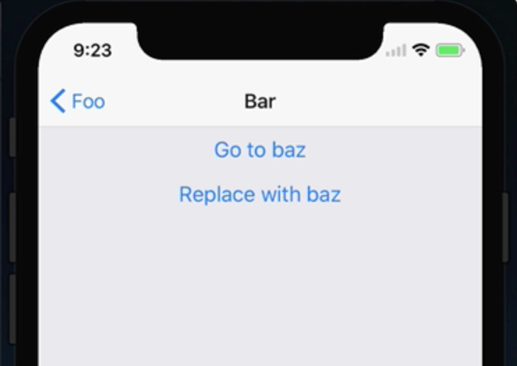

Instructor: 00:00 We're starting off with an application that has three screens, a `foo`, `bar`, and a `baz` screen. We can go ahead and navigate through by pressing our buttons, and we can go from foo to bar to baz.



00:10 Now, what we want to add is, instead of having to go from baz back to bar back to foo, we want to replace bar with baz, so that our navigation history stays the same, but we're using a different screen in the second index.

00:24 To do this, we can go ahead and override the `getStateForAction` on our `mainAppStack`. We'll say `prev.getStateForAction`. This is going to `equal` the `mainAppStack.router.getStateForAction`. We can then go ahead and override it by saying `mainAppStack.router.getStateForAction`.

```javascript
const prevGetStateForAction = MainAppStack.router.getStateForAction;
MainAppStack.router.getStateForAction = (action, state) => {
  
  return prevGetStateForAction (action, state);
};
```

00:44 That's going to be a function which takes an `action` as a first argument, and `state` as the second argument. At the very bottom, we'll go ahead and return the `prev.getStateForAction`, and we'll pass that `action` in `state`.

00:55 That way, if our `getStateForAction` doesn't handle this action that's being dispatched, it'll go ahead and use the default one from React Navigation. Now, inside of our `getStateForAction`, we'll say if `state` `and` the `action.type` is `equal to replaceCurrentScreen`, which is the `action` that we'll `dispatch` when we want this to happen.

01:16 We'll go ahead and say `const routes` is `equal to state.routes.slice`. We just want to take from the first index to `state.routes.length - 1`. We can then go ahead and say `routes.pushAction`, which will replace our current route with this new one that we're dispatching.

01:35 We can then go ahead and `return` the new navigation `state`. We'll go ahead and use object destructuring to pass all of the existing `state` we're not modifying. We can then pass the new `routes` `array`. Finally, we'll `pass` the `index` we want to be the current index. We can do that by saying `routes.length - 1`.

```javascript
const prevGetStateForAction = MainAppStack.router.getStateForAction;
MainAppStack.router.getStateForAction = (action, state) => {
  if (state && action.type === 'ReplaceCurrentScreen') {
    const routes = state.routes.slice(0, state.routes.length - 1);
    routes.push(action);
    return {
      ...state,
      routes,
      index: routes.length - 1,
    };
  }
  return prevGetStateForAction(action, state);
};
```

01:51 Next, we'll set up a new function, which we'll call `const replaceCurrentScreen`. This is going to take a `routeName`, as well as a second argument of `params`. We're going to want to set a default argument for `params` to be an empty object.

02:07 This is going to return an object, and the `type` is going to align with what we defined here, which is `replaceCurrentScreen`. We're going to set a `routeName`, and then we'll pass those `params`. 

```javascript
const replaceCurrentScreen = (routeName, params = {}) => ({
  type: 'ReplaceCurrentScreen',
  routeName,
  params,
});
```

Now, to utilize our `replaceCurrentScreen` function, we'll go up to our bar screen, which is where we have our replaceWithBaz.

02:23 You can see we're using `navigation.navigate`, but instead, what we'll do down here with replaceWithBar, we'll say `navigation.dispatch`. We'll then go ahead and call our `replaceCurrentScreen` function.

02:34 We'll pass the key of the screen we want to replace it with. In this case, it's going to be `Baz`, which aligns with the key of the screen down here. 

```javascript
const Bar = ({ navigation }) => (
  <View>
    <Button
      title="Go to baz"
      onPress={() => navigation.navigate('Baz')}
    />
    <Button
      title="Replace with baz"
      onPress={() => navigation.dispatch(replaceCurrentScreen('Baz'))}
    />
  </View>
);
```
With the application reloaded, if we go to bar, we can still go to baz in the typical way. We can also replace bar with baz. Now, when we press go back, we'll go directly to foo.