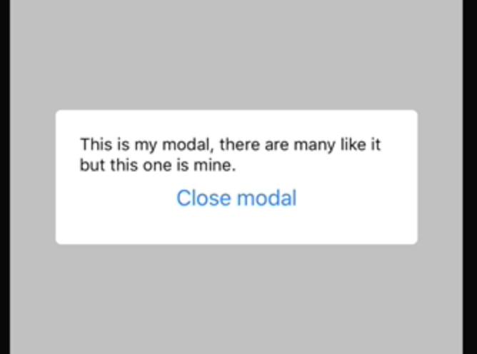

Instructor: [00:00] To begin, we're rendering two screens, a `Home` and `Details` screen. Each one of these has a button in which we can go to the `Details` screen and we can open up the `modal` from each screen once it's set up. 

#### index.js
```javascript
const Home = ({ navigation }) => (
  <SafeAreaView>
    <Button
      title="Go to details"
      onPress={() => navigation.navigate('Details')}
    />
    <Button
      title="Go to modal"
      onPress={() => null}
    />
  </SafeAreaView>
);

const Details = ({ navigation }) => (
  <SafeAreaView>
    <Button
      title="Go to modal"
      onPress={() => null}
    />
  </SafeAreaView>
);
```

These are being rendered via `StackNavigator` coming from React Navigation, and I'll just set some basic navigation options of Title.

[00:18] Now if we want to use the core React Navigation and component of `modal` to render a `Modal`, what we're going to do is set up a new class of `App` which will extend `React.Component`. Inside of here, we're going to set some initial `state` of `modalVisible` set to `false`.


```javascript
class App extends React.Component {
  state = {
    modalVisible: false,
  };

```

[00:37] We're then going to create a new method called `changeModalVisibility`. We're going to give that one argument of `modalVisible`, and I'll set the default value for that to `false`. Then inside of this method, we'll say `this.setState`, and I'll change `modalVisible`.

```javascript
changeModalVisibility = (modalVisible = false) => {
    this.setState({ modalVisible });
  }

  render(){

  }
  ```


[00:54] Next, we'll go ahead and set up our `render` function, and before we do that we're going to import a few things from React Native. We'll import the `View`, `Modal`, `Stylesheet`, and `Text`. 

```javascript
import React from 'react';
import { Button, View, SafeAreaView, Modal, Text, Stylesheet } from 'react-native';
import { StackNavigator } from 'react-navigation';
```

Before we go writing anymore code, I'm just going to paste in a few pieces of styling information.

[01:11] We've got a `modalContainer` which is just going to allow us to take up the entirety of the screen that the `modal` is rendered in, and then a `modalBody` which will actually surround the content that we want to render inside of our `modal`.

[01:23] Now inside of our `render`, we'll set up our `return`, and we're going to have a containing `View` with style={{ flex: 1 }}, just to ensure it takes up the entirety of the space it's given. We're then going to `render` our `MainAppStack` and replace our `export default` with just `App`.

[01:38] With everything rendering in the same way, we can go ahead and start rendering our `Modal` and to do that we'll set up our `Modal` component. Inside of there, we'll set a `<SafeAreaView>`.
```javascript 
render() {
    return (
      <View style={{ flex: 1 }}>
        <MainAppStack
          screenProps={{ changeModalVisibility: this.changeModalVisibility }}
        />  
        <Modal
          visible={this.state.modalVisible}
          animationType="fade"
        >
          <SafeAreaView style={styles.modalContainer}>
            <View style={styles.modalBody}>
              <Text>
                This is my modal, there are many like it but this one is mine.
              </Text>
              <Button
                title="Close modal"
                onPress={() => this.changeModalVisibility(false)}
              />
            </View>
          </SafeAreaView>
        </Modal>
      </View>
    );
  }
}
```
[01:48] Inside of our `<SafeAreaView>`, we're going to render a `View` with a `style` of `styles.modalBody`. We'll `render` some `text`, and we'll `render` a `button`. In this button, we're going to call the `this.changeModalVisibility` function, and we'll pass an argument of false to close the `modal`.

[02:07] Before we move on, we need to set the style for our `<SafeAreaView>`, and we're going to set that to `styles.modalContainer`. We're also going to pass a few props to our `Modal` component, the first of which is going to be `visible`. That's going to be equal to `this.changeModalVisibility`.

[02:24] We're also going to specify the animation type that should be used. In this case, we're going to use the `animation` of `fade`. 
```javascript
render() {
    return (
      <View style={{ flex: 1 }}>
        <MainAppStack
          screenProps={{ changeModalVisibility: this.changeModalVisibility }}
        />
        <Modal
          visible={this.state.modalVisible}
          animationType="fade"
        >
```
We can now go ahead and, using `screenProps`, pass our function of `changeModalVisibility` down to any children components and screens.

[02:40] Using `changeModalVisibility` and looking inside of our screens, what we can do is actually access our `screenProps` as another prop inside of any component that has been registered with the navigator.

```javascript
const Home = ({ navigation, screenProps }) => (
  <SafeAreaView>
    <Button
      title="Go to details"
      onPress={() => navigation.navigate('Details')}
    />
    <Button
      title="Go to modal"
      // onPress={() => null}
      onPress={() => screenProps.changeModalVisibility(true)}
    />
  </SafeAreaView>
)
```


[02:50] Using `screenProps`, we can then go ahead and replace our `onPress` and say `screenProps.changeModalVisibility`. 

```javascript
const Details = ({ navigation, screenProps }) => (
  <SafeAreaView>
    <Button
      title="Go to modal"
      // onPress={() => null}
      onPress={() => screenProps.changeModalVisibility(true)}
    />
  </SafeAreaView>
)
```

 In this case, we want to pass an argument of true. We'll do the same for both the `Home` screen and the `Details` screen.

[03:04] Now when we press Go To `Modal`, you can see a modal fade in, and when we press `Close modal`, it will fade out. We can do the exact same thing from our `Details` screen once we import our `screenProps` prop.



[03:15] Now when we go to `Details`, we can open our modal, close our modal, and do the exact same thing on the `Home` screen.