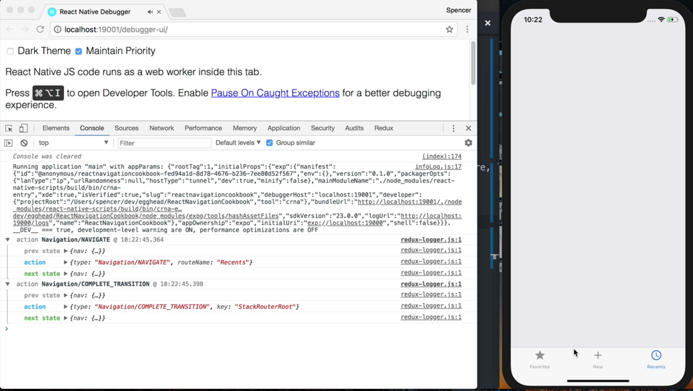

Instructor: 00:00 We're starting with an application that has two navigators. First, a `tabNavigator`, which renders a `Favorites` screen and a `Recent` screen. It also opens up a modal screen which is being rendered by a stack navigator with a configuration of mode modal.

00:17 To begin integrating Redux into React navigation, we're going to go to our entry point of our application. Which is currently just importing React, our navigator, then exporting that navigator.

```javascript
import React from 'react';

import RootNavigator, './router';

export default RootNavigator;
```

00:27 To start, we'll have to `import` a handful of things from third-party packages. The first one's going to be from react-navigation. From this package, what we're going to `import` is `addNavigationHelpers`.

00:37 We'll then go ahead and `import`, from Redux, `combineReducers`, `createStore` and `applyMiddleware`. From `react-redux`, we want to `import` `Provider` and `connect`. From `react-navigation-redux-helpers`, we want to `import` `createReactNavigationReduxMiddleware` and `createReduxBoundAddListener`.

```javascript
import React from 'react';
import { addNavigationHelpers } from 'react-navigation';
import { Provider, connect } from 'react-redux';
import { combineReducers, createStore, applyMiddleware } from 'redux';
import {
  createReduxBoundAddListener,
  createReactNavigationReduxMiddleware,
} from 'react-navigation-redux-helpers';
import logger from 'redux-logger';

import RootNavigator, { MainApp } from './router';
```

01:08 The final third-party package we need to `import` is `logger` from `redux-logger`. That will allow us to actually see that our navigation is happening within Redux. Finally, from our application, we also want to `import` MainApp from our `router` file.

01:23 With those out of the way, we can go ahead and start setting up our `initialState`. To do this, we'll say `RootNavigator.router.getStateForAction`. Since our initial screen is actually within our tabNavigator -- which is our `MainApp` -- we need to say `MainApp.router.getActionForPathAndParams`. Then, we want to pass it the key of our initial screen, which is `Favorites`.

```javascript
const initialState = RootNavigator.router.getStateForAction(
  MainApp.router.getActionForPathAndParams('Favorites')
);
```

01:48 We can now go ahead and start setting up our `navReducer`, and we'll pass it our `state`. We'll give it an `initialState` of the `initialState` we just defined, and then the second argument is our `action`.

```javascript
const navReducer = (state = initialState, action) => {
  const nextState = RootNavigator.router.getStateForAction(action, state);
  return nextState || state;
};
```

02:00 To get the next state, we want to say `RootNavigator.router.getStateForAction`. Then, I'll pass it the `action` and the `state`. Finally, we can go ahead and `return` `nextState`. Or, if that's not defined for some reason, we'll just default to the existing `state`.

02:19 We can then go ahead and set up our `rootReducer`, and we'll use `combineReducers` here. We'll set a `nav` key to handle our `nav` `state`. This is where you go ahead and add in any of your other reducers.

```javascript
const rootReducer = combineReducers({
  nav: navReducer,
});
```

02:32 Since we're overwriting the navigation, we need to go ahead and create a new `ReactNavigationMiddleware`, to ensure all events are fired correctly. We'll go ahead and call that `createReactNavigationReduxMiddleware`.

```javascript
const reactNavigationMiddleware = createReactNavigationReduxMiddleware(
  'root',
  state => state.nav
);
const addListener = createReduxBoundAddListener("root");
```

02:45 As the first argument, we'll pass it a string of `root`, then as the second argument, we'll pass a `function` which return `state.nav`. We then want to create an `addListener` variable, which is going to be equal to the `createReduxBoundAddListener`.

03:01 This is where we want to pass it the `root` key, which aligns with what we created here in our `ReactNavigationReduxMiddleware`. 

We can now go ahead and create `App`, which is going to `equal` a `component` that's going to have a `props` of `dispatch` and `nav`.

03:18 From there, we're going to go ahead and return our `RootNavigator`, which is the StackNavigator that's the root of our application. On this, we want to pass a `navigation` `prop`. Inside of that `navigation` `prop`, we'll use the `addNavigationHelpers`.

```javascript
const App = ({ dispatch, nav }) => (
  <RootNavigator
    navigation={addNavigationHelpers({ dispatch, state: nav, addListener })}
  />
);
```

03:32 We're going to pass an object with a key of `dispatch`, `state` is going to be equal to `nav`, then we want to make sure we pass that `addListener` that we created. So that all the events that happen within ReactNavigation still propagate correctly.

03:47 We then want to set up our `mapStateToProps`, and that's going to be equal to a function, which goes ahead and returns `nav` from where we have it in our `reducer`. Which is `state.nav`.

```javascript
const mapStateToProps = (state) => ({
  nav: state.nav
});
```

04:01 We can now create our `AppWithNavigationState`, and that's going to be equal to `connect`. We'll pass it the `mapStateToProps`, then we'll pass it `App`. 

```javascript
const AppWithNavigationState = connect(mapStateToProps)(App);
```

We then need to create our `store`, and we can do that by saying `createStore`. We'll pass it the `rootReducer`, then we'll want to pass it our middleware.

```javascript
const store = createStore(rootReducer, applyMiddleware(reactNavigationMiddleware, logger));
```

04:22 We'll say `applyMiddleware`, then it'll pass the `ReactNavigationMiddleware`, as well as our `logger` middleware. We can now replace our `export default` with a `function`. From within here, we'll say `Provider`, and we'll pass it the `store` of `store`.

```javascript
export default () => (
  <Provider store={store}>
    <AppWithNavigationState />
  </Provider>
);
```

04:40 Within our `Provider` component, we want to `return` our `AppWithNavigationState`. Upon refresh, our application works exactly the same way. But if we observe our Redux Logger, as we go ahead and change, we can see that all these navigation events are actually running through our Redux store.


04:58 You can go ahead and modify your application based off of these different events.