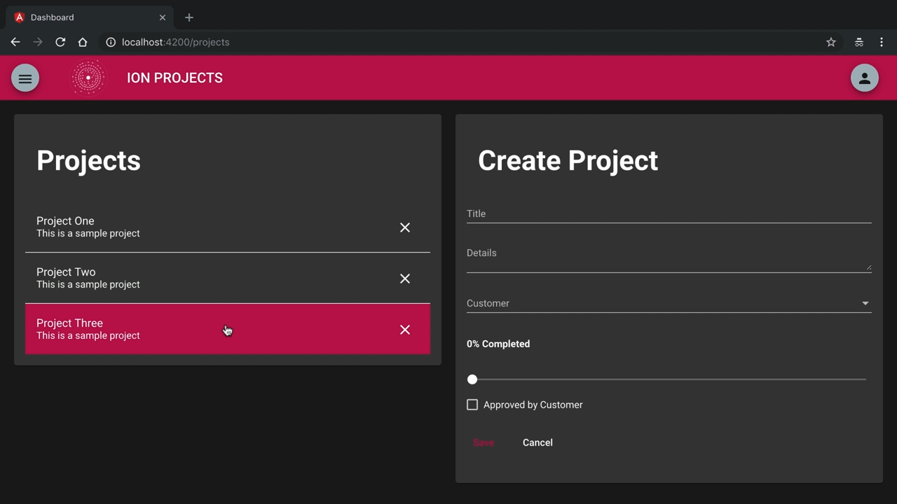

Instructor: [00:00] In this lesson, we are going to get started integrating NgRx into our application by building out the projects reducer. We have some initial data here that we'll use in just a moment for our initial state, but the first thing that we need to do is we need to define the shape of the state for our feature. Think of this as almost a table definition.


[00:25] We're going to define an interface called `ProjectsState`. We're going to give it two properties. The first one is going to be `projects`, which is going to be just an array of `Project` objects. The second property is going to be `selectedProjectId`. We can keep track of the ID of the currently selected project, which is either going to be a `string` or, if no project is selected, then `null`.

#### projects.reducer.ts
```javascript
export interface ProjectsState {
    proejcts: Projects[],
    selectedProjectId: string | null;
}
```

[00:52] Now that we've defined the shape of the state, let's go ahead and define our initial state, which is going to be of type `ProjectsState`. We'll define `initialState`. Then we'll strongly type it to the interface that we just created.

```javascript
export const initialState: ProjectState
```

[01:09] We'll go ahead and set `projects` to initial state. That's the data structure we saw just at the very beginning of this lesson. Then we'll set `selectedProjectId` to `null`.

```javascript
export const initialState: ProjectState = {
  projects: initialProjects,
  selectedProjectId: null
}
```

[01:24] The next thing that we need to do is define the simplest possible reducer that we can. A reducer is just a function that takes state and an action. Based on the action type, it's going to perform some transformation and return new state.

[01:43] We'll go ahead and define our `projectsReducer`. It's going to take two properties, `state`, which we will initialize to `initialState`, and then an `action` parameter as well. This is always going to return state. In the case of the `projectsReducer`, it's going to return `ProjectsState`.

```javascript
export function projectsReducer(
    state = initialState, action): ProjectsState{

    }
)
```

[02:07] Internally to this function, there is a `switch` case that evaluates the `action.type`. Then based on the `action.type`, it will do some operation. We're going to define the `default` case where it's just going to `return state` without doing anything at all. We're setting it to initial state. Then we are returning that for our application.

```javascript
export function projectsReducer(
    state = initialState, action): ProjectsState{
        switch(action.type) {
            default:
              return state;
        }
    }
)
```

[02:31] Now that we have defined our reducer, we need to make it available to the rest of our application. We'll go into the `index.ts`, which is just above that. We're going to import our reducer. We're going to call this `fromProjects`.

#### index.ts
```javascript
import * as fromProjects from './projects.reducer';
```

[02:51] As you have multiple features, you can have multiple states for that feature and reducers. We're going to update the overall `AppState` and add in `projects` as well as add in our `projectsReducer` into the `ActionReducerMap`. Essentially, what we're doing is we're combining all of the reducers into one top-level master reducer.

```javascript
export interface AppState {
    customers: fromCustomers.CustomersState,
    projects: fromProjects.ProjectsState
}

export const reducers: ActionReducerMap<AppState> = {
    customers: fromCustomers.customersReducer,
    projects: fromProjects.projectsReducer
}
```

[03:16] Once we've defined that, then we'll go into our `state` module. We'll see where we would register our reducer if we hadn't already. That's in `StoreModule.forroot`. We'll pass in the `reducers` import. Because we're adding in the projects reducer into the top-level reducer, this is automatically going to be added.

#### state.module.ts
```javascript

import { reducers } from '.';

@NgModule({
    StoreModule.forRoot(reducers)
})
```

[03:46] We'll hop into our `core-data.module`, which is the lib that our state is living in. We'll go ahead and `import` our `StateModule` so that whatever project is using the core data module that state is available for that. 

#### core-data.module.ts
```javascript
@NgModule({
  providers: [
    AuthService,
    AuthGuardService,
    NotificationsService,
    CustomersService,
    ProjectsService
  ],
  imports: [CommonModule, HttpClientModule, StateModule],
})
```

Let's go ahead as well and define an entry point for our project state.

[04:14] In the top-level barrel roll for this lib, we're going to `export` `ProjectsState` and make that available for whatever application that we're going to have that's going to be using the projects state feature. 

#### index.ts
```javascript
export { ProjectsState } from './lib/state/projects/projects.reducer';
```

Now that we've exported that, we're ready to integrate this into our application.

[04:40] Now we'll hop into our projects component. The first thing that we need to do is we need to import the NgRx store into our component. We'll go ahead and create a new line in the `constructor` call. We're just going to define `store`. We'll import `Store`. Then we'll set the generic to `ProjectsState`.

#### projects.component.ts
```javascript
 constructor(
    private projectsService: ProjectsService,
    private customerService: CustomersService,
    private store: Store<ProjectsState>,
 )
```

[05:09] Now that we have the `store` available to us, we are going to go ahead and set our projects observable stream to the initial data that we defined in the reducer. We're going to go `this.projects` equals `store.pipe` because this is an observable stream.

[05:30] Then from there, we're just going to `select` `projects` off of this observable stream. What this is going to do is grab the project state object from the `store` and return it to us.

```javascript
  constructor(
    private projectsService: ProjectsService,
    private customerService: CustomersService,
    private store: Store<ProjectsState>,
    private ns: NotificationsService) {
      this.projects$ = store.pipe(
        select('projects'),
      )
    }
```

[05:45] Let's go ahead and comment this call to the service. 

```javascript
  getProjects() {
    // this.projects$ = this.projectsService.all();
  }

```
Let's go into our template. Let's make one small change here so that we can see what we're working with. Obviously, the project's observable stream is to be consumed by the projects list. We'll comment that out.

[06:07] Instead, we're going to go ahead and add a `pre` tag. We'll just go `projects` `async`, obviously because it's an observable stream, and then `JSON`. We're just going to dump this out into the browser for just a moment. So we can see what is happening.

#### projects.component.html
```html
<div class="container">
  <div class="col-50">
    <pre>{{project$ | async | json}}
 <!--    <app-projects-list
      [projects]="projects$ | async"
      (selected)="selectProject($event)"
      (deleted)="deleteProject($event)">
    </app-projects-list> -->
  </div>

  <div class="col-50">
    <app-project-details
      [project]="currentProject"
      [customers]="customers$ | async"
      (saved)="saveProject($event)"
      (cancelled)="resetCurrentProject($event)">
    </app-project-details>
  </div>
</div>
```

[06:22] If we hop over to the browser, you can see that we're getting the entire project state as it was defined by the interface. We have `projects` and `selectedProjectId`. What we really want is this projects collection. Because it's an observable stream, that is easy enough to fix.


[06:41] Let's go back into our `constructor` here. We're just going to `map` `projectsState` to just the projects itself. Just doing a simple `map` operation, we're passing in `projectState`. We're just going to return projectsState.project. We'll go ahead and save this.

#### projects.component.ts
```javascript
  constructor(
    private projectsService: ProjectsService,
    private customerService: CustomersService,
    private store: Store<ProjectsState>,
    private ns: NotificationsService) {
      this.projects$ = store.pipe(
        select('projects'),
        map((projectsState: ProjectsState) => projectsState.projects)
      )
    }

```
[07:06] Then, let's hop back into the browser and see what we are returning. This is exactly what we need, just the collection of projects. 


We can uncomment out the projects list because we now have the data that we want coming from NgRx and not from the service.

#### projects.component.html
```html
    <app-projects-list
      [projects]="projects$ | async"
      (selected)="selectProject($event)"
      (deleted)="deleteProject($event)">
    </app-projects-list>
```

[07:26] Let's refresh this. This is exactly what we need. We've basically replaced the service call with a very basic implementation of the reducer.



[07:36] Just a quick review. The first thing that we did is we defined our `projectsState`, then `initialState`. Then we wired that up into a `projectsReducer` that takes `initialState`. We're setting that to initial data structure.

[07:54] Then from there, within our top-level reducer, we modified application state to include `projectsState`. This is like an interface of interfaces. Then, we updated the top-level reducer to include the projects reducer, which then was registered in store module `forRoot`.

[08:16] We added in the state module into our core data module, which then makes that available for any application that's using the core data module lib. Then we exposed our `ProjectState` or the entry point to that by exporting `ProjectState` in the barrel roll.

[08:43] From there, we went into the projects component. We imported the `store`. From that import, we were able to then select the `projects` off the `store` and then `map` the project state to just the piece that we wanted to use. By creating that reducer, passing in the initial state, we were able to pull that off, and then, from there, bind that into our template via the projects observable stream.

[09:21] These are the basic steps that you need to do to integrate NgRx into a feature within your application.
