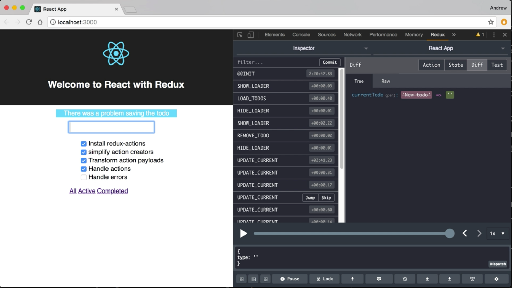
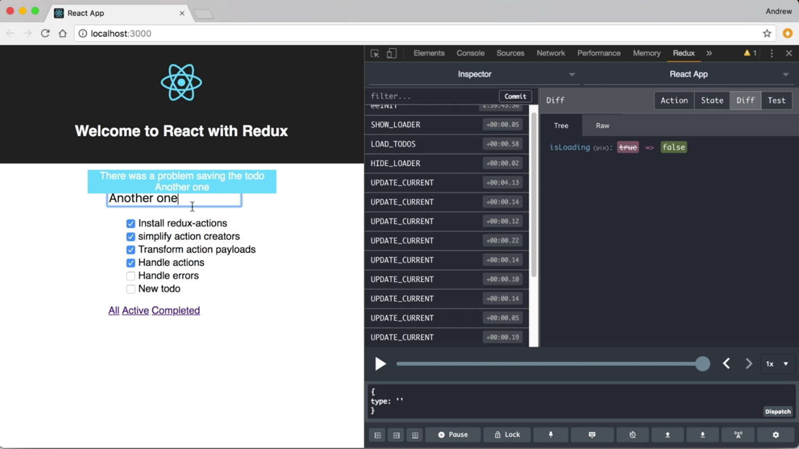

Instructor: 00:00 I'm simulating an error while saving it to do by throwing in this then back in my reducer file when I call that create to do function. I've added a catch. This takes the error and dispatches it through the add to do action.

00:14 Down on the reducer add to do is now an object with the next and the throw reducer. This way when I get aån error, throw reducer handles it, and it sets the message to there was a problem saving that to do.

00:24 We can see this in action in the browser. When we try to add a new to do, we'll see. It'll tell us there was a problem saving that to do. 



I'd like to make this error message a little more specific. I'm going to come up to where we're catching and dispatching the action with the error object. I'm going to pass in a second argument here, which is going to be the `name` that gets passed in the `saveTodo`, originally.

#### reducer.js
```javascript
export const saveTodo = name => {
  return dispatch => {
    dispatch(showLoader())
    createTodo(name)
      .then(res => {
        dispatch(addTodo(res))
        dispatch(hideLoader())
      })
      .catch(err => {
        dispatch(addTodo(err, name))
        dispatch(hideLoader())
      })
  }
}
```

00:52 Now as it stands, `addTodo` is going to take the error and make that the payload. I need a way to get this name into my reducer so that I can use it as part of that message. This is where the meta property of a flux standard action object comes into play.

01:07 Our `addTodo` action creator gives us the ability to take this value and put it into a metadata property on that action. 

I'm going to scroll up to where we're creating our actions. I'm going to take `ADD_TODO` out of the collection that's just going to use identity. I'm going to move it up into the action map.

01:36 Now typically in the action map, these action types map to the payload creator function, but we also have a metadata creator function that we can pass in, as well. I'm actually going to pass an array and this is going to be two functions.

01:49 The first is for the payload creator. I don't really want to change that, I'm just going to use a simple identity function here. The second is going to be for my metadata. This is going to take two arguments, it's going to take the value that's being passed and uses the `payload`. It's also going to take that second argument which in this case is `name`. Then, I want to return an object. It's going to be used as my metadata.

02:15 All I'm worried about here is the `name`, I'm going to return an object that has `name` as point of its properties. I'll just use the object literal shorthand syntax here, I'm going to get a key called `name` with a value of whatever is a `name`. Because I'm ignoring `payload` here, I'm just going to take this and replace it with an `underscore`.

02:34 Now, only use the add to do action creator. It's going to use that identity function as the payload creator. Nothing will change there, but if it has that second argument we're going to get a meta property on the action object that has that name value. 

```javascript
export const {
  updateCurrent,
  loadTodos,
  addTodo,
  replaceTodo,
  removeTodo,
  showLoader,
  hideLoader
} = createActions(
  {
    UPDATE_CURRENT: fixCase,
    SHOW_LOADER: () => true,
    HIDE_LOADER: () => false,
    ADD_TODO: [x => x, (_, name) => ({ name })]
  },
  LOAD_TODOS,
  REPLACE_TODO,
  REMOVE_TODO
)
```
Now that we're going to have that available, let's update our error message.

02:57 Instead of this generic, there was a problem saving that todo, we'll add the name of the todo as part of our message. I'm going to use string interpellation, we'll say saving that todo and we're going to give it the text that was typed in.

03:10 In this case, we're going to access that through `action.meta.name`. 

```javascript
export default handleActions(
  {
    ADD_TODO: {
      next: (state, action) => {
        return {
          ...state,
          currentTodo: '',
          todos: state.todos.concat(action.payload)
        }
      },
      throw: (state, action) => {
        return {
          ...state,
          message: `There was a problem saving the todo ${action.meta.name}`
        }
      }
    },
```

Let's save this. We'll reload our app in the browser. This time when we try to add a new to do, we'll see that that's part of our error message this time.



03:32 That was actually added to our metadata on our action object, which we can see here in the Redux dev tools.