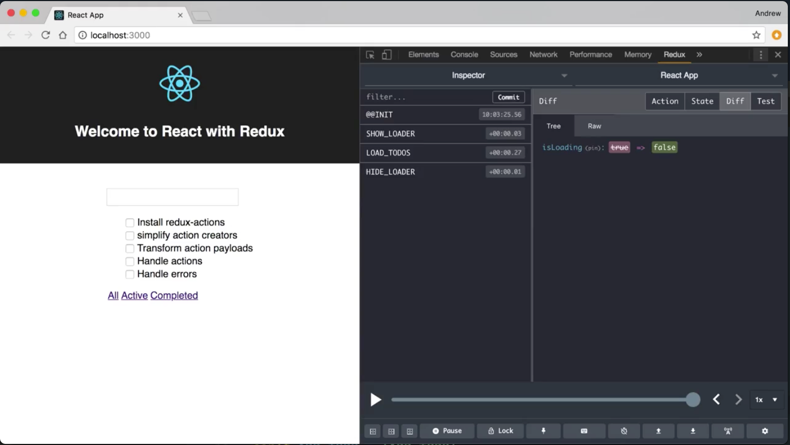
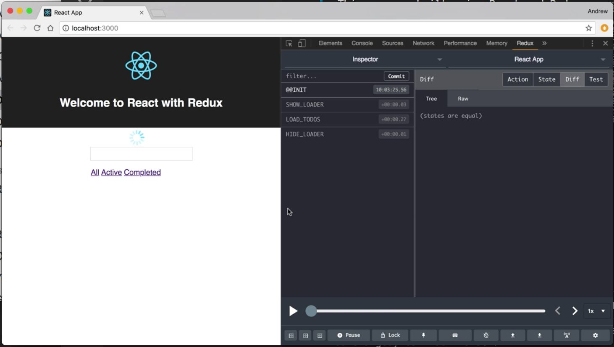
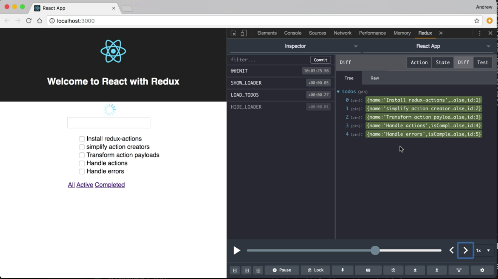
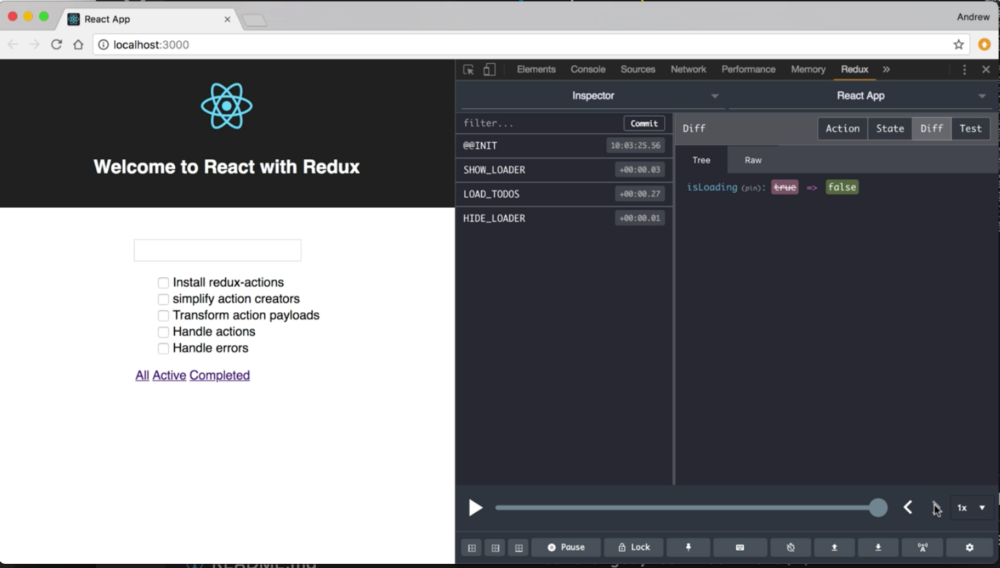
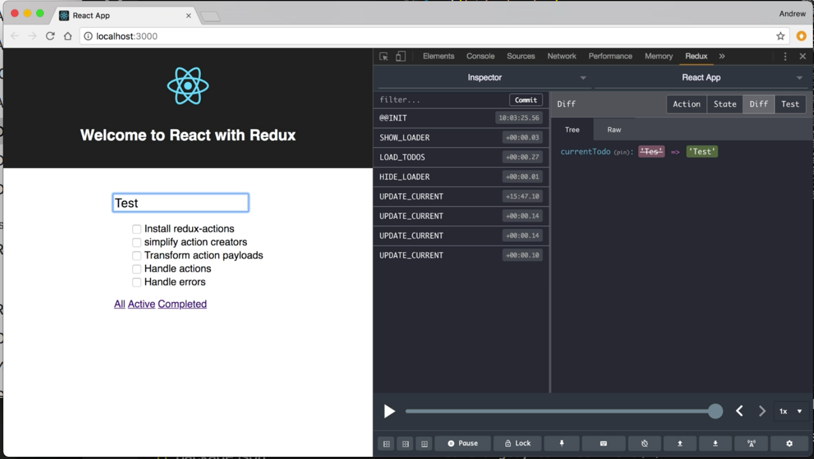

Instructor: 00:00 Here we have a simple Todo application running in the browser. This app was built using React and Redux. We can see in the Redux DevTools that the initial load of the application has dispatched a few actions.



00:10 We can use the Redux DevTools to see the process that happens when we load this page. If we take a few steps back, we'll see that initially we're showing this loading indicator.



Then our Todos are loaded asynchronously and passed into this load Todos action. I'm just going to update our state to include those items.



00:29 We dispatch an action to hide the loader. 



We also have a controlled input. As I type text in, we'll see that this update current action is dispatched for each character like it's typed in. 



If I press enter to submit the form, we'll show the loader.

00:44 When that item comes back from our server, we'll add the Todo and then hide the loader. We can also toggle. We'll see actions dispatched for that. We can delete an item, and actions will be dispatched for that as well.


00:58 Everything here is being controlled by Redux. Let's take a look at the code that drives the state management.

01:03 I have this single reducer file and I've collocated all the action constants, the action creators, the reducer, and the initial state -- just to make our lives easier.

01:15 At the top, we have an `import` statement that's pulling in four functions from our `todoServices` file, and this handles our asynchronous calls to our server. 

#### reducer.js
```javascript
import {
  getTodos,
  createTodo,
  updateTodo,
  destroyTodo
} from './lib/todoServices'
```


We have an `initState` with an empty `todos` array, a `currentTodo` which is a blank string, `isLoading` is set to `true`, and we have an empty `message`.

```javascript
const initState = {
  todos: [],
  currentTodo: '',
  isLoading: true,
  message: ''
}
```

01:31 We have action constants created for the actions that we need to dispatch.

```javascript
const UPDATE_CURRENT = 'UPDATE_CURRENT'
const ADD_TODO = 'ADD_TODO'
const LOAD_TODOS = 'LOAD_TODOS'
const REPLACE_TODO = 'REPLACE_TODO'
const REMOVE_TODO = 'REMOVE_TODO'
const SHOW_LOADER = 'SHOW_LOADER'
const HIDE_LOADER = 'HIDE_LOADER'
```

Then we have some action creator methods that will take in a value and creator action object for us with the type in the payload.

```javascript
export const updateCurrent = val => ({ type: UPDATE_CURRENT, payload: val })
export const loadTodos = todos => ({ type: LOAD_TODOS, payload: todos })
export const addTodo = todo => ({ type: ADD_TODO, payload: todo })
export const replaceTodo = todo => ({ type: REPLACE_TODO, payload: todo })
export const removeTodo = id => ({ type: REMOVE_TODO, payload: id })
export const showLoader = () => ({ type: SHOW_LOADER, payload: true })
export const hideLoader = () => ({ type: HIDE_LOADER, payload: false })
```

01:43 We have a few functions that handle our Redux func action creators, and these will dispatch actions handle asynchronous code, and then dispatch again once that's complete. We have `fetchTodos`, one for `saving` a Todo, a `toggle`, and a `delete`. We have `getVisibleTodos` which is used in conjunction with React router to handle our filtering links.

```javascript
export const fetchTodos = () => {
  return dispatch => {
    dispatch(showLoader())
    getTodos().then(todos => {
      dispatch(loadTodos(todos))
      dispatch(hideLoader())
    })
  }
}

export const saveTodo = name => {
  return dispatch => {
    dispatch(showLoader())
    createTodo(name).then(res => {
      dispatch(addTodo(res))
      dispatch(hideLoader())
    })
  }
}

export const toggleTodo = id => {
  return (dispatch, getState) => {
    dispatch(showLoader())
    const { todos } = getState()
    const todo = todos.find(t => t.id === id)
    const toggled = { ...todo, isComplete: !todo.isComplete }
    updateTodo(toggled).then(res => {
      dispatch(replaceTodo(res))
      dispatch(hideLoader())
    })
  }
}

export const deleteTodo = id => {
  return dispatch => {
    dispatch(showLoader())
    destroyTodo(id).then(() => {
      dispatch(removeTodo(id))
      dispatch(hideLoader())
    })
  }
}

export const getVisibleTodos = (todos, filter) => {
  switch (filter) {
    case 'active':
      return todos.filter(t => !t.isComplete)
    case 'completed':
      return todos.filter(t => t.isComplete)
    default:
      return todos
  }
}
```

02:06 Our default `export` is a reducer function. This has our `switch`, which switch is on the `action.type`, and based on the `action.type`, it will return a new `state` with the appropriate `updates`.

```javascript
export default (state = initState, action) => {
  switch (action.type) {
    case ADD_TODO:
      return {
        ...state,
        currentTodo: '',
        todos: state.todos.concat(action.payload)
      }
    case LOAD_TODOS:
      return { ...state, todos: action.payload }
    case UPDATE_CURRENT:
      return { ...state, currentTodo: action.payload }
    case REPLACE_TODO:
      return {
        ...state,
        todos: state.todos.map(
          t => (t.id === action.payload.id ? action.payload : t)
        )
      }
    case REMOVE_TODO:
      return {
        ...state,
        todos: state.todos.filter(t => t.id !== action.payload)
      }
    case SHOW_LOADER:
    case HIDE_LOADER:
      return { ...state, isLoading: action.payload }
    default:
      return state
  }
}
```

02:16 We want to maintain the same functionality that we have, but we want to reduce some of this boilerplate. Back up at the top, for example, we want to be able to reduce the amount of code that we need to create these actions. We are going to do this and a couple of other optimizations using the redux-actions library.

02:33 To start, we need to install that as dependency for our project. In the terminal, I am going to use yarn add redux-actions. 

```bash
$ yarn add redux-actions
```

Now we have the redux-actions library available to help us reduce some of the boilerplate in our reducer file.