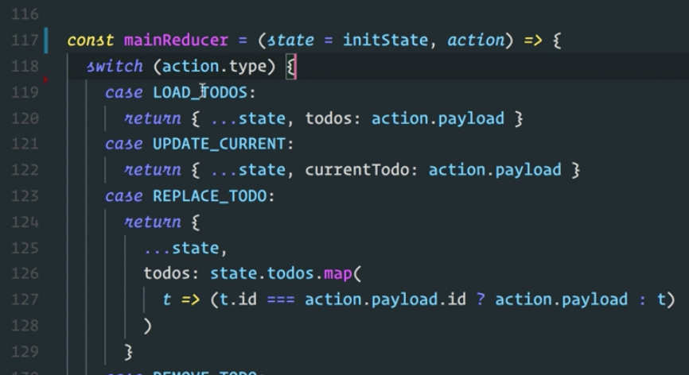
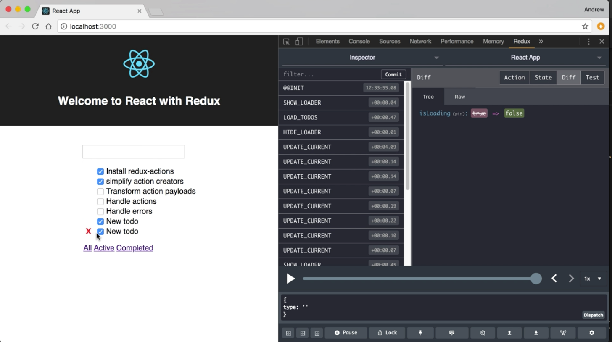
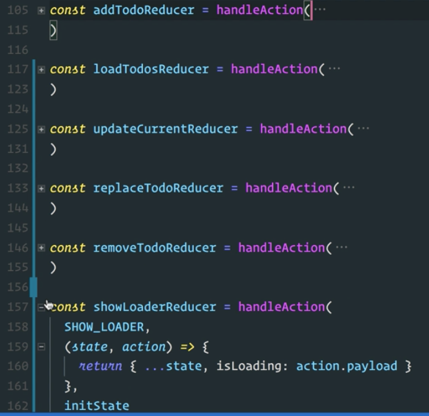

Instructor: 00:00 Here we've created a single reducer function that's specific to the add todo action using `handleAction` from redux-actions. In order to get that into our application without changing the structure of our reducers, we made a call to that in our switch case statement for the add todo action passing the state and action through.

00:19 Ideally, we'll like to be able to get rid of this switch statement all together and create individual reducers for each action. Let's start by adding the reduce reducers library to our project. I'll use `yarn add reduce-reducers`. 

```bash
$ yarn add reduce-reducers
```

With that installed, let's import it into our file. Up at the top, I'll add an import.

00:47 We're going to `import` `reduceReducers` from `reduce-reducers`. 

#### reducer.js
```javascript
import reduceReducers from 'reduce-reducers'
```

Now that we have this imported, let's go down to our reducer and refactor a little bit. I'm going to scroll down. We're going to find our `addTodoReducer`, which we've created with `handleAction`, and our `default` `export`, which is our main reducer.

01:14 I'm going to give this a name. We'll call it `mainReducer` That's going to equal that reducer function. Because we already have a reducer for `ADD_TODO`, I'm going to remove that from the switch statement here. We're going to handle the ones that don't have individual reducers in this main reducer.



01:34 Now I'm going to replace the default export, so I'll scroll down underneath. I'll do an `export default`. This is going to be a call to `reduceReducers`, passing in our `mainReducer` and our `addTodoReducer`. 

```javascript
export default reduceReducers(mainReducer, addTodoReducer)
```

Now if this does what we expect, this is going to give us one reducer that encapsulates both of those reducer functions.

02:03 Everything should continue to work like it was before. I'll save this, switch to a browser, and when our app reloads, we should see everything continuing to work, including adding a new todo. I can still toggle and delete just like I did before.



02:27 This means that instead of creating these individual reducers and having to fit them into the old switch case statement, we can create a bunch of individual reducers, reduce those, and return that as a single reducer function. I can come up here. I can create a `loadTodosReducer`. That's going to use the same `handleAction` call.

02:51 We'll pass this our `LOAD_TODOS` action and reducer function. That's going to take in `state` and an `action`. Then, it's going to `return` a new `state`. That's going to be exactly what we have here. I'll copy and paste that. Then, we want to pass it our `initState`. With that defined, I can come up here and copy this, take this case statement out of our switch.

```javascript
const loadTodosReducer = handleAction(
  LOAD_TODOS,
  (state, action) => {
    return { ...state, todos: action.payload }
  },
  initState
)
```

03:22 Then we can drop down to the end of our file and we can pass this new reducer function into reduce reducers. 

```javascript
export default reduceReducers(mainReducer, addTodoReducer, loadTodosReducer)
```

I'll save that. I'll switch back to the browser. We'll see that everything continues to work just like it did before.

03:44 We could continue this process, create individual reducers, pass them into reduce-reducers, and eventually get rid of this mainReducer with this switch case statement. After creating individual reducers for each action type with handleAction, this is what our code will look like.

04:03 We'll have reducers for add todo, load todos, update current, replace todo, remove, show loader, hide loader. 



Then all of those get combined with `reduceReducers`. 

```javascript
export default reduceReducers(
  addTodoReducer,
  loadTodosReducer,
  updateCurrentReducer,
  replaceTodoReducer,
  removeTodoReducer,
  showLoaderReducer,
  hideLoaderReducer
)
```

Then if we look in the browser, we'll see that our application continue to load and function like it did before...