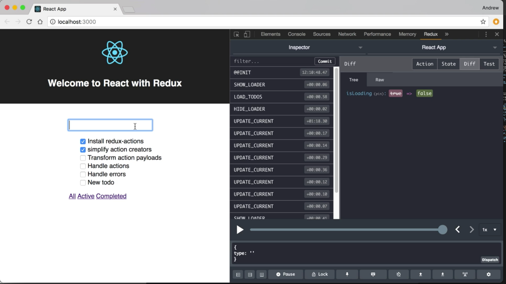

Instructor: 00:00 I am going to update my import for `redux-actions` to `import` the `handleAction` function. 

#### reducer.js
```javascript
import { createActions, handleAction } from 'redux-actions'
```

I am going to scroll down to the bottom of this file where reducer is.

00:10 I am going to use `handleAction` to create a reducer for one of our actions. I am going to start and I am going to declare the `addToDoReducer`. This is going to be a call to `handleAction`, and I am going to pass in `ADD_TODO`.

00:31 My second argument is going to be a reducer function that I want to handle this action. That's going to take in `state` and an `action`, just like our reducer does. In that function, I want to `return` the update the `state` based on the action so I can just take this code right here and paste that in.

00:58 That's going to take in the `state` in the `action` and it's going to `return` the new `state`. Just like our main reducer, it needs to take in the `initState`. That's going to be passed in as the third argument. `handleAction` takes an action type, takes a reducer function, and it takes an initial state.

```javascript
const addTodoReducer = handleAction(
  ADD_TODO,
  (state, action) => {
    return {
      ...state,
      currentTodo: '',
      todos: state.todos.concat(action.payload)
    }
  },
  initState
)
```

01:21 Now, we've our reducer function with specific to the `ADD_TODO` action. In order for this to handle our actions within our application though, we still need to work into our main reducer.

01:31 What I am going to do here is I am going to replace this inline logic, and for `case ADD_TODO`, I am going to return a call to that `addToDoReducer` that we just created, passing through the `state` and the `action`.

```javascript
export default (state = initState, action) => {
  switch (action.type) {
    case ADD_TODO:
      return addTodoReducer(state, action)
    case LOAD_TODOS:
      return { ...state, todos: action.payload }
    case UPDATE_CURRENT:
      return { ...state, currentTodo: action.payload }
    case REPLACE_TODO:
      return {
        ...state,
        todos: state.todos.map(
          t => (t.id === action.payload.id ? action.payload : t)
        )
      }
```

01:49 All we've done here is taking our reducer logic and move it out of our switch case statement to clean up our code a little bit. Everything still works the same. We can verify that by saving this, switching to our application. When it reloads, we'll see that everything is still working as expected.

02:07 We can make sure that refactoring that addToDo reducer logic still works by adding a new to do, and we'll see that it's still working.



02:20 If we wanted to keep breaking this up, we could take the same approach for each one of these items creating a separate reducer and just calling it with our main reducer.

02:30 For now, we'll just leave this as this