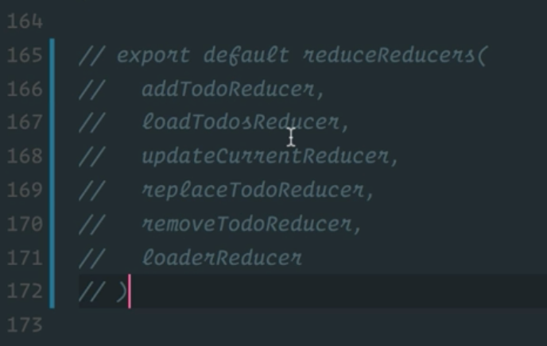
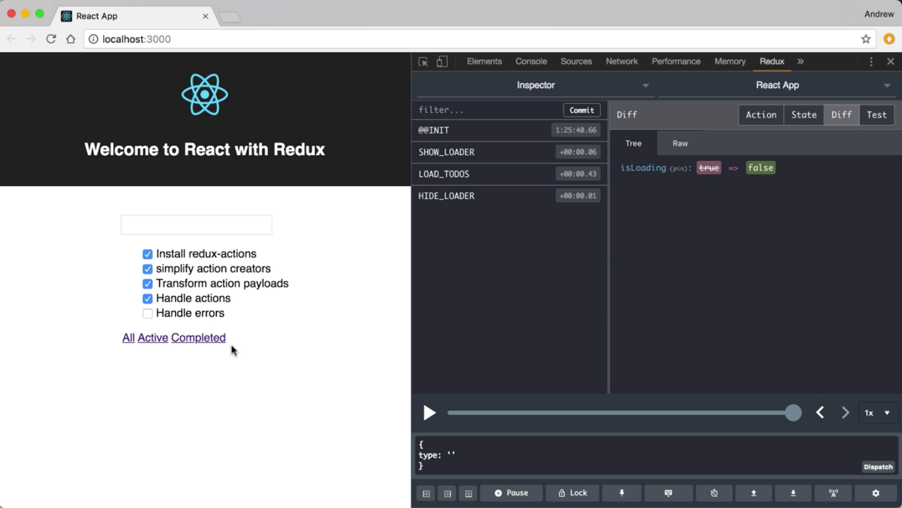

Instructor: 00:00 We're using the reduced reducers library to take these individual reducers that we've created with handle action and combine them into a single reducer. This is a fairly common need.

00:13 Redux actions actually gives us a function that will take care of a lot of this wiring for us. I'm going to jump to the top of this file and I'm going to update this import to Redux actions. Instead of this singular handle action, I'm going to `import` the plural `handleActions`.

#### reducer.js
```javascript
import { createActions, handleActions, combineActions } from 'redux-actions'
```

00:30 Now, I'm going to jump back down to the bottom of the file, and we're going to find that we don't need this `reduceReducers` call anymore once we finish this refactor, so I'll comment that out. 



I'm going to scroll up above these reducer definitions. I'm going to define a new `const` and I'm going to call it `reducer`. I'm going to make this `equal` a call to `handleActions` using the 's' for plural.

00:58 `handleActions` is going to take an object as its first argument. This object is a reducer map. In this reducer map is going to map action types to reducer functions.

01:11 If we look at our first individual reducer definition we have `ADD_TODO`, followed by a reducer function and the `initState`. I'm going to take this, I'm going to copy the first two arguments, and I'm going to bring them up here and going to paste them. Instead of treating them as two arguments, I'm going to treat them as a key and value pair in this reducer map object.

01:38 I can do the same thing for each individual reducer, so I can do the same thing with `LOAD_TODOS`. Where `LOAD_TODOS` as my key and the reducer function is the value. As I do this for each one of these individual reducers, we're not going to need the reducer function anymore, so we can delete those. I'll finish this up for the rest of these reducers.

02:04 With the refactoring done, my reducer has a call to `handleActions` with this reducer map where each action type is a key and the reducer function for that type is the value. We have one for `ADD_TODO`, `LOAD_TODOS`, `UPDATE_CURRENT`, `REPLACE_TODO`, `REMOVE_TODO`.

```javascript
const reducer handleActions(
  {
    ADD_TODO: (state, action) => {
      return {
        ...state,
        currentTodo: '',
        todos: state.todos.concat(action.payload)
      }
    },
    LOAD_TODOS: (state, action) => {
      return { ...state, todos: action.payload }
    },
    UPDATE_CURRENT: (state, action) => {
      return { ...state, currentTodo: action.payload }
    },
    REPLACE_TODO: (state, action) => {
      return {
        ...state,
        todos: state.todos.map(
          t => (t.id === action.payload.id ? action.payload : t)
        )
      }
    },
    REMOVE_TODO: (state, action) => {
      return {
        ...state,
        todos: state.todos.filter(t => t.id !== action.payload)
      }
    }
})
```

02:27 The last one I left out is this `loaderReducer` that using `combineActions`. In order to use this, we're going to need to treat this `combineActions` key as a computed value. Put that in square brackets, and we're going to take `combineActions` with our `SHOW_LOADER` and `HIDE_LOADER` and throw them in there. The same rule applies where my value is going to be my reducer function.

02:56 After the reducer map object, the second argument to handle actions is that `initState` value. 

```javascript
    [combineActions(SHOW_LOADER, HIDE_LOADER)]: (state, action) => {
      return { ...state, isLoading: action.payload }
    }
  }, 
  initState
)
```

Now, I can get rid of this loader reducer. We can get rid of this called a reduce reducers. Now, we just need our default export to be the reducer that we've created with handle actions. I can export default reducer. We can save this and back in our browser, we can verify that our application is still working as expected.

03:40 Back in the code, if we wanted to get rid of this extra variable creation, we can take our export default. Bring it up to the top of our call to handle actions, and just do that right there.


 One more time, verify that we haven't broken anything.

 

04:01 Handle actions is going to create our individual reducers keyed off of our action type. Under the hood, it's going to do exactly what we were doing with our individual reducers using reduce reducers to create that single reducer function at the end.

04:17 Now that, we have that encapsulated in the handle actions, we can jump up to the top of the file, and we can get rid of `reduceReducers`, because it's being handled for us.