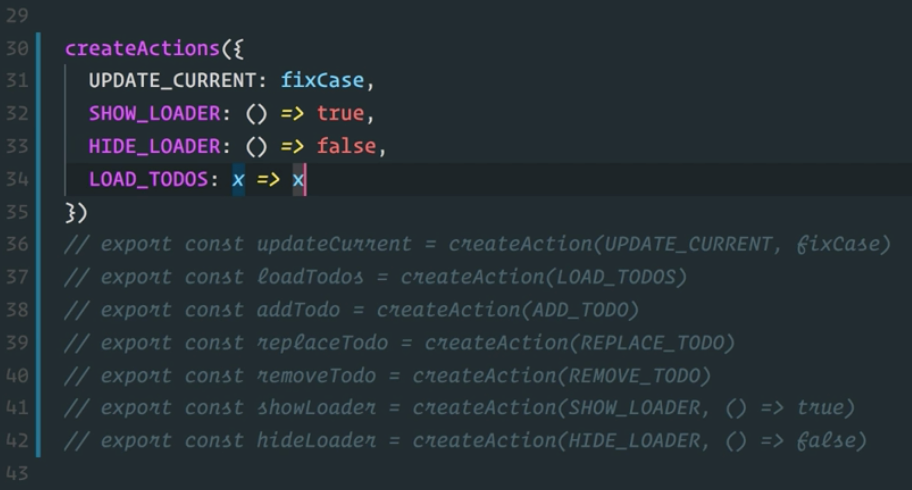
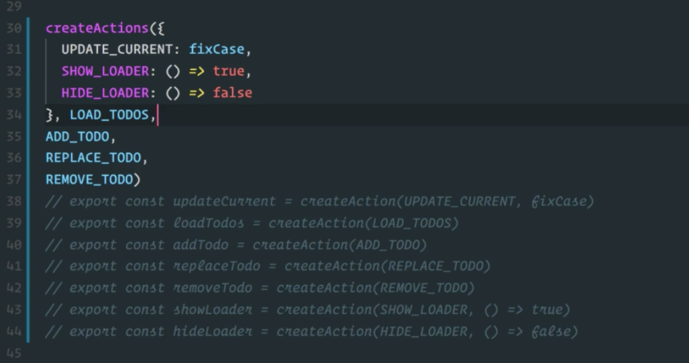
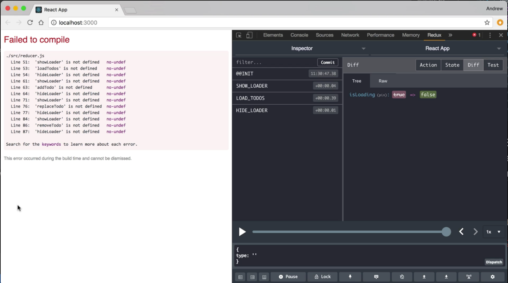
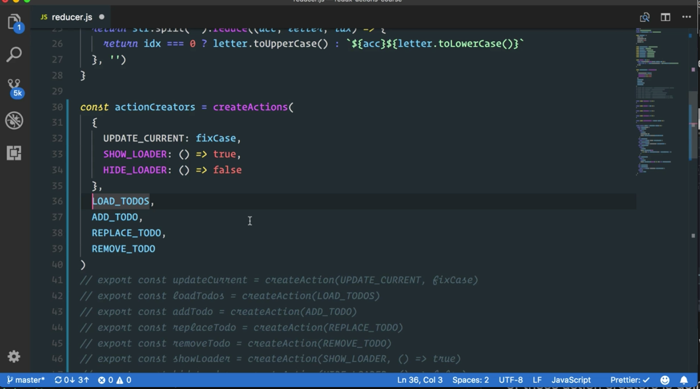
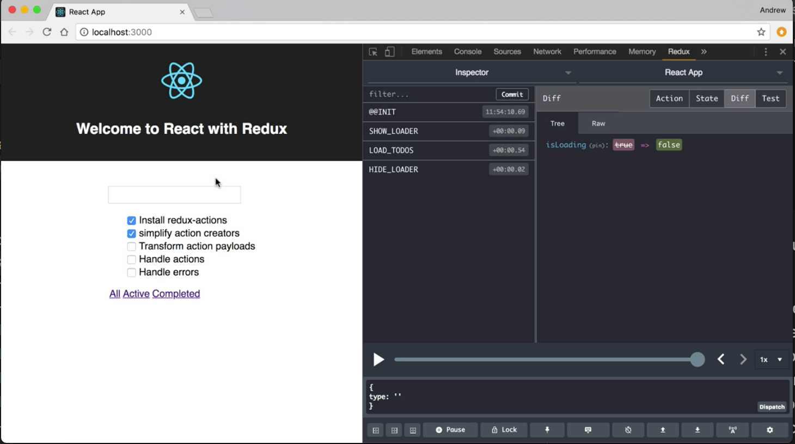

Instructor: 00:00 Using create action to cut down on some of our boilerplate code. These action creators are much simpler than what we had before where we had to define each individual object with a type payload. We can simplify this even further, though.

00:13 Up in our import, we're going to change our `import` from `createAction` to `createActions`, plural. This is going to give us a function that will create multiple action creators for us.

#### reducer.js
```javascript
import { createActions } from 'redux-actions'
```

00:25 Scroll back down to the action creators. For now, I'm just going to take what we have and comment it out. I'm going to add a call to `createActions`, and create actions, it's going to take an object as its first argument, and this object is an action map.

00:44 In the action map, I'm going to use my action types as keys. We'll start with `UPDATE_CURRENT`, and the value for this is going to be the payload creator function. In this case, it will be `fixCase`.

01:00 I'll do the same thing for `SHOW_LOADER` and `HIDE_LOADER`. Now, we just have to deal with our actions that are using the default behavior of taking the passed in value and using that as the payload.



01:16 Behind the scenes, the way that works is that our payload creator function is replaced with an identity function, and identity function just takes in a value and returns it. We could do this for `LOAD_TODOS` using our action map, and just using this identity function as our payload creator. Then, we could do that for each of the other actions.

01:40 Because this is fairly common, there's a better solution. Remove that and after the action map all the following arguments can just be action types and each one of those will give you an action creator that accepts the value and makes that the payload.

01:59 I can just grab the rest of these action creators load to do's, add to do replace, and remove, and copy them, and I can throw them in here, separating them with commas to make them arguments for this function.



02:15 Soon after saving this, if we look at the reloaded application, we'll see that all of these action creators are showing up as undefined, because we're no longer exporting them like we were before with our individual calls to create action.



02:29 The way `createActions` works, this is going to return an object with all of our action creators. Each one of those action creators is going to be a function with the camel cased version of the key that we used in our action map, or in our other lists of action creators that just use the identity function behind the scenes.



02:53 Because our existing action creator names match up with this pattern, we can just use these. What we can do is, we can do an `export const`. Then, we'll destructure that action creators object that was returned from `createActions`. Throws `commas` in here. 

```javascript
export const {
  updateCurrent,
  loadTodos,
  addTodo,
  replaceTodo,
  removeTodo,
  showLoader,
  hideLoader
} = createActions(
  {
    UPDATE_CURRENT: fixCase,
    SHOW_LOADER: () => true,
    HIDE_LOADER: () => false
  },
  LOAD_TODOS,
  ADD_TODO,
  REPLACE_TODO,
  REMOVE_TODO
)
```

We'll save and we'll see that our application is back to working.



03:31 Of course, we can do the same thing without this extra object being created. We can bring this up to where we're using create actions. We can just export and destructure directly from that method call. Then, we can get rid of our old action creators, save, double check the application one more time, and our refactoring was successful.