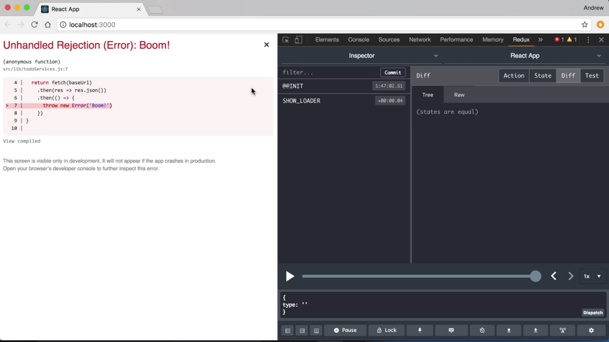
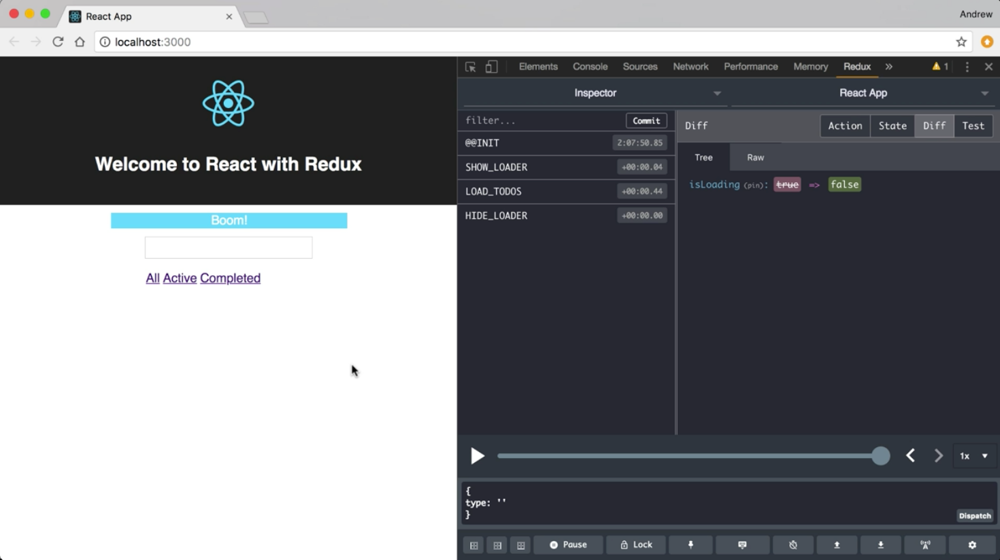

Instructor: 00:01 Currently, the reducer functions that are in our reducer map only handle the happy path. Nothing in here accounts for an error condition.

00:08 Let's simulate an error and see what happens with the load todo's reducer when our service throws an exception. In that to do services JS file, I'm going to come into this get to do's method where we're calling fetch and returning the JSON for the result.

00:22 I'm going to attack on an extra then. Inside that function, I'm just going to throw a new exception. I'll `throw` a `new` `Error` and will give it the `message`. Since I only load the page, our call to get to do's should throw an exception. Let's save this and see what happens in the browser.

#### todoServices.js
```javascript
export const getTodos = () => {
  return fetch(baseUrl).then(res => res.json())
  // .then(() => {
  //   throw new Error('Boom!')
  // })
}
```

00:46 We'll see that our loading indicator ran for a little bit longer than expected, and now we get this unhandled rejection with our boom error. 



Now, let's go back to our register file and handle this exception. In `reducer.js`, I'm going to find the `fetchTodos` function, and this is where a calling gets to do's which is throwing exception. You see here we have a call that gets to do's with it then, but no catch.

01:11 Let's fix that. We'll drop on here and will throw a `catch` on here, and we're going to get an `error`. We need to do something with that. Since we're controlling our state with Redux, let's `dispatch` an action. At this point, you might consider creating a new action creator and adding another step to our reducer that basically allows us to `dispatch` an error action.

01:35 Instead, what we're going to do is we're going to dispatch `loadTodos` just like we did before, but this time we're going to pass our `error` through. We're also going to `dispatch` `hideLoader`, so that it hides that better.

#### reducer.js
```javascript
export const fetchTodos = () => {
  return dispatch => {
    dispatch(showLoader())
    getTodos()
      .then(todos => {
        dispatch(loadTodos(todos))
        dispatch(hideLoader())
      })
      .catch(err => {
        dispatch(loadTodos(err))
        dispatch(hideLoader())
      })
  }
}
```

01:54 Now, let's go back to our reducer function and see how we can make this work. Down here in `LOAD_TODOS`, you'll see that we're expecting our payload to be an array of todos. That works in our happy path, but with the way we just dispatched this action, now we're sending an error in.

02:12 Obviously, the error isn't going to work in place of our array of Todo objects. The flux standard action format that we're using for these action objects has an error property that is a Boolean flag. If our payload object is an error, that error flag is going to be set to true by our action creator, and because we're using Redux actions for our action creators, that's handled automatically for us and we don't have to do anything to create that.

02:38 What we do need to do is differentiate how we want to handle our reduction based on whether this is an error object or not. Handle actions gives us the capability right through a reducer map. What we're going to do is instead of just using reducer function as our value for this `LOAD_TODOS` key, we're going to pass it an object.

02:58 That `object` is going to have two keys of its own, and `next` key, and `next` is going to be our reducer function. I'll just cut that and paste that right there.

03:11 Our second property here is going to be `throw`. `Throw` is also reducer function, but this is the one that we called if our payload is an error and the error key on that action is set to true. If we `throw` the final reducer function the same signature is going to take `state` and our `action`. We're going to return a new `state`.

03:36 Just like before, I spread out the existing `state`. Now, what I want to do is I want to set the `message` property, and this is going to display a message at the top of our page.

03:48 Because, I know I'm inside this throw reducer. I know that the payload is going to be an error object. I'm going to use the `action.payload` which is my error object, and I'm going to use that error object's `message` property to define what that message text should be.

```javascript
LOAD_TODOS: {
  next: (state, action) => {
    return { ...state, todos: action.payload }
  },
  throw: (state, action) => {
    return {
      ...state,
      message: action.payload.message
    }
  }
},
```

04:07 I'll save this. Go back to the browser and this time when it reloads, we'll get our error, but our indicator is hidden and our message is shown with the text that we gave in that error.



04:22 Of course, I might not want to use the error message as my display message, so I can just come in here and I can change this. This error handling is still tied to my original action, I can make this handling very specific instead of having a new action that's just for showing error messages that I'd then have to pass the message into.

```javascript
LOAD_TODOS: {
  next: (state, action) => {
    return { ...state, todos: action.payload }
  },
  throw: (state, action) => {
    return {
      ...state,
      message: 'There was a problem loading todos'
    }
  }
},
```

04:48 I can do this all in place and I can handle errors for different action types completely independently. I'll save this. Reload the browser one more time, and we'll see that we get our new custom error message.


05:01 I'm going to go back into to do services. I'm going to take this, then that there is an error out. Just make sure my application still works as expected. When we don't get an error, you'll see that it's still loading the to do's and it's not showing our message.