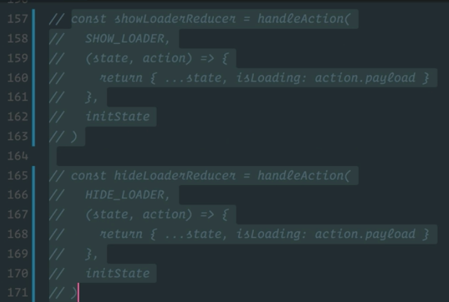
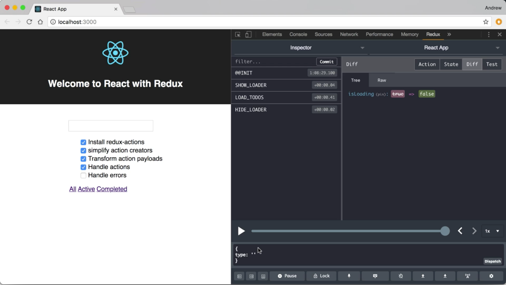

Instructor: 00:00 If we take a look at the `SHOW_LOADER` reducer and the `HIDE_LOADER` reducer, we'll notice that they are doing exactly the same thing, because our payload creator function for these actions is actually deciding what the payload value should be, and a reducer is essentially just setting the isLoading flag based on that payload value.

00:17 We can use redux-actions to combine these into a single reducer. Let's start by jumping to the top of our file and updating our import to also pull in the combined actions function from redux-actions.

#### reducer.js
```javascript
import { createActions, handleAction, combineActions } from 'redux-actions'
```

00:31 We can scroll back down to where these reducers are defined. Let's take these two reducers and we'll comment them out for now. 



Let's create a new reducer in their place. We'll just call it the `loaderReducer`.

00:47 This is going to be a call to `handleAction`, and `handleAction`'s first argument is the action type. We need to create a new action type for this action that combines our two actions.

00:58 Let's create a `loaderAction`. We are going to make that a call to `combineActions`, and that's going to take `SHOW_LOADER` and `HIDE_LOADER` as its arguments. Now we have this combination action that we can use in place of an individual action in our call to `handleAction`.

01:22 We'll use `handleAction` as we did before. Our second argument is going to be a reducer function. That's going to take `state` and an `action`, and it's going to return new `state`. We can just copy that from right here. It's going to take our `initState` as an argument.

```javascript
const loaderAction = combineActions(SHOW_LOADER, HIDE_LOADER)
const loaderReducer = handleAction(loaderAction, (state, action) => {
    return { ...state, isLoading: action.payload }
  },
  initState)
```

01:49 We'll drop down to the bottom here. We'll define a single `loaderReducer` instead of passing it to individual reducers. 

```javascript
export default reduceReducers(
  addTodoReducer,
  loadTodosReducer,
  updateCurrentReducer,
  replaceTodoReducer,
  removeTodoReducer,
  loaderReducer
)
```

We can save this. We'll jump over to the browser, and we'll verify that everything is still working, and our loader is being shown and hidden as expected.

02:12 Now I can jump back into the code. I can come up here, and I can just remove these...comment it out, reducers. If we wanted to skip the step where we defined this new variable, we could honestly just take combined actions, cut it from there, paste it in as the first argument to handleAction. There's no need to create that intermediate variable.

```javascript
const loaderReducer = handleAction(
  combineActions(SHOW_LOADER, HIDE_LOADER),
  (state, action) => {
    return { ...state, isLoading: action.payload }
  },
  initState
)
```

02:38 I'll save this, just verify that my refactor hasn't broken anything. We're still good to go.



