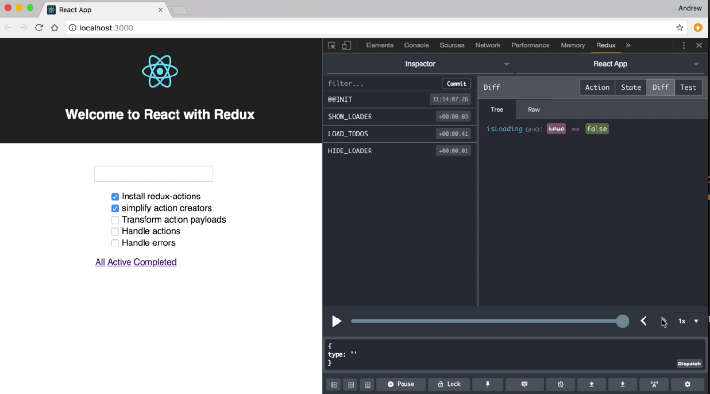

Instructor: 00:00 When we pass our action type into `createAction`, the default behavior is to return a function that's going to accept our value, and make that the payload in the resulting action object. For these two action creators, we're not accepting our action payload as an argument, we just have these hard-coded.

00:17 Luckily, `createAction` gives us a second argument, which is a payload creator function. Let's implement `showLoader`, using `createAction`. I'm going to come down here, and I'm going to use `createAction`, passing in the `showLoader` type.

00:30 Then for my second argument, I can give this a function. That value that gets returned will be used as a payload. In this case, I'll just give it a function that takes no arguments, and returns `true`. Now, I can do the same thing for `hideLoader`, calling `createAction`, giving it the type, and give it a function that returns `false`.

#### reducer.js
```javascript
export const showLoader = createAction(SHOW_LOADER, () => true)
export const hideLoader = createAction(HIDE_LOADER, () => false)
```

01:01 Let's save this, and verify that we didn't break anything. We can come up here, and we can step through. We'll see that `showLoader` will show our indicator, and `hideLoader` will hide it again. We can also use this to modify the payload as it's passed into our action creator.



01:23 By default, any argument that's passed into our action creator will be passed into this function as an argument. Let's say I want to update the text as it's typed in, and make sure that the action that goes into the reducer reflects the changes to that updated text.

01:39 For example, let's say I want to let you type in whatever case you want, but I want to make sure that the output is always sentence cased. If you type in all lower, I'm going to capitalize that first letter. If you type in all uppercase, I'm going to lowercase the rest of these.

01:57 Let's create a function that does that. I'll declare a `constant`. I'll called it `fixCase`. `fixCase` is going to be a function that takes a `string`. Then we're going to process that `string`, and `return` the result. We're going to `return` our `str.split`, and we're going to `split` that for every character.

02:23 Then I'm going to call `reduce`, and I'm going to take an `accumulator`. Each individual item will be passed in as a `letter`. I also want the `index` of the item. We're going to return based on the `index`'s value. If the `index` is `zero`, then we're going to take our `letter`, and we're going to call `toUppercase` on it.

02:49 We'll use string interpolation here. I'll take my `accumulator` string. That's going to be followed by that `letter`, with a call to `toLowerCase` on it. Our default value going into this reducer will just be an empty string.

```javascript
const fixCase = str => {
  return str.split('').reduce((acc, letter, idx) => {
    return idx === 0 ? letter.toUpperCase() : `${acc}${letter.toLowerCase()}`
  }, '')
}
```

03:14 Now, we have a function that'll take in a string. It'll call `toUpperCase` on the first character, `toLowerCase` on the rest of the characters, and return that entire string properly cased. I'm going to drop down to this update current action creator, and I'm going to pass in `fixCase` as the payload creator function.

```javascript
export const updateCurrent = createAction(UPDATE_CURRENT, fixCase)
```

03:35 Now, we can save this, and let's take a look at our app. We'll reload. Now, I'm going to type in here in all lowercase, and we'll see that the resulting value has a capitalized first letter. If I hold the caps key down, we're still going to get the same value no matter what I type.

03:53 Just to verify, I can take a string, and just drag it in there. We'll see that when it processes that, we're going to get our resulting string back out. This is what's going to be passed into our reducer. That's why we see that value reflected in our input.

