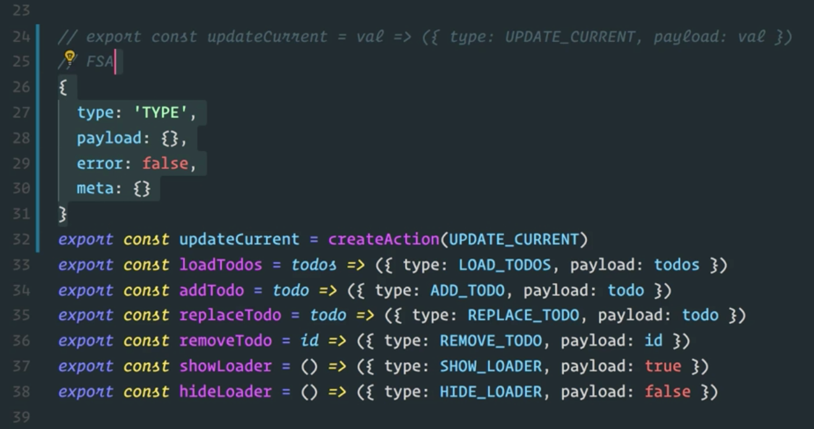

Instructor: 00:00 Let's use Redux Actions to reduce the amount of code we need for our action creators. We'll start at the top of the file, and we'll add an `import`. We'll `import` the `createAction` function from `redux-actions`.

#### reducer.js
```javascript
import {
  getTodos,
  createTodo,
  updateTodo,
  destroyTodo
} from './lib/todoServices'
import { createAction } from 'redux-actions'
```

00:10 Now, let's scroll down to where action creators are defined. We are going to start by replacing this `updateCurrent` action creator. Just so we have it as a reference, I am going to duplicate this line and comment out the original. Down here, I am going to take this function and I am going to replace it with a call to `createAction`, and I am going to pass it my action type.

00:37 I am going to get rid of the rest of that statement. This `createAction` function is going to take our type, and it's going to return a new function. That new function is waiting for some value, which up here will be val.

00:51 When it gets that value, it's going to take the type that it already knows about and the value that gets passed in, and it's going to return this object with the type property and the payload property.

```javascript
export const updateCurrent = createAction(UPDATE_CURRENT)
```

01:03 The shape of this object is standard. In fact, there is a name for this. It's the Flux Standard Action format, or FSA for short. This defines what an object should look like.

01:15 The definition states a couple rules. One, the object must have a `type` property. That would be the type of our action, and that's how we control our switch within our reducer.

01:29 It may have a `payload` which carries whatever data we need for our state to be updated properly. It can also have an `error` key, and that `error` key is a Boolean value that indicates whether or not the payload is an error object.

01:49 It can also have a `meta` key, which can carry additional information that's important for the action that is not part of the `payload`. The rules also specify that this object shouldn't have any keys outside of the four listed here.



02:03 It's important to note that Redux doesn't enforce any rules. This is a standard that's been created to allow tools like Redux Actions to work with a standard object shape. This is why we can encapsulate the behavior of creating the action, because we basically lock ourselves in to a defined action object shape.

02:24 Now that we understand what our object is going to look like, we can go and use `createAction` to update some more action creators. We'll come down here, and we'll use `createAction` just like we did above for the `loadTodos` action. We can get rid of that payload there, and then we'll do the same thing for `add`.

02:44 We can do this for `replace`, and `remove`. The `showLoader` and `hideLoader` action creators don't actually accept their payload. They are just hardcoded in. We'll leave those as it is for right now.

```javascript
export const updateCurrent = createAction(UPDATE_CURRENT)
export const loadTodos = createAction(LOAD_TODOS)
export const addTodo = createAction(ADD_TODO)
export const replaceTodo = createAction(REPLACE_TODO)
export const removeTodo = createAction(REMOVE_TODO)
export const showLoader = () => ({ type: SHOW_LOADER, payload: true })
export const hideLoader = () => ({ type: HIDE_LOADER, payload: false })
```

03:13 With our changes in place, let's save this and double check in a browser to make sure everything is still working as expected.

03:22 Our app will reload, and we'll see that our actions are still firing off, and everything seems to be OK. We can check some items off. We can add a new item. We can toggle that, delete it. Everything is still working.

