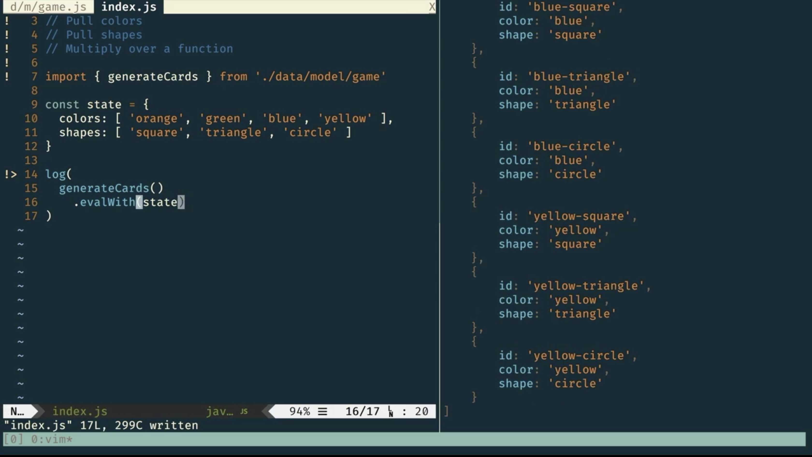

We'll be doing three things to multiply two lists from our initial state. First, we pull our colors array, followed by pulling our shapes array. Finally, we multiply them over a combining function. Our initial state contains both arrays, a colors array and an array of shape names.

Let's kick this off by first pulling our colors from our state. We'll jump into our game model and export a new transaction that places our colors array in our resultant, calling it `getColors`, taking a unit as its input. We define the `getColors` transaction as a function that takes a `() -> State AppState [ String ]`. We implement `getColors` using our `getState` helper function, pointing at our colors array. `getState` will look up the colors attribute and place whatever resides there in the resultant of our state instance.

#### data/model/game.js
```js
import converge from 'crocks/combinators/converge'
import curry from 'crocks/helpers/curry'
import liftA2 from 'crocks/helpers/liftA2'
import option from 'crocks/pointfree/option'
import { getState } from '../helpers'

// buildCard :: String -> String -> Card
const buildCard = curry((color, shape) => ({
  id: `${color}-${shape}`, color, shape
}))

// getColors :: () -> State AppState [ String ]
export const getColors = () => 
  getState('colors')
```

In our `index.js` file, we `import { getColors } from './data.model/game'`. Then we `log` out the result of calling it down below to get our expected state instance ready to be run with our initial state by using `evalWith` to peek at the resultant, although it's not what we expect.

#### index.js
```js
// Pull colors
// Pull shapes
// Multiply over a function

import { getColors } from './data.model/game'

const state = {
  colors: [ 'orange', 'green', 'blue', 'yellow' ],
  shapes: [ 'square', 'triangle', 'circle' ]
}

log(
  getColors
    .evalWith(state)
```
#### output
```txt
'Just [ "orange", "green", "blue", "yellow" ]'
```

We want an array of string but have a maybe of array of string due to `getState` returning a maybe. That's cool. We'll just option out the maybe with an empty array by mapping our state. Problem solved. 

#### data/model/game.js
```js

...

// buildCard :: String -> String -> Card
const buildCard = curry((color, shape) => ({
  id: `${color}-${shape}`, color, shape
}))

// getColors :: () -> State AppState [ String ]
export const getColors = () => 
  getState('colors')
    .map(option([]))
```

#### output
```txt
'[ "orange", "green", "blue", "yellow" ]'
```

That finishes up the first task and kind of solves the second because we need to do the same thing for getShapes. With some copypasta love, we duplicate this flow and change the name and attribute we're pointing to. 

#### data/model/game.js
```js
...
// getColors :: () -> State AppState [ String ]
export const getColors = () => 
  getState('colors')
    .map(option([]))

// getShapes :: () -> State AppState [ String ]
export const getShapes = () => 
  getState('shape')
    .map(option([]))
```

Now we can pull shapes like a boss. Nice. To demonstrate, we replace `getColors` with `getShapes` up top and down below, followed by a quick save to see just how cool we are.

#### index.js
```js
// Pull colors
// Pull shapes
// Multiply over a function

import { getShapes } from './data.model/game'

const state = {
  colors: [ 'orange', 'green', 'blue', 'yellow' ],
  shapes: [ 'square', 'triangle', 'circle' ]
}

log(
  getShapes
    .evalWith(state)
```
#### output
```txt
[ "square", "triangle", "circle" ]
```

 Now we want to multiply these arrays over this function that takes a string to a function that takes a string to a card, called `buildCard`. buildCard is a curried function that accepts names for `color` and `shape` and returns an object that constructs an `id` and adds the names to the object, thus giving us a card.

#### data/model/game.js
```js
import converge from 'crocks/combinators/converge'
import curry from 'crocks/helpers/curry'
import liftA2 from 'crocks/helpers/liftA2'
import option from 'crocks/pointfree/option'
import { getState } from '../helpers'

// buildCard :: String -> String -> Card
const buildCard = curry((color, shape) => ({
  id: `${color}-${shape}`, color, shape
}))
...
```

To multiply, we'll take advantage of the fact that array, just like state, is an applicative functor. To demonstrate, we'll export this function that we aptly name `buildCards`, plural, that takes an `[ String ] -> [ String ] -> [ Card ]`. Implementation is as simple as applying `liftA2` with `buildCard` ready to take two arrays of string. 

```js
...
// getColors :: () -> State AppState [ String ]
export const getColors = () => 
  getState('colors')
    .map(option([]))

// getShapes :: () -> State AppState [ String ]
export const getShapes = () => 
  getState('shape')
    .map(option([]))

// buildCards :: [ String ] -> [ String ] -> [ Card ]
export const buildCards = 
  liftA2(buildCard)
```

To prove that this does what we think it does, we `import { buildCards } from './data.model/game'` into our `index.js` file and replace our getShapes mess with a call to `buildCards`, passing an array of `1`, `2`, `3` for the first argument and the strings `A`, `B` for the second. Voilà. Array multiplication at it's finest. 

#### index.js
```js
// Pull colors
// Pull shapes
// Multiply over a function

import { buildCards } from './data.model/game'

const state = {
  colors: [ 'orange', 'green', 'blue', 'yellow' ],
  shapes: [ 'square', 'triangle', 'circle' ]
}

log(
  buildCards([1, 2, 3 ], [ 'a', 'b' ])
```


Not convinced this is multiplication? Checking the length gives us back 2*3, or 6.

```js
log(
  buildCards([1, 2, 3 ], [ 'a', 'b' ])
    .length
```
#### output
```txt
6
```
Adding a fourth gives us eight. If that's not multiplication, I don't know what is.

 ```js
log(
  buildCards([1, 2, 3, 4 ], [ 'a', 'b' ])
    .length
```
#### output
```txt
8
```
Moving right along, we need to get this into our state. Again, we rely on the applicative, this time for state, by exporting a function we cleverly call `generateCards`, which we define as a function that goes from `() -> State AppState [ Card ]`. We just lean on the Crocks converge combinator and lift `buildCards` into our state flow by partially applying it to `liftA2` for our combining function.

#### data/model/game.js
```js
...
// getShapes :: () -> State AppState [ String ]
export const getShapes = () => 
  getState('shape')
    .map(option([]))

// buildCards :: [ String ] -> [ String ] -> [ Card ]
export const buildCards = 
  liftA2(buildCard)

// generateCards :: () -> State AppState [ Card ]
export const generateCards = converge(
  liftA2(buildCards),
  getColors,
  getShapes
)
```

With getColors coming in on the left and getShapes coming in on the right, we're ready to show this off to the world, which we do by replacing buildCards with `generateCards` throughout our `index.js` and then promptly call it with unit to see our expected state instance. 

#### index.js
```js
// Pull colors
// Pull shapes
// Multiply over a function

import { generateCards } from './data.model/game'

const state = {
  colors: [ 'orange', 'green', 'blue', 'yellow' ],
  shapes: [ 'square', 'triangle', 'circle' ]
}

log(
  generateCards()
    .evalWith(state)
```

When peeking at the resultant, we see our expected results. 



A quick check of length is 3*4, or 12.

```js
log(
  generateCards()
    .evalWith(state).length
```
#### output
```txt
12
``` 