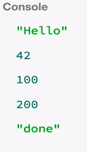

Now we know the very basics of the `observable` type. But RxJS is a lot about the so-called 'operators'. If you check the documentation, there are many, many operators available out there. The list is long, but there are actually a reasonable amount of operators that are important to know. That's why this course here exists.

We're going to start by looking at the creation operators. These are essentially a static function on the `observable` type. The observable there has `of`, and `from`, and `create`, etc. We're going to start by looking at `of`. It's a common pattern to produce a sequence of values, this sequence being synchronous.

Remember, when we had `var bar = Rx.Observable.create` with the `function (observer)`. Then we delivered `observer.next(42)`, and then we delivered `observer.next(100)`, then `200`, and then `complete`.

#### ES6/Babel
```javascript
var bar = Rx.Observable.create(function (observer) {
    observer.next(42);
    observer.next(100);
    observer.next(200);
    observer.complete();
});
```

This is a quite common pattern. We just wanted to leave the values and then stop. `of` does precisely that. It just allows you to deliver '42', '100', and '200' synchronously, 

```javascript
far foo = Rx.Observableof(42, 100, 200);
```

so that is much less much boilerplate to write than the second one here. It does essentially the same, if we now consume this `observable` when we `.subscribe` to it, we get the next value on handler.

we log out `('next ' + x)`. Then we have an `err` handler, we logs `('error ' + err);`, and then it has the `completion` handler. Here we log, `('done')` on the console log.

```javascript
foo.subscribe(function (x) {
    console.log('next ' + x);
}, function (err) {
    console.log('error ' + err);
}, function () {
    console.log('done');
});
```

If you run this, we see `42`, `100` and `200`, and `done`. 



That's what `of` is about. If you want to deliver synchronous values in the sequence, you use `of` instead of writing this boilerplate.