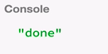

Next we are going to look at some of the most boring, simple operators there are out there. As we will see later on, observables are meant to be combined, and transformed, and concatenated in many ways, so even the boring observables are useful.

Just like with numbers in mathematics, some numbers are quite boring but very important. For instance, the number '0' is very boring. It basically means that you have no number. But it's still incredibly important when you combine it with others in some equation or formula.

With observables, we have something similar. The operator `Rx.Observable.empty` gives you an empty `observable`. Let's call that `foo`. Let's see what it does.

#### ES5/Babel
```javascript
var foo = Rx.Observable.empty();

foo.subscribe(function (x) {
  console.log('next ' + x);
}, function (err) {
  console.log('error ' + err);
}, function () {
  console.log('done');
});
```

If we `.subscribe` to it, what will happen? It says done. It only delivered the completion notification, but it didn't deliver any value.



That's because it's equivalent to a `create`, such that for each `observer` that we `.subscribe` to, it just does `observer.complete()`. 

```javascript
Rx.Observable.create(function (observer) {
    observer.complete();
});
```

It doesn't deliver any value ever. It just says immediately that it's done. You can think of it as an `observable` that does nothing. But at least it tells you that it did nothing.

That's because there's also another case, another operator called `never`. What `never` does, let's check, if we `.subscribe` to it, so far nothing happened. 

```javascript
var foo = Rx.Observable.never();
```

`.never()` is equivalent to `Rx.Observable.create`. For each `observer` that subscribes, it does nothing.

You can think of it as an infinite `observable`. That's because the `observer` that subscribes to this `never` doesn't know if a value will come soon or not. It's just infinitely expecting for a value. That's because it wasn't called `done`, so the `done` was not sent. It means that it's still open for values to be sent.

Because the `observer` doesn't know exactly how the `observable` works, it's just infinitely there hanging, waiting for a value. There's yet another boring operator called `.throw()` which takes a JavaScript error. What it does is it simply throws that error.

```javascript
var foo = Rx.Observable.throw(new Error('bla'));
```

If you think of it in terms of `create`, it takes an `observer`. For each `observer` that we `.subscribe` to, it just does `observer.error()`. 

```javascript
Rx.Observable.create(function (observer) {
    observer.error()
});
```

It sends that error there. If we run this, we just see, "Oh, an error happened."

As we will see later on, `throw`, `empty`, and `never`, they will be quite useful when we combine them with other operators in RxJS. They exist just as shortcuts so that we don't need to write the `create`.