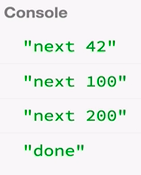
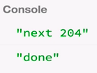

When we used the `of` operator, we essentially gave a list of arguments to this operator, `var foo = Rx.Observable.of(42, 100, 200);`. The common structure for lists in JavaScript is an array. The natural question that arises is, can we convert an array to an `observable`? The answer is, yes. We use an operator for that called `fromArray`.

#### ES6/Babel
```javascript
var foo = Rx.Observable.fromArray([42, 100,200]);
```

Instead of taking a list of arguments, it takes one argument, which is that array. If you run this, you see the values `42`, `100` and `200` being delivered synchronously.



This API is useful instead of using `of` in the case where you already have an array, like it's declared somewhere, `var arr = [42, 100, 200];`, and you want to convert that to an `observable`, and it works. 

```javascript
var arr = [42, 100, 200];

far foo = Rx.Observable.fromArray(arr);
```

Besides `fromArray`, we also have similar operators in the **from** family. Another one is called `fromPromise`, and this is how you use it. It's also under `Rx.Observable.fromPromise`, and it takes a `promise` as an argument only.

```javascript
var foo = Rx.Observable.fromPromise(promise);
```

Let's try using that. We can use the `fetch` API, which is a DOM API, and it takes a URL. Let's just use `jsbin`. This promise will be resolved with a value, which is a response object.

```javascript
var foo = Rx.Observable.fromPromise(
    fetch('https://null.jsbin.com')
);
``` 

That response object has, among other stuff, `status` as one of the fields there. If this promise is resolved, it will give us that `status` response object. If it's rejected or if it fails, then that will become an error in the `observable`, and it will be delivered here, `function (err)`.

```javascript
var arr = [42, 100, 200];

var foo = Rx.Observable.fromPromise(
    fetch('https://null.jsbin.com')
);

foo.subscribe(function (x) {
    console.log('next ' + x.status);
}, function (err) {
    console.log('error ' + err);
}, function () {
    console.log('done');
});
```

If you run that, we see that the status is 204. After that, it just completed as well, because we know from promises, they can only deliver one result value which is why the observable decided, 'I'm going to complete, since no other values will come, anyway'.



There's another operator that we could look at, which is called simply `from`. This is how you use it. It's also under `Rx.Observable.from`. You can give here, an argument, and it will detect automatically if that argument is an array or a promise. We can give for instance, that array, `arr`, that we had before, and it still works. 

```javascript
var foo = Rx.Observable.from(arr);
```

We can also give a promise, and it will detect that the argument was a promise. It will do the same thing that `fromPromise` did, as you can see.

```javascript
var foo = Rx.Observable.from(
    fetch('https://null.jsbin.com')
)
```

`from` also takes yet another type of argument, which is an iterator. If you remember the lesson about generators, we can make a `generator()` function that will deliver some values -- let's say 10, 20 and 30. 

```javascript
function* generator() {
    yield 10;
    yield 20;
    yield 30;
};
```

We then recreate the `iterator` by calling that `generator`. Then we can convert an `iterator` to an observable by passing in the `iterator` into the `from()`, and we will see those values being delivered.

```javascript
var iterator = generator();
var foo = Rx.Observable.from(iterator);
```

The difference is that, of course, because we converted the `generator` to an observable and the observable is pushed, so it means that the `observable`, which is the producer, will determine when those values are delivered. They are delivered synchronously. There's no way of pulling out values from an observable, because we lost that. We converted from pull to push.

The overall lesson is, if you have other types of objects like `array` or `promises` or `iterators`, you can convert them to observables.