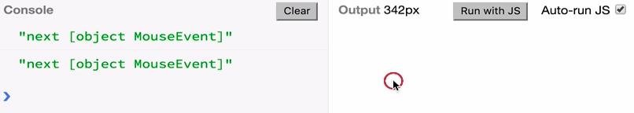

We just saw how to convert arrays and promises to observables using the `from` operator. There are other things we can convert to observables as well.

Whenever you have an API that looks like this, `addEventHandler` and `removeEventHandler`, these are quite common in the DOM and also in node.js -- you can convert that to an `observable` using the operator `fromEventPattern`, which is available under `Rx.Observable`. That is a function that takes two arguments. It takes `addEventHandler` and `removeEventHandler`, and then it will return an observable.

#### ES6/Babel
```javascript
Rx.Observable.fromEventPattern(
    addEventHandler, removeEventHandler
);
```

Let's see how this works in practice. Let's listen to `'click'` events, for instance. Let's make `addEventHandler` a function as it takes a `handler` as an argument, `handler()` function. Then it registers on the DOM that we are interested in listening to click events using this handler. 

```javascript
function addEventHandler(handler) {
    document.addEventListener('click', handler);
}
```

Symmetrically for removing, we'll remove that event listener with `removeEventHandler`.

```javascript
function removeEventHandler(handler) {
    document.removeEventListener('click', handler);
}
```

OK, so now when we call `fromEventPattern` we get an observable, which we can call `foo`. 

```javascript
var foo = Rx.Observable.fromEventPattern(
    addEventHandler, removeEventHandler
);
```

When `foo` is subscribed, it will attach that event handler to the DOM here to listen to clicks. When clicks happen, they will be delivered to the observer, which will put them in `console.log()`. If we run this and click on the DOM here, we see those events being delivered to the observer, which is putting them on console.



How does `fromEventPattern` happen or work under the hood? Let's try to use `create` as we had in previous lessons, `Rx.Observable.create()`. If you see a `fromEventPattern` as a function that takes `add` and `remove`, what that returns is an observable, such that for each `observer` that subscribes, it will `add` that event handler. What is that handler, actually? That's a good question.

```javascript
funciton fromEventPattern(add, remove) {
    return Rx.Observable.create(funciton (observer) {
        add()
    });
}
```

As you can see in `Rx.Observable.fromEventPattern()`, this API doesn't take the actual handler in. It just takes the function that knows how to add that handler, but it doesn't take the handler. That's because a handler in this case will be a `function` that takes that event, ev, and just forwards that event to the `observer`. That's what the handler is in this case. It forwards the events that it listens to the `observer`.

```javascript
function fromEventPattern(add, remove) {
    return Rx.Observable.create(function (observer) {
        add(function (ev) {
            observer.next(ev);
        });
    });
}
```

This is a really simplified version of `fromEventPattern`. Now if we use that, if we say `var foo = fromEventPattern` and we use these two functions, `addEventHandler` and `removeEventHandler`, we will see it working as it was before. 

```javascript
var foo = Rx.Observable.fromEventPattern(addEventHandler, removeEventHandler);
```

Of course, `fromEventPattern` is more complex than this, it also handles removing. We didn't use that, but the idea is pretty much this.

Because it's quite common to handle DOM events such as `click` and et cetera, there is also another operator which is a specialized version of `fromEventPattern`, which is called just `fromEvent`. That takes a `target` and an `eventType`, and this is mainly for the DOM.

```javascript
fromEvent(target, eventType)
```

What from event allows us to do is to forget about adding and removing event handlers. We just think about the target, which is the document, and what type of events we want, which are clicks. We can just say `var foo` equals that. 

```javascript
var foo = Rx.Observable.fromEvent(document, 'click');
```

Once we click here on the DOM, we see the same thing.

That is basically how you convert `fromEvent` streams on the DOM and in node.js to observables if you have an API that looks like `addEventHandler` or `removeEventHandler`.