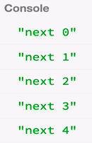
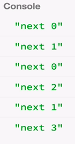

Now we're going to look at more practical operators. These are especially related to time. It's quite common to need an observable that ticks periodically, for instance, every second or every 100 milliseconds. We're talking about an alternative to `setInterval`.

Let's start by creating an observable called `foo` with `Rx.Observable.create()` such that for each `observer` that subscribes, we are going to `setInterval` to run a `function`, let's say, every one second. Every one second, we're going to deliver a value to the `observer`.

#### ES6/Babel
```javascript
var foo = Rx.Observable.create(function (observer) {
    setInterval(function () {
        observer.next();
    }, 1000);
});
```

Which value will we deliver? Let's say we deliver `0`. Actually, instead of `0`, let's deliver a sequence of values starting at `0`, like `i` is initialized at `0`. If we deliver `i`, it's `0`. Then we can increment `i`. The next time this function runs, `i` will be `1`. Next time, it will be `2`, `3`, `4`, etc.

```javascript
var foo = Rx.Observable.create(function (observer) {
    var i = 0;
    setInterval(function () {
        observer.next(i);
        i = i+1;
    }, 1000);
});
```

If we run this, we will see after one second the value is zero. Then, every one second, we see the next number. 



Instead of writing all of this, it would be practical to have a shortcut to making these observables, and there is. There's an operator called `interval` which takes one argument, which is the `period`.

If we give `1000` for one second, we will see the same observable. 

```javascript
var foo = Rx.Observable.interval(1000);
```

`. interval()` has internal to it this machinery of remembering the values and incrementing them. We can also change this to make it faster. `100` milliseconds will run faster.

There's something really important to know about `interval`, is that it sets a separate interval for each `observer` that we `.subscribe` to. Let me demonstrate. If I `setTimeout` to run a `function` after let's say, one and a half seconds, `1500`, I am going to subscribe to the same observable.

```javascript
setTimeout(function () {
    foo.subscribe(function (x) {
  console.log('next ' + x);
}, function (err) {
  console.log('error ' + err);
}, function () {
  console.log('done');
});
}, 1500);
```

Remember, because `observable` executions are not shared like we saw in the beginning of the course, the second observer that subscribes won't see the same numbers at the same time. Let's try that.

We first see zero. Then after one and a half seconds, the other one subscribes. Because it set it's own `interval`, they won't be seeing the same values at the same time. That's always important to keep in mind when dealing with observables and time.



There's also another operator that we can look at, which is called `timer`. `timer` is very similar to `interval`. `interval` took just one argument called `period`, but `timer` takes two. It takes the `startTime`, and it takes the `period`. I can do something like after three seconds, we will start. After we start, every one second we will tick.

```javascript
var foo = Rx.Observable.timer(3000, 1000);
```

It's basically saying, wait for three seconds. Then after three seconds, start doing the same thing that `interval` did. If I run this, it waits for three seconds. After that, it starts to tick every one second. A `timer` can receive the `startTime` as a number to indicate the milliseconds. But it can also take a JavaScript `Date`. Let's see how we can do that.

If we create a variable called `date` and set it equal to `new Date()`, we get the time now. If we do `getTime`, we get the time stamp. We can add three seconds to that, `3000`. Then we can make this become a date as well by surrounding it in parens. 

```javascript
var date = new Date(newDate().getTime() + 3000);
var foo = Rx.Observable.timer(date, 1000);
```

This `date` is basically the date JavaScript object for now plus three seconds. If I run that, after three seconds it will start. When it starts, it ticks every one second.

If you want, you could for instance, insert your birthday. Then this observable, `foo`, will start ticking on your birthday. After that, it will tick every one second. That's how we make observables related to time in RxJS.