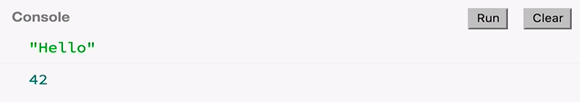
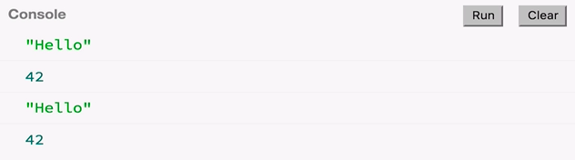
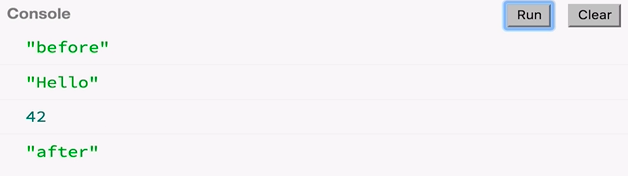

Now we are in JS Bin, and here we have RxJS version 5 imported. 

#### JS Bin
```html
<script src="https://npmcdn.com/@reactivex/rxjs@5.0.0-beta.1/dist/global/Rx.umd.js">
</script>
```

That gives us the global object `Rx`, which has `Observable`. 

```javascript
Rx.Observable
```

`Observable` is by far the most important concept in this library. It's important to note that it's not like an event stream, such as `EventEmitter` in Node.js. It's better to think of it as a powerful generalization of a function. I can explain what I mean.

Let's make a `function` here called `foo`, which takes no arguments. Then it's just going to cause side effects such as `console.log('Hello')`. Then it'll `return 42;`. 

```javascript
function foo() {
    console.log('Hello');
    return 42;
}
```

Once you've called this function, it will immediately give you a value which we can store in a `var` called `x`. We can also `console.log(x)`.

```javascript
var x = foo();
console.log(x);
```

When we run this, we see hello, and 42. 



I'm also going to simplify this by just replacing `x` with the actual call of `foo()`. Once we call `foo()`, we get that value, and we can put it in the console.log.

```javascript
console.log(foo());
```

Besides that, I'm also going to do `.call`. Every function in JavaScript has this method called `call`. This does the same thing that we had before. 

```javascript
console.log(foo.call());
```

You're probably wondering, why am I doing this now? But bear with me.

Please note also, that whatever's inside of the `function foo()`, it won't happen if I don't `call` that function. If I comment out `console.log(foo.call())` and run this, nothing happens. That's because whatever is inside of our function is a lazy computation. Because it's lazy, it won't happen until I actually ask for it with `call`.

Keep all that in mind, and let's look at observables now. Let's make an observable called `bar`. We are going to use the API to create observables like this, `var bar = Rx.Observable.create()`, which takes a `function`, which takes an `observer`. Here inside, we're going to write almost the same thing that we had here for function. We're going to do a `console.log('Hello');`, and also how we need to return a value, so we do `observer.next(42);`.

```javascript
var bar = Rx.Observable.create(function (observer) {
    console.log('Hello');
    observer.next(42);
});
```

Now, observables have a method called `subscribe`. That takes a `function` which takes the value `x`. `x` is whatever was fed through `.next`. Once I have that value `x`, I can just put it in `console.log`, almost the same thing we had for functions. 

```javascript
bar.subscribe(function (x) {
    console.log(x);
});
```

If I run this, I see hello and 42. So far, no difference with functions.


What happens then if I comment out our `.subscribe` block? Basically, I don't have a `.subscribe` anymore. What will happen? Well, nothing. That means that whatever is inside an `observable` is also a lazy computation. Just like with functions, if you don't express your interest in the values, then nothing will happen.

What is the difference between observables and functions? Maybe if we call `.subscribe()` twice, what happens really? Let's see. We see hello, 42, hello and 42. 



What happened here was duplicated for each of these calls to `.subscribe()`, so these are really independent to each other. They're not common or shared. If we try to call the function foo twice, what happens?

As most people expect, we're calling the function twice, so we're going to see hello, 42, and hello, 42. 


So far, no difference. Hmm. People say sometimes that observables are asynchronous. Is that true? Let's check that. Let's first make a sanity check to see that functions are actually synchronous.

If we put the function call between a sandwich here before and after, we expect to see before, hello, 42, and then after. We see before, hello, 42, and after. Functions are working as expected, so how do observables compare in this regard? Let's see.

Surrounding the subscribe, I'm going to put a console.log for before, and a console.log for after. 

```javascript
consle.log('before');
consle.log('foo.call()');
consle.log('after');
```

Now it's in the sandwich, so what's going to happen when I run this? Are we going to see before, after, and then after some while, hello, 42? Or are we going to see hello, 42 happening in between these? Let's check.

We see before, hello, 42, and after. 



Functions are working as expected. So, how do observables compare in this reguard? Let's see. Surrounding the `.subscribe` with a `console.log('before');` and a `console.log('after');`. Now our `.subscribe` is in the sandwitch. 

```javascript
console.log('before');
bar.subscribe(function (x) {
    console.log(x);
});
console.log('after');
``` 

So, what is going to happen when I run this? Are we going to see `before` and `after` then after some time our `hello` and `42`? Or are we going to see `hello` and `42` happening between our console.logs? Lets check. 


It means the observable here in this case, this `bar`, is completely synchronous just like the function is. So far, no difference at all. What is really the difference between observables and functions?

Here is one major thing, is that you can call `observer.next` multiple times. You can give another value, so here is `.next(100)`. Here is `.next(200)`, and now we're basically returning many values.

```javascript
var bar = Rx.Observable.create(function (observer) {
    console.log('Hello');
    observer.next(42);
    observer.next(100);
    observer.next(200);
});
```

When we now run this, we see 42, 100, and 200, and this happens synchronously.


All of these values were delivered between this `before` and `after`, which means that this is happening really all here, `console.log(x)`.

That's interesting, but observables also allow you to not just be synchronous. You can also set a timeout, `setTimeout`, which will happen after one second. Then you can deliver yet another value like 300. 

```javascript
var bar = Rx.Observable.create(function (observer) {
    console.log('Hello');
    observer.next(42);
    observer.next(100);
    observer.next(200);
    setTimeout(fucntion () {
        observer.next(300);
    }), 1000;
});
```

When we run this now, we see 100, 200, and then after one second, we saw 300.

These values, `42`, `100`, and `200`, happened between the sandwich of the `before` and `after` calls, but the value `300` was delivered after one second. That's the difference between observables and functions.

In functions, you can't `return` multiple times. That doesn't work. Also, it's kind of cheating to return an array, because still, you are returning one value, and that value is the array. The fundamental difference between functions and observables are that observables can return you multiple values.

When you `.call` on a function, you're basically saying, "give me a value immediately, and just one value". But when you're saying `.subscribe` on an observable, you're saying, "give me values". I don't know, maybe they come immediately. Maybe it's just one. Maybe they are asynchronous. That is basically the difference. It's like a powerful generalization of a function.