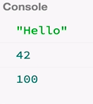

We just saw how observables are almost like functions but allow you to return many values. There's another concept in JavaScript called `Generator` functions, which do something very similar. `Generator` functions were added in ECMAScript 2015, so they're a relatively new feature. Basically, they allow you to return multiple values as well.

This is how we would create one. We say `function baz`, but after the `function` keyword, we'll put a star, `*`. That's to indicate that this `function*` can give many values. 

```javascript
function* baz() {

}
```

I'm also going to comment out everything else so they don't interfere with our output. Then I'm going to create `console.log('Hello')`, as we had before. I'm going to `yield` a value, `42;`, which is the generator style of giving a value.

Then I'm going to yield more values, `100` and `200`. 

```javascript
function* baz() {
    console.log('Hello');
    yield 42;
    yield 100;
    yield 200;
}
```

This is sort of like `return`, but we're going to see how it's different. This is also a lazy computation, so nothing will happen until we ask for these values. The way we do that is by getting an `iterator` when calling this function `baz()`. 

```javascript
var iterator = baz();
```

Once we have that `iterator`, we can get values from that by saying `iterator.next().value`. Once I do that, it will give me the `.next().value`, sort of.

```javascript
var iterator = baz();
console.log(iterator.next().value);
console.log(iterator.next().value);
```

If we run this, we see hello 42 and 100. 



It executed this side effect. Then it gave me the value 42 and 100, but it didn't give me 200. That's because the generator function is allowed to pause its execution. For instance, here it paused on 100. That's because you need to explicitly pull out the values from this generator function by saying `iterator.next()`. That's why I need to put yet another `iterator.next()` here to get the third value out.

```javascript
var iterator = baz();
console.log(iterator.next().value);
console.log(iterator.next().value);
console.log(iterator.next().value);
```

How does that differ from observables? You need to look at the observable `bar` up above as a producer of values. Also, this part here, `bar.subscribe`, is the consumer of those values. With the generator function, this is producing many values, and this part here, `var iterator`, is consuming those values. The difference is that with observables, the producer determines when the values are sent and with generators, the consumer determines when the values are sent.

The first style is generally called 'push', and the second style is generally called 'pull'. Observables are more useful for sequences of values that are sort of alive, such as setting a `timeout` or setting an `interval` to run every second to deliver values or click events. It doesn't make sense to put a `setInterval()` inside a generator function, because the values won't be necessarily sent every one second. You would need to put the set interval on the consumer side, like that.

```javascript
var iterator = baz();
console.log(iterator.next().value);
console.log(iterator.next().value);
console.log(iterator.next().value);

    setInterval();
```

Generator functions are more useful as a passive factory of values. For instance, you can think of the Fibonacci sequence, right? Let's keep in mind that with observables, the values are pushed from the producer, and with generators, the values are pulled from the consumer.